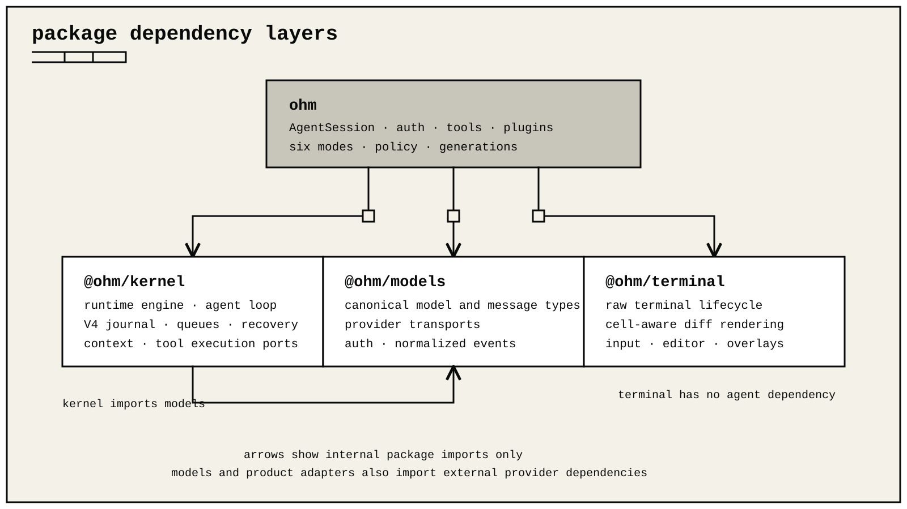
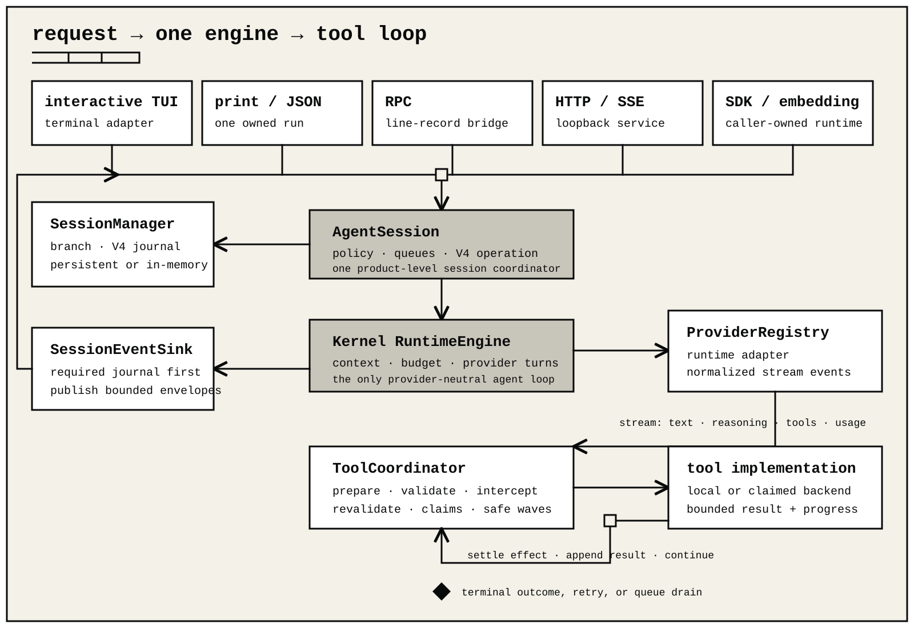

# Architecture

ohm is a local coordinator runtime with six operating modes: interactive,
print, JSON, RPC, serve, and SDK. Print and JSON use the same one-shot adapter.
Every mode reaches the same `AgentSession` and kernel runtime engine. The modes
have different input, output, and lifecycle rules. They do not have separate
agent loops.

The coordinator normally runs in one Node.js process. Tool calls and RPC compatibility support can start child processes, so ohm is not literally a single-process system.



## Package layers

The repository has four runtime packages:

- `@ohm/models` owns canonical model types, standalone provider adapters,
  authentication contracts, and normalized streaming events.
- `@ohm/kernel` owns the canonical runtime engine, the strict V4 journal and
  recovery reducer, context policy, resources, and execution interfaces. It
  depends on `@ohm/models`.
- `@ohm/terminal` owns raw-terminal input, cell-aware rendering, editing, overlays, and terminal capabilities. It has no agent-runtime dependency.
- `ohm` combines the lower packages with product policy: CLI startup,
  `AgentSession`, the product provider registry and catalog, credential
  selection, extensions, tools, sessions, RPC, and TUI presentation.

`@ohm/models` and `@ohm/terminal` remain usable on their own. The `ohm` package is the product integration layer.

The standalone model package and the product integration expose the same model
and streaming contracts, but they have different host responsibilities. The
product adapters also bind the credential broker, extension wire hooks,
provider-specific lifecycle, and product diagnostics. Shared request semantics
are covered in both layers; a change to an overlapping protocol must update both
contract suites.

## One execution path

`AgentSession` owns product policy. It selects settings, providers, tools,
extensions, and storage. It does not contain a second agent loop.

The product bridge in `ohm` converts `ToolCoordinator` to the kernel
`ToolExecutionPort`. It then delegates each run to the one
`@ohm/kernel` runtime engine. Interactive, print, JSON, RPC, serve, and SDK
all use this path.

Every model-requested tool call also uses one `ToolCoordinator`. The
coordinator prepares and validates input, applies trusted interceptors,
validates transformed input again, checks resource claims, and selects the
local or external execution path. Its lifecycle observers connect tool
execution to the V4 operation journal and public events.

User shell shortcuts and extension process APIs are separate operator
surfaces. They do not bypass the model tool coordinator because they are not
model tool calls. They still use the process runner, bounds, cancellation, and
their documented session-event policy.

## Request and tool loop



Each mode adapter normalizes its input, then calls `AgentSession.prompt()`. A
run follows this path:

1. `AgentSession` admits the prompt and records the accepted V4 operation
   before provider work starts.
2. The session claims any accepted steering or follow-up item. It keeps later
   work in the durable queue.
3. `SessionConversation` reconstructs the selected `SessionManager` branch.
   The manager can use a V4 JSONL journal or an in-memory V4 state.
4. The product bridge sends the request and one tool execution port to the
   kernel runtime engine.
5. The engine projects instructions, messages, tools, provider settings, and
   context limits. It can select compaction before a provider request.
6. The selected `ProviderRegistry` adapter emits normalized text, reasoning,
   tool-call, usage, error, and terminal events.
7. `ToolCoordinator` prepares each tool input, validates it before and after
   interceptors, collects resource claims, and builds non-conflicting waves.
8. Before a side effect starts, the session records the prepared and
   dispatched tool effect. It then records the bounded result or recovery
   outcome.
9. The session appends canonical output and checkpoints. The engine continues
   with the next provider turn when required.
10. A terminal provider result, cancellation, failure, or `maxSteps` records
    the operation outcome. Queue policy can then start another run before
    `agent_settled`.

`SessionEventSink` publishes bounded event envelopes after the required
durable transition. Interactive presentation, JSON output, RPC, SSE, and SDK
listeners project those envelopes differently. The CLI-owned local observer is
another post-persistence projection. It writes fixed metadata and aggregate
usage only; SDK and embedding runtimes do not create it unless their caller
injects one.

### Tool scheduling

The scheduler builds deterministic waves in provider source order:

- a parallel call joins the current wave only when none of its validated
  resource claims conflict with another call in that wave;
- a conflict closes the current wave and starts the next one;
- a sequential call closes the current wave, runs alone, and completes before
  scheduling continues.

Read claims may overlap. Any overlapping claim involving a write is serialized,
including workspace-wide claims supplied by an external execution backend.
File safety remains layered: `read`, `write`, and `edit` resolve canonical
physical paths, and write/edit operations also serialize mutations to the same
file.

Tool failures become bounded, model-visible results. Runtime invariant failures stop the run.

## Runtime generations and refresh

Startup canonicalizes the workspace and builds one resource generation. A
generation owns:

1. global settings and trusted project settings;
2. project trust;
3. network and proxy configuration;
4. provider adapters and credential bindings;
5. installed and loose extensions;
6. skills, prompt templates, themes, and instruction roots;
7. tool registrations and extension listeners.

`/refresh` is a transaction:

1. require the active session to be idle;
2. send `session_shutdown` to the old generation;
3. build a candidate generation;
4. create a candidate `AgentSession` over the same `SessionManager`;
5. run candidate preparation hooks;
6. swap the runtime generation and `AgentSession` references;
7. close the old session and generation;
8. bind the candidate and send `session_start`.

Failure before the swap closes the candidate, restores the old model catalog
and extension bindings, and leaves the original session active. The
`SessionManager`, session ID, active branch, and V4 history remain the same
across a resource refresh.

Session replacement is different. New, resume, fork, and clone operations can adopt another manager or branch and then rebind each front end to the new `AgentSession`.

## Canonical context

Canonical messages keep visible text, images, tool calls, tool results, and provider-owned opaque data separate. Provider conversion happens after branch reconstruction and does not mutate stored messages.

The runtime checks tool-call/result ordering across history. Invalid historical fragments are excluded from a provider request. A pending call in the active turn remains available for execution and recovery.

Provider continuation state is replayed only when its provider, protocol, model, and tool-definition fingerprint remain compatible. Hidden reasoning and opaque provider blocks are never exposed as ordinary assistant text.

Instructions, skills, prompt expansion, image normalization, extension reducers, and input bounds all run before the provider request.

## Compaction

Compaction shortens provider context without deleting session history. The planner can bound older tool output, then chooses a retained boundary that does not split a tool call from its result.

The in-memory compaction plan contains exact source message IDs. A generated or extension-provided summary must match those IDs and pass shape and token-budget checks before it can commit.

The V4 compaction node stores:

- a JSON-safe summary payload;
- the retained node IDs;
- its immutable parent and operation identity.

The product projection exposes `firstKeptEntryId`, `tokensBefore`, normalized
usage, details, and hook provenance when those values are present in the
summary payload. Exact planning source IDs remain validation data; they are
not a second durable ledger.

On resume, context reconstruction starts with the latest compaction summary,
follows the retained branch, and includes later reachable nodes. Original
nodes remain in the tree.

Provider prompt caching is separate from compaction. Caching can reuse a stable
request prefix when a provider supports it. Compaction changes that prefix, so
the first request after compaction can have a lower cache-hit rate. The runtime
normalizes provider-reported cache reads and writes for usage events and the
TUI. It does not invent cache usage when the provider does not report it.

See [Context compaction](compaction.md) and [Session JSONL format](session-jsonl.md).

## Storage and recovery

Each durable product session is one strict V4 JSONL journal. The first record
is an exact header. Every later record is an ordered commit with a non-empty
change set. The reducer reconstructs:

- immutable conversation nodes and the selected `main` head;
- session names, node labels, and model, thinking, and tool selections;
- accepted operations, attempts, cancellation, checkpoints, and outcomes;
- steering, follow-up, and next-run queues;
- prepared, dispatched, in-doubt, and settled tool effects.

Only LF-terminated records are committed. A trailing unterminated fragment is
ignored and truncated by a writable open. Invalid committed UTF-8, JSON,
schema, sequence, ancestry, ownership, operation, queue, or effect
transitions fail with a bounded diagnostic.

The writer validates a transition, appends and synchronizes it, then publishes
the reduced state. A product writer lease rejects concurrent writers for the
same file. Read-only snapshots do not take the writer lease.

The current engine permits one open operation per session. Tool recovery is
policy-driven: repeat verified repeatable work, reconcile when a tool provides
that contract, and require an explicit decision for never-repeat effects.

An external worker or delegated agent launched by an extension is not a child
of the current `AgentSession`. The parent journal records the ordinary tool
call and result; the extension owns any external session, profile, scheduling,
event parsing, and retained state. Managed-process ownership still guarantees
bounded cancellation and process-tree cleanup on refresh or shutdown.

## Providers and credentials

Provider adapters own wire serialization and return normalized events. Model
records describe protocol, input, reasoning, tool, token, and cost
capabilities. Provider discovery does not change the agent loop.

Startup can hydrate maintained and cached model data without network access.
The interactive CLI starts live discovery after the first screen is visible.
The normal model picker shows only models from a current, successful provider
listing. Offline and SDK views can use their documented configured or cached
data.

Credentials are resolved outside provider transports. A provider binding maps
a provider ID to its API-key, OAuth, local, or ambient methods. The default CLI
credential factory prefers Linux Secret Service. On Windows, it uses a
DPAPI-protected encrypted file when local key creation succeeds. On macOS, it
uses Keychain Services through a packaged Security-framework executable with a
bounded stdin/stdout protocol; secrets are not passed in arguments or the
environment. When a stronger backend cannot be created on first use, it uses
the owner-only atomic file store. A nonsecret marker pins a selected strong
backend, so a later outage fails closed. Stored secrets are not written to
settings, events, sessions, or diagnostics.

## Per-user installation root

A managed installation keeps its user-owned files under one root:

```text
~/.ohm/           configuration, credentials, sessions, logs, diagnostics, crash reports, and resources
~/.ohm/bin/       managed launcher
~/.ohm/runtime/   versioned standalone runtimes
```

On Linux and macOS, `~/.local/bin/ohm` is only a command symlink. Runtime
paths use `~/.ohm` by default. `OHM_HOME` can move the full application
home, and `OHM_SESSION_DIR` can move only session storage.

See [Install, update, and uninstall](install.md).

## Processes and execution boundaries

The process runner owns cancellation, timeouts, process-tree termination, ordered output, byte limits, artifacts, and redaction. It starts commands directly unless a tool explicitly invokes the configured shell.

An `ExternalToolBackend` can route selected model tools through a fixed executable. This routing does not provide isolation by itself. The executable must create the container, virtual machine, operating-system sandbox, or remote boundary. Trusted extension JavaScript and `ohm.exec` still have host-process authority unless you isolate them separately.

See [External execution backends](execution-backends.md).

## Extensions and packages

Runtime extensions can register tools, commands, shortcuts, flags, providers,
event handlers, UI renderers, bounded ordered TUI slots, generation-owned named
rich-TUI routes, managed processes, and durable extension state. Extension
tools can declare resource claims and recovery policy. Protocol bridges and
delegated-agent workflows are built entirely from these generic surfaces: the
extension owns protocol semantics, profiles, orchestration, limits, and
presentation, while ordinary tool validation, authorization, resource
arbitration, and generation process cleanup remain harness-owned. Core has no
MCP registry or subagent scheduler, handles, events, journals, or UI semantics.

Installed packages can contribute extension factories, skills, prompts, and themes. Normal application loading trust-gates project packages. The root-exported `discoverAndLoadExtensions()` compatibility helper is only for callers that have already approved project-local executable code; it does not establish trust. Locked project declarations resolve exact versions, revisions, and digests before startup reconciliation.

## TUI ownership

`LiveSurfaceRenderer` owns one complete rich viewport: retained transcript,
changing stream, editor, footer, overlays, widgets, and safe background cells.
Mutable rows are never committed irreversibly while reasoning, tool output,
refresh, or resize can still change their position. Non-TTY and accessibility
hosts use bounded line output. See [Terminal UI](tui.md).

## Public boundaries

`ohm` is a local-runtime package for Node.js 26.7.0 or newer. None of its
entry points is a browser contract. A browser
or remote UI must use RPC, the authenticated loopback HTTP and SSE service
through a trusted same-origin bridge, or another reviewed bridge to the local
process.

The six modes use the same `AgentSession` core, but they have different
lifecycle rules. Print, JSON, and RPC own the runtime passed to their mode
helpers and dispose it. The serve process owns every session that it opens and
closes them on shutdown. SDK and embedding callers own their retained
resources. The interactive CLI owns its runtime, while public
`InteractiveMode` keeps the runtime supplied by its caller.

See [Run modes](modes.md), [HTTP and SSE service](serve.md), and [RPC](rpc.md).

## Verification

Tests cover the runtime engine, provider fixtures, strict V4 replay and
recovery, extension refresh, package transactions, TUI components, PTY
behavior, public type surfaces, built output, and packed artifacts.

Run the repository gate from the root:

```sh
npm run check
```

Release checks execute built JavaScript and clean installed artifacts, not only TypeScript source.
