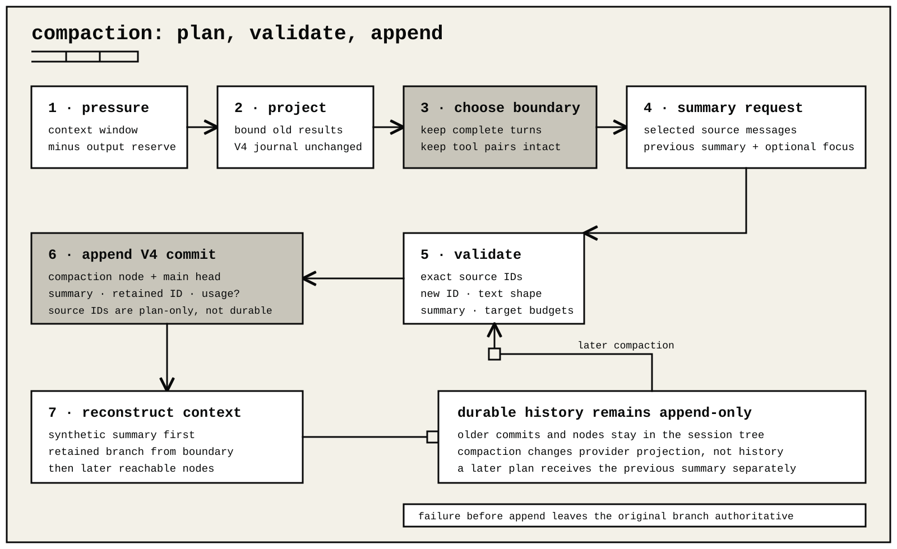

# Context compaction

Compaction keeps long sessions within a model's context window. It changes the provider projection, not the append-only transcript.



## When compaction runs

Automatic compaction compares the projected context with the selected model's resolved context window and output reserve. It can run in four places:

- before a provider request crosses the local threshold;
- after system and extension processing makes the final provider projection cross its hard budget, with one same-step compact-and-reproject path;
- after a provider returns a typed context-overflow result, with one compact-and-retry path;
- after a successful response reports usage beyond the threshold, without replaying that response.

`/compact [FOCUS]` starts the same planner manually. Manual failure is reported to the caller. Automatic failure leaves the original history authoritative and lets the run continue when safe.

Persistent CLI settings use the `compaction` object in `config.json`:

```jsonc
{
  "compaction": {
    "enabled": true,
    "triggerPercent": 85
  }
}
```

The interactive `/settings` panel can change `enabled` and `triggerPercent`.

The context window comes from the selected model. The default policy keeps 15% of that window as response headroom and starts compaction at the remaining 85%. An explicit per-call output ceiling enlarges the headroom when it is greater than 15%. An independent provider-published maximum input ceiling can lower the resulting input budget further. `reserveTokens` and `triggerPercent` are deliberate fixed overrides; omit them to keep the ratio policy.

After a response, context pressure combines the provider-observed prompt with an estimated projection of the generated response and later durable messages, because all of them occupy the next request. The concise TUI percentage uses the same `ctx N.N%` form for both direct observations and projections; extension footer snapshots retain the source distinction. A large response can therefore move the meter across the automatic threshold. The configured threshold remains available in `/settings` instead of being repeated in the footer.

Programmatic prompt calls may override `contextTokenBudget`, `summaryTokenBudget`, and `autoCompaction`. An explicit
`contextTokenBudget` remains the run ceiling across every tool/model step; model-derived budgets refresh between steps
only when the caller did not supply that override. It is a total-context override and cannot bypass an independent
provider maximum input ceiling. The kernel-level exact `contextTriggerTokens` override takes
precedence over the percentage policy.

Programmatic session creation may also override `autoCompaction`, `compactionReserveTokens`, `compactionRecentTokens`, `compactionRetainRecentTurns`, and `compactionToolResultBytes`. These are SDK options, not extra `config.json` keys.

## Planning

Normal provider requests keep the complete projected message history. A tool result does not change merely because newer turns were added. This keeps the provider-visible prefix stable until a real compaction boundary.

When provider usage matches the exact provider, model, API, message prefix, and tool definitions, that observation is authoritative for the unchanged prefix. ohm estimates only messages appended after it. A changed prefix or tool set discards the observation and uses the conservative full projection instead.

The public compaction helpers use that same kernel-owned projection estimator for text, tool calls, tool results, and images. They do not maintain a second image-size heuristic, and positive provider-native usage remains authoritative for the observed prefix.

When a summary is needed, the planner groups history into complete turns and chooses an older prefix to summarize. By default, it tries to keep 20% of the trigger budget verbatim. An explicit `recentTokens` value replaces that target. If the token target does not find a boundary, the planner falls back to `compactionRetainRecentTurns`, which must be at least one.

The default summary target is 5% of the model context, clamped from 1,024 through 8,192 tokens and reduced when the retained context leaves less space. The actual summary request is also capped by its exactly serialized input, the provider output ceiling, and host-added checkpoint framing. A programmatic `summaryTokenBudget` remains an exact override and must still fit those contracts and the final compacted context.

The planner never cuts between a tool call and its result. A single oversized turn can split only at a safe user or assistant message boundary. After a provider-reported overflow, the planner tests progressively later safe boundaries and selects the first one that fits, preserving the largest possible recent tail.

For a split turn, the checkpoint states the original request and early progress needed to understand the newer suffix that remains verbatim.

For example, suppose the durable branch contains `A → B → C → D → E → F → G`
when `G` crosses the trigger. If `E → F → G` fits the recent-history target,
the next provider request contains `[summary of A → D] → E → F → G`. The V4
journal still contains every original node. If `F` is a tool call, its result
stays beside it and the planner moves the boundary earlier when necessary. A
later compaction summarizes the previous summary together with the next older
prefix; it does not inject both that summary and the omitted raw messages.

## Summary input

The summarizer receives:

- the selected source messages;
- the previous compaction summary as a separate input, when one exists;
- bounded file-activity continuity;
- optional manual focus instructions.

Tool-result text is bounded only in this temporary summary view. The default cap is 2,000 characters per result. The canonical transcript and ordinary provider context keep the full result. Provider continuation blocks and provider-trace reasoning are not summary input.

Abandoned-branch summaries select the largest bounded recent suffix. A tool call and its matching result form one boundary span: the selector includes both or neither, and unmatched calls or results are not forwarded as summary conversation.

The in-memory plan records exact `sourceMessageIds`. Before committing, ohm verifies that the returned summary refers to the same IDs, uses a new message ID, contains non-empty user text, ends normally without tool calls, and fits both summary and target context budgets. Positive normalized provider output usage is authoritative for generated text and reasoning; zero or missing usage uses conservative text-and-reasoning estimation instead. Signatures are excluded from token estimation. Host-added framing and file activity are always counted separately.

## What is persisted

A successful product compaction appends one validated V4 commit. The commit
adds a compaction conversation node and moves the selected `main` head to that
node. The product projection has this shape:

```ts
{
  type: "compaction";
  summary: string;
  firstKeptEntryId: string;
  tokensBefore: number;
  usage?: NormalizedUsage;
  details?: unknown;
  fromHook?: boolean;
}
```

The V4 node stores this product value as its JSON-safe summary payload. Its
`retainedNodeIds` contains `firstKeptEntryId`. `sourceMessageIds` belong to the
runtime plan and completion event. They are not durable journal fields.

File activity is carried in the summary text and may also be represented by
optional details. Recent messages remain ordinary nodes. No old commit or node
is deleted or rewritten.

On resume, `SessionManager` projects:

1. preserved system instructions;
2. a synthetic compaction-summary message;
3. the reachable branch beginning at `firstKeptEntryId`;
4. reachable nodes appended after the compaction.

A later compaction receives the previous summary separately instead of treating it as ordinary chat.

## Usage and retries

Normalized usage from summary generation contributes to session token, cache, and cost totals. Usage before the latest compaction boundary is not reused to trigger a later post-response compaction.

The full-screen TUI presents a successful compaction as one unpadded,
background-free receipt. It shows only the verified token count before
compaction and a `Ctrl+O details` hint. Expanding it reveals the retained
summary-request counters and bounded summary body beneath a compact rail. The
detailed receipt calls total input `prompt` and states that any cache
percentage belongs only to that request. A zero cache read means that the
one-off summary request was cold; it does not describe the cache-hit rate of
normal assistant requests. For built-in summaries, ohm neither supplies the
active conversation's session identity nor requests retained session affinity.
When a provider omits either cache counter for that request, the TUI labels that
cache-read or cache-write telemetry unavailable instead of inferring zero reuse,
inventing a write, or presenting a stale session-wide value.

Branch-summary cards follow the same collapsed and expanded transcript state.

Transient compaction and branch-summary failures use bounded retry policy. Partial summary output is never committed or replayed. Retry lifecycle events are available through the TUI, RPC, SSE, extension, and SDK event surfaces.

A final-projection or provider-reported context overflow permits one compact-and-retry attempt for the current unchanged context. An immediate second overflow fails instead of looping. A later overflow can recover again only after a successful provider response or tool-result append has made genuine progress. If system or extension context is itself irreducible, ohm fails before transport.

Cancellation during automatic compaction leaves the original context intact. Manual cancellation emits one terminal `compaction_end` record with `aborted: true`.

## Caching is separate

Provider prompt caching can reduce price or latency while leaving the full prefix in the context window. Compaction shortens that prefix. A compacted prefix may miss the old cache once, then become a stable cacheable prefix for later turns.

## Diagnose early compaction

Check:

- the selected model's resolved context window;
- any reviewed or live maximum-input ceiling;
- any programmatic `contextTokenBudget`;
- `triggerPercent`, `reserveTokens`, and output-token limits;
- large tool results or images;
- a typed provider overflow result.

The TUI footer shows context pressure. RPC `get_session_stats` returns optional `contextUsage`; `get_state` reports whether compaction is active and whether automatic compaction is enabled. Session exports retain durable compaction entries for inspection.
