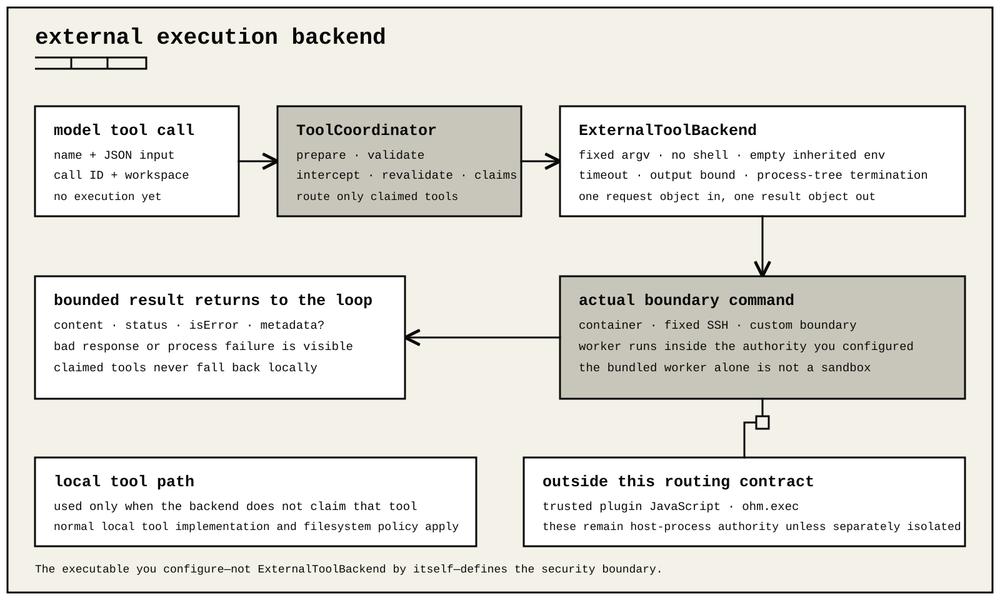

# External execution backends

ohm can route selected model tools through a fixed external process. Schema validation, tool interception, batch scheduling, output bounds, artifacts, and redaction still belong to the host runtime.

`ExternalToolBackend` is a routing contract, not a sandbox. Isolation exists only when the configured executable establishes a real container, VM, operating-system sandbox, or remote boundary.



For each routed call, the backend:

1. starts the configured `argv` without a shell;
2. does not inherit the parent environment;
3. writes one JSON object to standard input;
4. waits within the configured timeout and output limit;
5. accepts one JSON object from standard output.

Request:

```json
{"schemaVersion":1,"tool":"read","input":{"path":"README.md"},"workspace":"/workspace"}
```

Response:

```json
{"schemaVersion":1,"result":{"content":"...","isError":false,"status":"success"}}
```

Unknown fields, malformed JSON, a nonzero exit, a signal, timeout, truncation, an invalid result, or an unavailable executable fails visibly. A tool claimed by the backend never falls back to local execution.

Each configured tool declares `read` or `write` scheduler authority. Declare the strongest effect that executable can perform.

The distribution includes `dist/bin/tool-backend-worker.js` as a bundled
protocol worker. Running that worker directly is not isolation. Place it
behind the boundary command and map the virtual workspace deliberately.

Do not forward API keys, OAuth files, SSH agents, cloud metadata access, or the parent environment unless the deployment explicitly requires and protects them.

The backend governs only model tool calls on an `AgentSession` configured with it. Trusted runtime extensions are JavaScript loaded into the host process. `ohm.exec` is explicit extension process authority. Neither path is routed through the tool backend automatically.

## Linux container adapter

The packaged [`linux-container.mjs`](../examples/execution-backends/linux-container.mjs) adapter requires three values: an absolute container-engine path, an immutable image reference, and one host workspace. The engine must be compatible with Docker or Podman. The adapter starts one container for each tool call. It disables networking, makes the root filesystem read-only, removes all Linux capabilities, and enables `no-new-privileges`. It also limits processes, memory, and CPU. The selected workspace is the only read-write mount. The workspace path cannot contain a comma because the `--mount` option uses commas as separators.

Build an image whose `/app` directory contains the package's complete `dist/` tree. The adapter starts `node /app/dist/bin/tool-backend-worker.js` inside it. Pin the base image and resulting image by digest in production. This Dockerfile shows only the required layout:

```dockerfile
FROM node:26.7.0-bookworm-slim
WORKDIR /app
COPY dist ./dist
```

Create a dedicated existing launch directory such as `/var/empty/ohm-backend`. Pass absolute values to `ExternalToolBackend.create()`, then supply the result as `toolBackend` to `createAgentSession()` or the lower-level `AgentSession` constructor:

```js
const backend = await ExternalToolBackend.create({
    "id": "workspace-container",
    "argv": [
      "/usr/bin/node",
      "/opt/ohm/examples/execution-backends/linux-container.mjs",
      "--engine", "/usr/bin/docker",
      "--image", "registry.example/ohm-worker@sha256:REPLACE_WITH_DIGEST",
      "--host-workspace", "/home/alice/project"
    ],
    "cwd": "/var/empty/ohm-backend",
    "workspace": "/workspace",
    "tools": {
      "read": "read", "grep": "read", "find": "read", "ls": "read",
      "write": "write", "edit": "write", "bash": "write"
    },
    "timeoutMs": 600000,
    "outputLimitBytes": 2097152
})

const { session } = await createAgentSession({
  cwd: "/home/alice/project",
  toolBackend: backend,
})
```

The configured host workspace must be the same directory mounted by the adapter, while the backend's `workspace` must remain `/workspace`. Do not mount the container engine socket, credential directories, or broader host paths into the worker image.

## Fixed SSH adapter

The packaged [`remote-ssh.mjs`](../examples/execution-backends/remote-ssh.mjs) adapter pins the SSH executable, destination, identity, known-hosts database, remote Node executable, worker module, and workspace. It ignores user SSH configuration, disables interactive authentication and forwarding, and requires strict host-key verification.

Remote paths accept only conservative absolute POSIX syntax because OpenSSH constructs the remote command through the login shell.

Install the complete matching ohm `dist/` tree on the remote machine and ensure the configured workspace exists. The SSH account needs only the filesystem and process authority intended for tool execution; it should not have provider credentials or privilege escalation. A complete host configuration is:

```js
const backend = await ExternalToolBackend.create({
    "id": "workspace-ssh",
    "argv": [
      "/usr/bin/node",
      "/opt/ohm/examples/execution-backends/remote-ssh.mjs",
      "--ssh", "/usr/bin/ssh",
      "--host", "ohm-worker@build.example",
      "--identity", "/home/alice/.ssh/ohm_worker",
      "--known-hosts", "/home/alice/.ssh/ohm_known_hosts",
      "--remote-node", "/usr/bin/node",
      "--remote-worker", "/opt/ohm/dist/bin/tool-backend-worker.js",
      "--remote-workspace", "/srv/ohm/workspace"
    ],
    "cwd": "/var/empty/ohm-backend",
    "workspace": "/srv/ohm/workspace",
    "tools": {
      "read": "read", "grep": "read", "find": "read", "ls": "read",
      "write": "write", "edit": "write", "bash": "write"
    },
    "timeoutMs": 600000,
    "outputLimitBytes": 2097152
})
```

Test the SSH account and known-hosts entry before enabling the backend; the adapter deliberately cannot prompt for a password or host-key decision. The backend `workspace` and `--remote-workspace` must be identical.

## Relay termination guarantees

Both adapters validate a bounded request before starting their executor. They retain at most 16 MiB of response plus 16 KiB of diagnostics.

Cancellation, timeout, terminal interruption, or response overflow terminates the executor process tree and waits for it to close. A stubborn tree is killed after a bounded grace period. Adapter conformance tests cover this behavior without requiring Docker or SSH.
