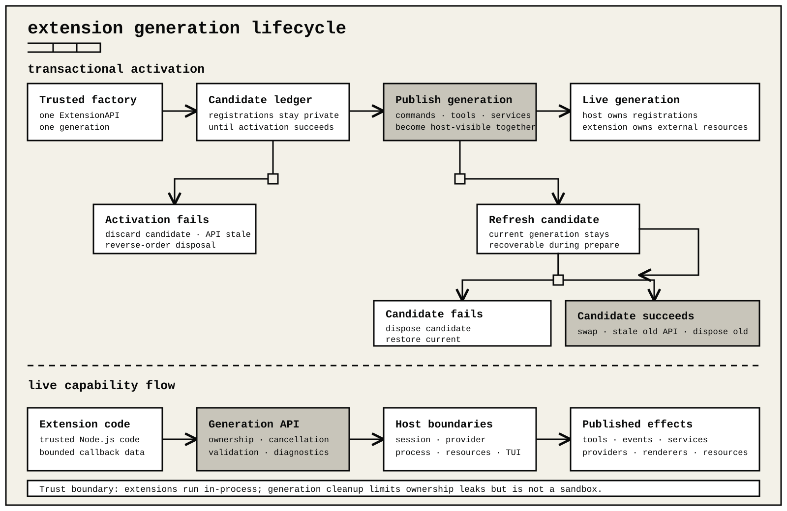

# Extensions

ohm loads trusted extensions as direct in-process factories. The factory receives one stable `ExtensionAPI`; commands, tools, event handlers, providers, services, renderers, flags, and shortcuts registered during activation become visible only after activation succeeds.

For package layout, installation, integrity, and publishing, read [Extension packages](packages.md). Choose a focused package from the [examples catalog](../examples/README.md); the smallest runnable package is [`examples/starter`](../examples/starter/README.md).

## One package, one runtime API

| Surface | Role |
| --- | --- |
| Package | Distribution envelope. A native `package.json` can declare extension factories, skills, prompts, and themes together. |
| Runtime extension | Trusted executable entry. Every factory receives the same generation-scoped `ExtensionAPI`. |
| Skill, prompt, or theme | Declarative resource. Declare fixed paths in the package manifest; use `resources_discover` only for runtime-selected paths. |
| Portable plugin | A `plugin.json` package can contribute portable skills and place ohm factories, prompts, and themes below `io.github.devsohm.ohm/`. |

Native and portable packages enter the same package resolver, trust boundary, refresh transaction, and extension runtime. Specialized imports such as `ohm/tui`, `ohm/providers`, and `ohm/storage` provide public components or types; they do not create another activation API, process, or plugin store. Keeping skills, prompts, and themes declarative lets ohm validate and refresh them without executing their contents as code.



## Activation lifecycle

```js
export default function activate(ohm) {
  const timer = setInterval(() => {}, 1000);

  ohm.onDispose(() => clearInterval(timer));
  ohm.registerCommand("hello", {
    async handler(_args, context) {
      context.ui.notify("Hello.", "info");
    },
  });
}
```

Activation is transactional and time-bounded. A factory that throws, times out, or is cancelled commits nothing. Its API becomes stale before its disposers run once in reverse order.

Refresh sends `session_shutdown` to the live generation, then prepares a candidate. If preparation or its factory fails before publication, ohm disposes the candidate and restarts the previous generation. If preparation succeeds, ohm publishes the candidate, makes the old API stale, and disposes the old generation. A failure in the published generation's subsequent `session_start` is past that rollback point: ohm disables and closes the incomplete generation, and recovery requires a refresh that publishes a fresh generation.

Use `onDispose` only for extension-owned resources such as timers, watchers, sockets, temporary files, or raw child processes. Host registrations, UI mounts, and `ohm.processes` workers are generation-owned and are removed automatically. Calling any generation API from a disposer fails because the API is already stale. One failing disposer is reported without skipping the remaining callbacks.

## Factory API

The direct factory API exposes:

- `onDispose(callback)` for generation cleanup;
- `on(event, handler)` for lifecycle, provider, message, tool, input, and session events;
- `registerTool`, `registerCommand`, `registerShortcut`, and `registerFlag`;
- `registerMessageRenderer`, `registerMarkdownTransformer`, and `registerEntryRenderer`;
- `registerProvider` and `unregisterProvider`;
- `sendMessage`, `sendUserMessage`, `appendEntry`, session name and label helpers;
- `exec` for one-shot argv-based child processes and `processes` for asynchronous generation-owned workers;
- `config` for bounded extension-specific user and workspace configuration;
- `services` for trusted same-process sharing of live objects or functions;
- tool, command, model, and thinking-level selection helpers;
- `getCommands()` for the invokable extension-command, prompt-template, and skill-command catalog in host order;
- `getDiscoveryView` for the richer bounded prompt and skill metadata view;
- `events.on` and `events.emit` for bounded in-process coordination.

The API object is generation-scoped. Do not cache it across refreshes.

Registrations remain live after activation. Re-registering a tool, its renderer, or a command with the same name from the same extension replaces that registration atomically. A tool name already owned by another extension keeps its first owner and produces a diagnostic.

Every `register*` method, `on`, `onDispose`, and `events.on` returns the same
callable `ExtensionRegistrationHandle`. Call the handle or its `dispose()`
method to remove that exact contribution early; repeated disposal is a no-op,
and an older handle never removes a newer same-name replacement. The host still
removes every remaining contribution when the generation ends.

## Commands and shortcuts

```js
ohm.registerCommand("inspect-session", {
  description: "Show current session size",
  async handler(args, context) {
    const entries = context.sessionManager.getEntries();
    context.ui.notify(`${entries.length} entries; request: ${args}`, "info");
  },
});
```

Command and shortcut contexts provide:

- `cwd`, `mode`, `hasUI`, `signal`, and project-trust status;
- extension-owned `paths.userData` and canonical-workspace-isolated `paths.workspaceData`;
- a read-only `sessionManager`, current `model`, `modelRegistry` with authenticated one-shot `complete()`, active `scopedModels`, and selected `thinkingLevel`;
- `ui.capabilities` feature negotiation plus dialogs, notifications, editor access, theme access, one active named UI route, ordered session slots, widgets, header/footer components, terminal input observation, and primary-editor replacement;
- idle, pending-message, abort, shutdown, context-usage, compaction, and system-prompt access;
- command-only `waitForIdle`, `newSession`, `fork`, `navigateTree`, `switchSession`, and `refresh`.

Check `hasUI` before requiring a dialog, then check `ui.capabilities` for the exact surface you need. A missing capability map means unsupported. Headless behavior must fail closed for destructive or privileged actions. Command arguments are user input; validate and bound them before side effects.

Normal submitted input uses this order:

```text
extension command lookup
→ input listeners
→ skill command expansion
→ prompt-template expansion
→ before_agent_start
→ agent run
```

An extension command runs immediately and does not pass through `input`
listeners. While a run is active, a command may still run immediately. Normal
messages must be submitted as steering or follow-up work.

The host creates isolated data roots for each extension owner:

- use `userData` for state that must cross workspaces;
- use `workspaceData` for project memory, indexes, caches, and task state.

Durable paths are isolated per runtime contribution. Legacy entries with the
same extension ID remain separate when their package-relative source entries
differ, and direct entries also include their canonical root identity. A
project package's declared ID and relative entry remain stable across refresh,
restart, and package or canonical-workspace root moves.

Use fixed filenames or validate them at the boundary. Schema-check and bound every read, use user-only file permissions, and define a concurrency strategy. Credentials belong in the host credential store, never extension data. See [`state-and-policy`](../examples/state-and-policy/README.md).

## Tools

```js
ohm.registerTool({
  name: "text_length",
  label: "Text length",
  description: "Count Unicode code points.",
  parameters: {
    type: "object",
    additionalProperties: false,
    required: ["text"],
    properties: { text: { type: "string", maxLength: 4096 } },
  },
  async execute(_callId, input, signal, onUpdate, context) {
    signal?.throwIfAborted();
    const count = [...input.text].length;
    return {
      content: [{ type: "text", text: JSON.stringify({ count }) }],
      details: { count },
    };
  },
});
```

Use a closed schema and validate before side effects. Tool output is an array of text or image blocks plus JSON-safe `details`; keep both bounded. Propagate cancellation. Throw from `execute` to mark a failed call; returning error-looking text is still a successful result. Optional call/result renderers must preserve a useful text observation for print, JSON, RPC, and non-image terminals.

Tools run in source-ordered, resource-compatible waves by default. Set
`executionMode: "sequential"` when a call must run alone as a barrier between
waves. Compatible parallel calls on either side may still overlap with their
peers. A `terminate: true` result ends the batch only when every result in that
batch sets it.

A `tool_call` listener or low-level `beforeToolCall` hook can return
`{ block: true, reason?, terminate: true }` to give its immediate blocked error
result the same terminating hint. `terminate` without `block: true` is ignored.
The low-level hook decision is an exact plain enumerable-data record; its reason
is limited to 16 KiB. Unknown fields, accessors, custom prototypes, and malformed
blocking, reason, or termination fields fail closed before execution.

A custom file-mutating tool must import `withFileMutationQueue` from `ohm`
and wrap its complete read, modify, and write operation for the absolute
target path. The queue serializes aliases of the same physical file without
blocking unrelated files.

The public bash factories expose current session, provider, model, and reasoning metadata to child commands through `OHM_*` variables by default. Set `exposeSessionEnvironment: false` when a custom bash tool must omit it; inherited session variables are cleared in either mode. See [Environment variables](environment-variables.md#shell-tool-session-identity).

`constrainedSampling` requests provider-native argument constraints without changing the canonical tool contract:

- `{ type: "json_schema", strict: "prefer" }` uses the ordinary schema when strict tools are unavailable;
- `strict: "require"` fails before the request when strict tools are unavailable;
- grammar tools accept reviewed `openai_lark` and `openai_regex` variants and must declare exactly one required string property.

Unsupported grammar routes use the ordinary function schema. Do not assume a constraint was enforced unless the selected model advertises the matching capability. See the [tool contract](extension-api.md#tool-contract).

Tool-call listeners may block calls or mutate input that passed the initial schema check. After mutation, the host applies the tool schema and validator again before it computes resource claims or starts execution. Tool-result listeners may replace bounded canonical result fields, and those replacements are validated. Never place host-controlled session identity into a model-controlled schema.

### MCP bridges

An MCP bridge is an ordinary trusted extension. It owns the transport,
protocol version, framing, discovery, allowlist, authentication, catalog
changes, cancellation, and server lifecycle. The host has no MCP registry or
protocol-specific configuration surface.

Start a bounded long-lived transport through `ohm.processes`, validate the
complete discovered catalog, and publish only selected model-facing definitions
with ordinary `registerTool()` calls. Keep every registration handle. On a
catalog change, validate the candidate first, publish its registrations, and
then dispose the previous handles; exact-registration ownership prevents an old
handle from removing its replacement. If publication rejects after it begins,
dispose the bridge's complete tool set and stop its server so no mixed catalog
remains model-visible. Refresh and shutdown remove the current generation's
tools and managed process automatically.

The [`mcp-stdio` example](../examples/mcp-stdio/README.md) demonstrates
bounded framing, allowlisted discovery, catalog refresh, failure handling, and
managed-process cleanup without a protocol-aware core API.

## Specialist delegation

Specialist delegation is also an ordinary trusted extension. The package owns
profile discovery and trust, model and tool selection, single or parallel
orchestration, concurrency and recursion limits, child invocation, JSON-event
parsing, cancellation, output bounds, result composition, and any presentation.

A delegation tool can start an ephemeral ohm JSON-mode process through
`ohm.processes`, consume its bounded event stream, and return the composed
result like any other tool. Refresh, unload, caller cancellation, or host close
terminates the extension-owned process tree. The core does not expose a
subagent service, scheduler, event family, handle, child journal, or tree UI.

The [`subagent-specialists` example](../examples/subagent-specialists/README.md)
shows named profiles and bounded parallel delegation using only public generic
extension contracts.

## Events

`ohm.on` accepts these event families:

- project trust and dynamic resource discovery;
- session start, metadata change, pre-switch, pre-fork, pre-compaction, compaction, shutdown, pre-tree, and tree completion;
- context construction and pre-agent-start mutation;
- provider request hooks and complete request/response header hooks for trusted direct extensions;
- agent, turn, message, and tool-execution lifecycle;
- model and thinking-level selection;
- user shell, interactive input, tool call, and tool result.

Handlers receive immutable or validated canonical data and a generation-bound context. Keep handlers deterministic, abortable, and bounded. Streaming `message_update` events contain accumulated canonical snapshots plus provider-neutral update metadata; do not retain provider-native objects.

See [`lifecycle-events`](../examples/lifecycle-events/README.md) for the full agent/turn/message/tool sequence, [`provider-hooks`](../examples/provider-hooks/README.md) for transport-safe request and response observation, and [`session-lifecycle`](../examples/session-lifecycle/README.md) for guarded session transitions.

`ohm.events` is an in-process topic bus. It is not durable and does not cross processes. Register its returned listener disposer when an earlier opt-out is needed; generation shutdown removes remaining listeners. Factory-time subscriptions and JSON-safe emissions remain private until activation commits. Commit publishes listeners first and then replays at most 1,024 snapshotted emissions in call order, bounded to 1 MiB each and 4 MiB in aggregate; rollback discards both.
Every factory-time or live emission is detached and limited to 1 MiB. Snapshots
accept only plain or null-prototype objects, dense arrays, and primitive JSON
data. They reject accessors, symbols, custom prototypes, cycles, more than 8,192
values, more than 4,096 containers, or nesting beyond 59 levels before
serialization. Values arriving from a supplied event bus pass through the same
snapshot boundary before an extension handler runs. The 1,024-emission and 4 MiB
aggregate limits apply only to the activation queue.

`ohm.services` serves a different trusted-only use case: cooperating extensions
can publish and retrieve an object or function by exact JavaScript reference.
Registrations are transactional and generation-owned, the first owner of a name
wins, names are limited to 128 ASCII identifier characters, and one host admits
at most 256 live services. The registry is not durable, cross-process, or an
isolation boundary. Removing a registration prevents later lookup but cannot
revoke a reference a consumer already retained. Keep `ohm.events` JSON-safe;
do not use the service registry as an unsafe event bus.

## Providers

`registerProvider(id, config)` composes a model provider registration. Registering an existing provider ID creates a generation-owned replacement; unloading restores the previous provider. Defined fields compose over the base registration, so a package can replace a catalog, transport family, base URL, display name, or headers without owning unrelated host state.

```js
ohm.registerProvider("ollama", {
  name: "Local Ollama",
  api: "openai-completions",
  baseUrl: "http://127.0.0.1:11434/v1",
  models: [{
    id: "local-model",
    name: "Local model",
    reasoning: false,
    contextWindow: 8192,
    maxTokens: 2048,
    input: ["text"],
    cost: { input: 0, output: 0, cacheRead: 0, cacheWrite: 0 },
  }],
});
```

Direct extensions use the public `@ohm/models` `Model`, `Provider`, `Api`, and streaming contracts. A provider may declare a custom API identifier when it also supplies `streamSimple`; the host preserves that identifier in extension contexts and translates it explicitly at the core run-loop boundary.

Use `unregisterProvider(id)` for an earlier explicit removal. Do not place real credentials in source, package metadata, logs, tool output, or session records.

See [`provider-override`](../examples/provider-override/README.md) for replacement lifecycle, [`provider-catalog`](../examples/provider-catalog/README.md) for managed OAuth and refreshed catalogs, and [Providers](providers.md) for model fields and authentication behavior.

## Session data and flow

Callback contexts expose the current session through a read-only `SessionManager` projection. It includes the JSONL header, append-only entries, tree, labels, branch context, session name, file path, and leaf. Read through this projection instead of reopening the file. Session text is private and untrusted.

Commands may request a new session, fork at an entry, navigate the current tree, or switch to an explicit session file. The host validates the operation, requires idle state where necessary, emits lifecycle events, and owns the transition.

Factory-level `appendEntry`, `sendMessage`, `sendUserMessage`, naming, and labeling helpers act on the active bound session. They are unavailable during installation activation tests because no live session exists.

Callback contexts also expose `sessionDelivery`, whose Promise-returning
message methods remain bound to the callback's exact session instead of following
a later host rebind. Use it for background results that need an acceptance
acknowledgement. It rejects after that live session closes; persist unfinished
extension work in `context.paths` and retry after a matching `session_start`
rather than retaining an implicit-current factory sender.

Pair `appendEntry(customType, data)` with `registerEntryRenderer(customType, renderer)`, and pair visible `sendMessage` calls with `registerMessageRenderer`. These renderers project the durable JSONL value directly: the same stored entry, ID, and order are used during live display and resume. Hidden messages stay hidden, and a renderer failure uses the host fallback without changing the session.

Path-loaded extension entries and messages expose host-owned provenance through
the read-only session projection and durable replay. The versioned envelope
identifies the exact extension ID and loaded source digest. It includes package
version, package-content digest, and manifest digest only when the package
resolver knew those values; loose files do not claim package identity. Older
records and sources without a verifiable digest omit the envelope.

Use `registerMarkdownTransformer` to change how ordinary user, assistant, and visible reasoning Markdown appears in the TUI. The callback receives the message type, live-stream state, and available terminal width. Transformations are display-only and run again after resize. They never change durable session content or provider input.

See [`session-jsonl`](../examples/session-jsonl/README.md), [`session-control`](../examples/session-control/README.md), [`session-lifecycle`](../examples/session-lifecycle/README.md), and [`session-metadata`](../examples/session-metadata/README.md).

## Terminal UI

The command context owns interactive UI. Simple extensions should use notifications, dialogs, text widgets, status, working messages, and editor text helpers. Trusted TUI extensions may import public components from `ohm/tui` and install a complete editor factory, autocomplete wrapper, header, footer, widget, custom overlay, or bounded named route.

`context.ui.setStatus` contributes compact keyed text to one shared footer status row. It does not create an independently placed content row. Use `context.ui.setWidget` when the extension needs a dedicated block above or below the editor.

`context.ui.routes` registers generation-owned names backed by structured
`RuntimeUiComponent` factories. Only the full rich TUI supports routes. Exactly
one route is active across the viewport: opening another closes the previous
one and replaces only the transcript region, leaving ohm's composer and
status chrome in place. The host provides the title/back row and closes on an
unhandled Escape or `Ctrl+C`. This is a bounded terminal detail surface, not a
tab system, desktop/web router, or separate session runtime. Check
`context.ui.capabilities.routes` before registering or opening a route.

`context.ui.slots` is the stable renderer-neutral path for bounded plain-text
content at `session.header`, `session.beforeEditor`, `session.afterEditor`, and
`session.footer`. Contributions are keyed, deterministically ordered, atomic,
and generation-owned. Check `context.ui.capabilities.slots` first: only the full
rich TUI supports them, while line, accessibility, RPC, and headless hosts
report false and reject registration. Slots do not expose raw terminal control.

Raw editor replacement must preserve submission, cancellation, paste, keybindings, resize behavior, focus, and accessibility. UI mounts are generation-owned and restored on failure, refresh, or close. See [`ui-surfaces`](../examples/ui-surfaces/README.md), [`raw-editor-ui`](../examples/raw-editor-ui/README.md), [`terminal-workbench`](../examples/terminal-workbench/README.md), and [Terminal UI](tui.md).

The declared extension ID remains display metadata. ohm keys UI ownership by the full contribution source and generation, so concurrently active sources with the same declared ID retain independent status, working state, components, and cleanup.

## Processes

`ohm.exec(executable, argv, options)` executes an argv array without a shell. Always use a fixed executable, pass untrusted values as distinct arguments, set an explicit timeout, propagate the callback signal, validate output, and bound displayed or model-visible bytes.

Use `ohm.processes.spawn({ argv, ... })` for long-lived or concurrently observed workers. The host owns generation and host concurrency caps, bounded capture or backpressured pipes, cancellation, and process-tree cleanup. The extension still owns its protocol, validation, task-level concurrency, recursion policy, failure presentation, and result delivery. Workers start only after activation commits, end on refresh or close, and never reattach after a host restart.

Use the [managed-process contract](extension-api.md#managed-asynchronous-processes) for a framed worker or extension-owned delegated agent. Use an [external execution backend](execution-backends.md) when a model tool must cross a reviewed isolation boundary. A process launched by an extension is not a sandbox merely because it runs another agent session.

## Skills, prompts, and custom themes

Declare fixed resources in `package.json`. Use `resources_discover` only when paths depend on runtime initialization:

```js
ohm.on("resources_discover", () => ({
  skillPaths: ["skills"],
  promptPaths: ["prompts"],
  themePaths: ["themes"],
}));
```

Relative paths resolve from the package root and remain within an approved resource boundary. See [`dynamic-package`](../examples/dynamic-package/README.md).

## Stable imports

TypeScript authors can import public declarations:

```ts
import type { ExtensionAPI } from "ohm/extensions";

export default function activate(ohm: ExtensionAPI): void {
  // registrations
}
```

Runtime code may import stable exported host modules such as `ohm/tui`, `ohm/providers`, and `ohm/storage`. Do not import `src/`, `dist/`, private files, or a second bundled copy of ohm.

## Verification checklist

Before distribution, prove:

1. source validation and focused tests pass;
2. activation failure commits nothing and the prior generation survives;
3. timeout and cancellation settle cleanly;
4. disposers run once, in reverse order, with the API already stale;
5. repeated refresh does not duplicate commands, listeners, providers, UI, timers, sockets, or processes;
6. headless behavior is safe;
7. the exact packed archive contains every declared file;
8. the exact installed copy performs its documented user-visible action;
9. removal restores provider, editor, process, and resource state.

The conformance suite in `packages/ohm/test/extensions/direct-example-packages.test.ts` activates every bundled example through `DefaultPackageManager` and the direct runtime.

`ohm extensions author refresh PACKAGE_DIRECTORY` activates two valid candidates and checks repeat activation and disposal. It does not inject a failed candidate or prove that a live host retains its previous generation. Test that rollback boundary in the ohm integration suite or with a disposable source-loaded package in a real host.
