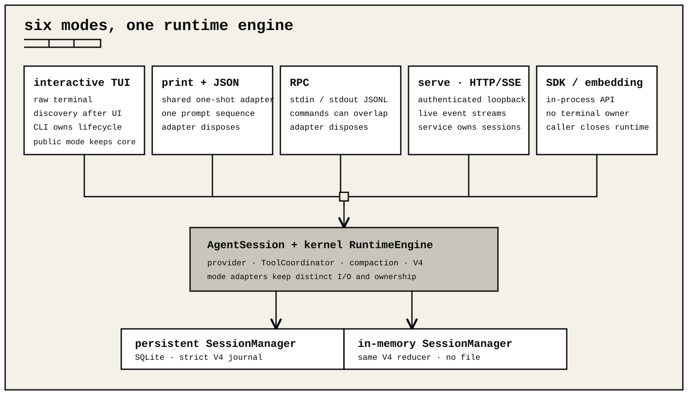

# Run modes

ohm has six operating modes:

1. interactive TUI;
2. one-shot text;
3. one-shot JSON event stream;
4. RPC;
5. local HTTP and SSE service;
6. SDK or embedding.

The public `runPrintMode()` adapter supports text and JSON embedding. The CLI
owns its one-shot lifecycle directly. All six modes share the same
`AgentSession`, kernel runtime engine, tool coordinator, compaction policy, and
V4 session state. They do not have identical UI, event projection, or lifecycle
ownership.

Protocol bridges and delegated-agent packages do not add another mode or agent
engine. They register ordinary extension tools in every supported host and use
generation-owned managed processes when they need an external transport or an
ephemeral JSON-mode agent process. The extension owns those process protocols;
the current `AgentSession` continues to observe one normal tool call and result.



## Interactive TUI

Run `ohm` in a terminal without `--print` or an explicit `--mode`.

The CLI:

1. creates the session owner;
2. loads cached model state and runtime resources;
3. binds extension UI;
4. renders the terminal;
5. starts live model discovery in the background.

Slow or offline model discovery therefore does not block the first screen.

Session replacement adopts another session or branch. `/refresh` is different.
It blocks input and builds a candidate resource generation and candidate
`AgentSession` over the current `SessionManager`. A successful swap keeps the
same session ID, branch, and V4 history. It replaces settings, keybindings,
extensions, skills, prompts, themes, context files, providers, and cached model
state as one transaction.

When startup finds an interrupted durable run, the TUI blocks input while it
attempts safe recovery. If a tool effect remains uncertain, the TUI reports
its effect ID and keeps new work blocked. Typing `/recover` explicitly asks the
interactive host to retry safe repeat/reconciliation first, then record all
remaining blocked effects as abandoned without replay. `/recover abandon
EFFECT_ID` retains one-effect control. Neither form claims that an external
action succeeded or failed, and recovery itself does not start a model turn.
The next prompt carries the unknown-outcome warning to the model.

One same-process case is intentionally narrower: after Escape cancels a live
interactive operation, the next submission can record that exact operation's
unfinished effects as abandoned and continue without replay. The authorization
is an in-memory operation marker; it does not survive refresh, session
replacement, close, or process restart. Reopened work remains blocked until
the user types `/recover` or provides an explicit programmatic resolution.

`InteractiveMode` is public for hosts that already own an `AgentSessionRuntime` and terminal dependencies. It closes the terminal it creates or receives. It does not dispose the supplied runtime.

Embedding hosts can rebuild the active transcript with `renderInitialMessages()`, wait for the next text-only idle submission with `getUserInput()`, clear the draft with `clearEditor()`, and add typed notices with `showError()`, `showWarning()`, `showNewVersionNotification()`, or `showPackageUpdateNotification()`. Slash commands, shell commands, and prompts with image attachments keep their normal routing while `getUserInput()` waits. Closing the mode rejects a pending input request.

While a model turn is active, built-in slash commands keep their documented
dispatch, interruption, cancellation, or follow-up policy. Registered extension
commands, prompt templates, and enabled skill commands are also admitted
immediately; any prompt they generate is queued as a follow-up to the active
turn. An unknown slash command reports an error immediately. `!` and `!!` shell
shortcuts remain queued until the session is idle. Embedding hosts pass their
static command and prompt projection as `InteractiveModeOptions.extensionCatalog`.

## Print and JSON

`runPrintMode()` receives an `AgentSessionRuntime`, runs the supplied messages, writes output, and disposes the runtime before returning an exit status. An embedded host owns process signals, cancellation, and process exit.

This adapter is for hosts that already own a fully composed runtime. Follow
[Reusable service composition](sdk.md#reusable-service-composition) to build
one: the public `createAgentSessionRuntime()` factory requires both an explicit
session factory and initial options; it is not a zero-argument configured
constructor. Use `ohm/embedding` when the host instead needs a ready-to-run
configured harness.

`mode: "text"` writes the final assistant text. It returns `0` on success and `1` after a provider or runtime failure.

At the CLI, `--mode text` explicitly selects this one-shot path even when standard input and output are terminals. `--print` is its shortcut.

`mode: "json"` writes a session header followed by public `AgentSessionEvent`
records as newline-delimited JSON. A failed extension callback is a bounded,
redacted `{ type: "extension_error", extensionId, extensionPath, event, error }`
record; startup failures are queued until after the session header. `initialImages`
applies only to `initialMessage` and accepts `{ type: "image", mimeType, data }`
values, where `data` is canonical base64 content.

Text and JSON modes attempt safe recovery before the first supplied message.
They return a failure if recovery needs an explicit decision. Use interactive,
RPC, serve, or SDK recovery before running the one-shot command again.

The default writer preserves stdout order and backpressure. An embedded host can provide `write(text)` instead.
The adapter does not redirect or take over `process.stdout`; embedded hosts retain stream ownership.

At the CLI, piped standard input in text or JSON mode is prompt text. JSON mode does not read command objects and is not bidirectional. Use RPC when the parent process must send commands while the session is running.

Use `ohm/embedding` when the caller must retain a session after one prompt, keep subscriptions alive, steer the current run, or enqueue follow-ups.

## RPC

Run:

```sh
ohm --mode rpc
```

RPC reads one JSON command per input line and writes responses, raw agent events, shell updates, and extension UI requests as JSON records on standard output. Human diagnostics use standard error.

RPC does not choose an explicit recovery outcome for its host. Read
`get_state.suspendedRun` or call `get_recovery_status`, then call
`recover_interrupted_run` with any verified resolutions before sending a new
prompt.

`runRpcMode()` owns and disposes the `AgentSessionRuntime` passed to it. `RpcClient` from `ohm/interfaces` owns the child process it starts.

See [RPC protocol and typed client](rpc.md).

## HTTP and SSE service

Run:

```sh
OHM_SERVE_TOKEN="YOUR_LONG_RANDOM_TOKEN_AT_LEAST_32_CHARS" ohm serve
```

The service exposes authenticated HTTP endpoints for session creation, session
open, state, prompts, cancellation, and close. It exposes live session events
through SSE. It is a thin adapter over the same `AgentSession`, kernel runtime
engine, tool coordinator, and V4 journal. It does not own a separate agent
engine or storage format.

`GET /v1/sessions/:id/recovery` exposes a suspended operation and its effect
IDs and statuses. `POST` to the same path attempts safe recovery or accepts
caller-supplied explicit resolutions. A blocked session remains registered so
the authenticated controller can recover it after cancellation or reopen. The
service never infers abandonment.

The default address is `127.0.0.1:4317`. The CLI accepts only `127.0.0.1`,
`localhost`, or `::1`. The service is for a trusted local operator. It has no
WebSocket, CORS, public multi-tenant policy, or SQLite backend.

See [HTTP and SSE service](serve.md).

## SDK and embedding

Use `ohm/sdk` to create and retain sessions in the current process. The SDK exposes providers, models, tools, extensions, resources, execution backends, events, and lifecycle controls without taking terminal or child-process ownership.

Use `ohm/embedding` for a smaller task-oriented wrapper around a retained session. It is an SDK facade, not a seventh runtime mode.

SDK callers own:

- the `SessionManager`, unless a factory creates one for them;
- subscriptions and external resources;
- session and provider shutdown;
- any process or UI bridge around the session.

An SDK session can use durable JSONL or `SessionManager.inMemory()`.

SDK hosts read `session.suspendedRun` and call
`session.recoverInterruptedRun()`. They own any prompt or UI used to obtain an
explicit recovery decision. The narrower `EmbeddingSession` exposes the same
two members as current-session pass-throughs. Neither SDK nor embedding chooses
an outcome after abort, refresh, or restart.

See [SDK composition](sdk.md) and [Embedding ohm](embedding.md).

## Choosing a mode

| Need | Mode |
| --- | --- |
| Human terminal workflow with live streaming and pickers | Interactive TUI |
| One shell-friendly answer | Print text |
| One shell-friendly event stream; piped input is prompt text | Print JSON |
| Long-lived subprocess control from another program | RPC |
| Trusted local HTTP control with reconnectable live events | HTTP and SSE service |
| In-process composition and custom lifecycle | SDK |
| Retained task session with a smaller API | Embedding |
