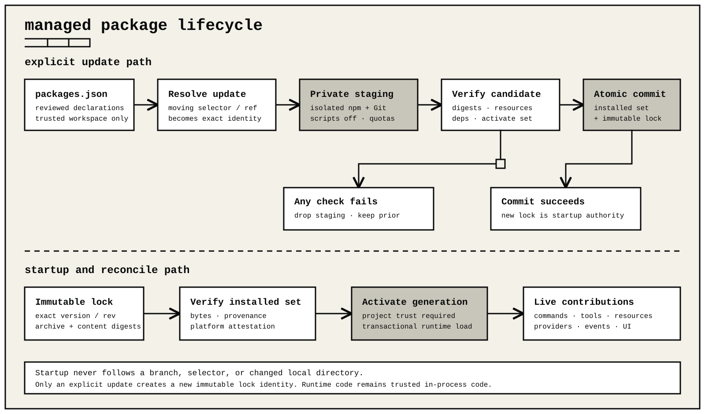

# Extension packages

ohm extensions are ordinary trusted Node.js packages. A package declares direct factory entry points and optional resources in `package.json`; each factory receives the public `ExtensionAPI` from `ohm/extensions`.

Start with the [examples catalog](../examples/README.md), then copy [`examples/starter`](../examples/starter/README.md) into a new workspace directory instead of editing the bundled example. The bundled copy stays `private` to prevent accidental publication from the ohm repository, but it includes the enforced ohm peer range. Choose your own package name and remove `private` only when the copy is ready for registry publication.

## Package shape

```text
my-extension/
  package.json
  README.md
  extensions/index.ts
  skills/review/SKILL.md       # optional
  prompts/review.md            # optional
  themes/ocean.json            # optional custom theme
  checks/runtime.test.mjs      # recommended
```

A complete declaration is:

```json
{
  "name": "@example/my-extension",
  "version": "1.0.0",
  "type": "module",
  "peerDependencies": { "ohm": ">=0.1.0 <0.2.0" },
  "ohm": {
    "extensions": ["extensions/index.ts"],
    "skills": ["skills"],
    "prompts": ["prompts"],
    "themes": ["themes"]
  }
}
```

The `ohm` object accepts four string arrays: `extensions`, `skills`, `prompts`, and `themes`.

Paths are package-relative, normalized, and constrained to the package root. Resource resolution rejects or reports missing paths, symlink escapes, and unsupported formats. Declare only the documented keys; unknown `ohm` keys are not extension configuration.

ohm ships the built-in `mono` and `signal` themes. Package declarations add reviewed custom themes without replacing them.

`peerDependencies.ohm` is the enforced host-compatibility range. ohm validates it before package activation and does not install a nested host runtime. `engines.ohm` remains optional report metadata for older packages, but it is not an activation gate. Test the packed artifact against every supported ohm release before publishing.

## Portable skill packages

ohm can also load the skills portion of the portable plugin 1.0.0 format. This is an additional package input, not a replacement for ohm's native extension package format.

```text
portable-tools/
  plugin.json
  skills/
    review/
      SKILL.md
  io.github.devsohm.ohm/
    extensions/index.mjs       # optional ohm factory
    prompts/review.md          # optional ohm prompt
    themes/ocean.json          # optional ohm theme
```

The minimal manifest is:

```json
{
  "$schema": "https://agent-plugins.org/schemas/1.0.0/plugin.schema.json",
  "name": "portable-tools"
}
```

When `plugin.json` exists, it is authoritative. ohm validates it before looking for components. An invalid manifest rejects that package; ohm does not reinterpret the directory as a native package. Unknown top-level fields and a non-object `extensions` field are reported and ignored, as required by the format. Namespaces that ohm does not implement are ignored without inspecting their values.

Portable skill discovery is intentionally narrow: `skills/` must be a directory, each skill must be an immediate child directory, and its manifest must be named exactly `SKILL.md`. Every discovered skill receives strict frontmatter, name, and root-containment validation. One invalid skill does not block valid siblings or namespaced ohm resources. A discovered component path may link within the package root; a link that resolves outside it is rejected at the narrowest component boundary.

The `io.github.devsohm.ohm` directory is ohm's file namespace. Its `extensions`, `prompts`, and `themes` directories feed the same loaders, trust checks, refresh transaction, `ExtensionAPI`, filters, and diagnostics used by native packages. There is no parallel extension runtime.

This release is skills-only for portable components. A root `mcp.json` is left untouched and ignored without a warning. MCP processes are not started from portable packages. Use a reviewed ohm extension when an integration needs an external protocol client.

When a declaration is omitted, the matching conventional directory is discovered if present. Explicit declarations are preferable for published packages because the packed file set is then obvious. Hierarchical `.gitignore`, `.ignore`, and `.fdignore` rules apply during package inventory.

Package metadata is read through bounded regular-file snapshots. Native and legacy manifests and ignore files are limited to 1 MiB; managed package locks, declared legacy integrity files, and direct runtime source files are limited to 16 MiB. Project package manifests use the narrower 512 KiB project-resource limit. Authoring inspection accepts at most 4,096 files, 32 MiB per file, and 64 MiB in aggregate; packed artifacts are also limited to 64 MiB, and gallery indexes to 4 MiB. Files that exceed a limit, are not regular files, or violate the applicable symlink policy are rejected before activation or publication. Descriptor-bounded reads prevent concurrent growth from bypassing the byte ceiling.

Runtime files may be JavaScript, TypeScript, or their standard ESM/CommonJS variants. Every runtime entry must default-export one factory:

```ts
import type { ExtensionAPI } from "ohm/extensions";

export default function activate(ohm: ExtensionAPI): void {
  ohm.registerCommand("hello", {
    description: "Show a greeting",
    async handler(_args, context) {
      context.ui.notify("Hello from the extension.", "info");
    },
  });
}
```

## Install and run

Install a local package:

```text
ohm install ./my-extension
```

Other immutable sources are supported:

```text
ohm install "npm:@example/my-extension@1.2.3"
ohm install "npm:file:///absolute/path/my-extension-1.2.3.tgz"
ohm install "git:https://github.com/example/my-extension.git#0123456789abcdef0123456789abcdef01234567"
```

For a bare `npm:file:` archive, ohm records the validated package identity
selected by the package manager. Multiple archives therefore remain
independently discoverable after restart; removal still uses the identical
source string. Two configured sources that declare the same package name are
rejected before either installed package is replaced.

Git package URLs are credential-free:

- HTTPS credential helpers are disabled, so private HTTPS repositories are unavailable;
- for private repositories, use a real SSH host URL with an agent or default key;
- SSH keeps the normal key and `known_hosts` locations, but ignores user/system SSH configuration, aliases, `ProxyJump`, `ProxyCommand`, and local commands;
- Git LFS filters and submodules are disabled.

A short moving ref resolves a same-named branch before a tag. ohm then verifies that the checkout still matches the advertised commit before activation.

Use `-l` for the trusted project scope. Lifecycle scripts are disabled by default; `--allow-scripts` is accepted only by install and update commands and should be used only after reviewing the complete dependency tree.

After changing package code, run `/refresh`. ohm sends `session_shutdown` to the current generation, activates a candidate, and replaces the current generation only after preparation succeeds. If candidate activation fails, the candidate is disposed and the previous generation receives `session_start` again.

Useful commands:

```text
ohm list --json
ohm extensions doctor
ohm extensions show PACKAGE_ID
ohm update SOURCE
ohm remove SOURCE
```

`ohm remove` removes the configured package contribution. For managed npm or
Git sources it also removes the installed package bytes; a local source directory
is never deleted. Package removal does not delete the separate extension-owned
user or workspace data roots, including documents written through `ohm.config`.
This lets a later reinstall of the same contribution identity recover durable
state. If a package needs an explicit "forget my data" operation, expose a
bounded, confirmed command that calls `ohm.config.remove` before removal. A
disposer cannot do this: the API is stale before disposal, and removed package
code is not activated merely to erase data.

Remove a packed archive with the identical immutable source string used to
install it:

```text
ohm install "npm:file:///absolute/path/my-extension-1.2.3.tgz"
ohm remove "npm:file:///absolute/path/my-extension-1.2.3.tgz"
```

With `--offline`, `update` rejects a selected moving npm version, range, tag, or Git ref before checking or staging it. Local paths and immutable npm versions or full Git revisions remain non-network selections. An explicitly requested `install` remains an intentional operation and is not disabled by this update guard.

For one invocation without persisting package settings, use `ohm --extension /absolute/path/to/index.mjs` or point `--extension` at a package source that resolves to direct entries. Invocation loading never enables dependency lifecycle scripts.

## Package entries in settings

The `packages` array in `config.json` accepts a source string or an object:

```json
{
  "packages": [
    "git:https://github.com/example/basic-tools.git#0123456789abcdef0123456789abcdef01234567",
    {
      "source": "npm:@example/review-tools@1.2.3",
      "autoload": true,
      "extensions": ["!extensions/internal.mjs", "+extensions/public.mjs"],
      "skills": ["skills/review"],
      "prompts": [],
      "themes": ["themes/*.json"]
    }
  ]
}
```

An object accepts `source`, `autoload`, `extensions`, `skills`, `prompts`, and `themes`. It can also set `"manifest": "legacy"` to read `extension.json` instead of the `ohm` object in `package.json`.

`autoload` is `true` by default. When it is true:

- an omitted resource field keeps the package declaration for that resource type;
- an empty resource array disables all resources of that type;
- an unmarked pattern selects matching resources;
- `!PATTERN` disables matching resources;
- `+PATH` enables one exact package-relative path;
- `-PATH` disables one exact package-relative path.

Exact `+` and `-` rules run after pattern rules. An exact `-` rule has final priority. A settings filter cannot enable a resource that the package manifest already excluded.

When `autoload` is `false`, the package does not add its resources automatically. Only entries in the resource arrays change the result. This form can apply a project delta to the same user package. For example, a project can disable one extension and keep the other user-scoped resources unchanged:

```json
{
  "packages": [
    {
      "source": "npm:@example/review-tools@1.2.3",
      "autoload": false,
      "extensions": ["-extensions/internal.mjs"]
    }
  ]
}
```

Project settings are read only after project trust. A project package entry wins over an equivalent user entry. The exception is a project entry with `autoload: false`; it keeps the user entry as its base and applies only its resource delta. If the project array repeats one package identity, the last project entry wins.

Package identity uses the npm package name, the Git repository, or the resolved local path. Resource paths are also deduplicated by canonical filesystem path. One physical resource loads only once, even when more than one configured path or symbolic link reaches it.

## Declarative project package set

A trusted workspace may declare a reviewed package set in `.ohm/packages.json`:



```json
{
  "schemaVersion": 1,
  "packages": [
    {
      "id": "local-review",
      "source": { "kind": "local", "path": "packages/review" },
      "disabledResources": ["command:internal-review"]
    },
    {
      "id": "published-review",
      "source": { "kind": "npm", "package": "@example/review", "selector": "^1.2.0" }
    },
    {
      "id": "git-review",
      "source": { "kind": "git", "repository": "https://github.com/example/review.git", "ref": "main" }
    }
  ]
}
```

Declarations are ignored without project trust. IDs are unique lowercase identifiers; local paths are normalized workspace-relative paths outside `.ohm`; Git repositories must be credential-free HTTPS or SSH locations. Resource filters use `runtime:`, `skill:`, `prompt:`, `theme:`, or `command:` followed by a package-relative resource key or command name. Filters are literal and exact: `*`, `?`, and brackets are not globs, and a basename does not match the same name in another directory. For migrated `extension.json` packages, prompt, command, and theme keys are their declared IDs or names rather than their file paths.

The declaration is intentionally separate from its generated `.ohm/packages.lock.json`:

```text
ohm packages check
ohm packages update --all
ohm packages update local-review
ohm packages reconcile
```

`update` is the only operation that follows a moving selector, branch, or local edit. It:

1. resolves the selected declarations;
2. records exact versions or revisions and archive, manifest, and content digests;
3. activation-tests the complete candidate set;
4. commits the installed set and lock together.

Partial updates reject unrelated declaration additions, removals, or edits.

Normal startup and `reconcile` consume only the immutable lock. A healthy local install is not refreshed merely because its source directory changed. If repair is required, the source must reproduce the locked digests or reconciliation fails.

ohm stages and swaps the complete `.ohm/packages` directory as one recoverable transaction. Cancellation or activation failure preserves the previous lock and installed set. Dependency lifecycle scripts remain disabled for every declarative operation. Do not hand-edit the generated lock.

New updates write project lock schema 2. Schema 2:

- uses locale-independent code-unit ordering;
- embeds canonical production dependency locks;
- includes empty directories in content identity;
- rejects package-content names that are not portable across supported filesystems.

Rejected names include case or NFC-equivalent collisions, Windows device basenames, colons and other Windows-invalid characters, and trailing dots or spaces. Historical public package IDs remain unchanged. A Windows-reserved or trailing-dot ID maps to a collision-free private install-directory name.

Modern packages with multiple runtime files receive deterministic path-derived extension IDs for every runtime. A single runtime keeps the package ID.

A schema 1 lock from the shipped extension-package system remains read-only: normal startup can activate it, but repair and partial update require `packages update --all`. That command migrates `extension.json` packages without rewriting their source manifest. It honors `enabled`, host compatibility, declared integrity, arbitrary skill/prompt/command/theme/runtime paths, static declaration metadata, and the shared extension ID of multiple legacy runtime entries. If unchanged legacy syntax cannot be represented by the hardened authoring grammar, the schema 2 lock records `"declarationGrammar": "legacy"`; this marker preserves exact v1 SSH-user and resource-filter parsing without loosening ordinary schema 2 locks. An unchanged `extension.json` remains authoritative even when the source also carries unrelated modern `package.json` metadata. Legacy `permissions` are strictly parsed, but a declarative project package is trusted in-process code; project trust, not the legacy permission object, is the authority boundary.

Schema 2 is a one-way lifecycle upgrade. An older host that only understands schema 1 cannot consume or safely downgrade a schema 2 lock. If a host downgrade is required, use version control to restore the declaration, lock, and matching installed state. Never edit the schema number.

Production dependency replay is split into a portable anchor and a local platform attestation. The lock digest covers every required installed byte and rejects omitted-development roots or extraneous content. Required non-host peers are installed and attested; optional peers remain optional. A `ohm` peer is checked against the running host version and removed from the install inventory so extensions cannot install a second host runtime. Optional, OS-gated, CPU-gated, and libc-gated packages may legitimately be absent on one platform and present on another, so their installed bytes are digested immediately after controlled `npm ci`. The exact digest is written to package provenance and to one append-only, mode-`0600` record keyed by canonical workspace, lock digest, package ID, and a stable OS/architecture/libc-family/Node-ABI fingerprint under ohm's manager-private state beside the operation-lease root. Linux fingerprints distinguish glibc from musl; other operating systems use a deterministic non-Linux libc marker. A different digest for the same lock and platform fails closed; a deliberate declaration update creates a new lock identity. Startup requires the installed bytes, provenance, and external record to agree, so deleting optional bytes and rewriting the excluded in-package provenance cannot select an older attested digest. This protects against workspace drift or a writer limited to the project tree, not an attacker who can also modify ohm's private agent state.

All npm resolution and replay commands run without the ambient process environment. ohm supplies only:

- executable and system path variables;
- a private HOME;
- empty npm user and global configuration;
- cache and temporary directories inside the quota-monitored staging root.

Ambient `.npmrc`, registry tokens, lifecycle scripts, and update/audit/fund helpers are unavailable.

Git materialization uses isolated configuration, empty hooks/templates and filters, non-interactive credentials, an explicit protocol allowlist, and no submodules. Materialization is monitored while commands run. It terminates beyond 4,096 filesystem entries, 64 MiB, or the depth bound, then removes partial staging state.

## Transaction and trust model

Install and update use a private staging directory. Before commit, ohm validates:

- bounds and package structure;
- declared resources;
- production dependencies;
- exact runtime entries;
- activation.

A failure removes the staged package and preserves the installed version byte-for-byte. A multi-package update stages and activation-tests the complete selected set before committing any member. If a later filesystem commit fails, ohm reverses earlier swaps.

Runtime code is trusted in-process code. It can use Node.js and any declared production dependency. Project-scoped code is not imported until project trust succeeds. Review the source, package metadata, dependency graph, install scripts, network destinations, and process boundaries before trusting a package.

An activation generation owns all registrations. Failed activation, timeout, successful refresh, package replacement, and host close make its API stale before cleanup starts. `ohm.onDispose` callbacks run once in reverse registration order. Cleanup failures are isolated and reported; later callbacks still run.

## Dependencies and host imports

Put runtime dependencies in `dependencies`; keep tests and build tools in `devDependencies`. Do not ship package-local `node_modules`.

A loaded extension may import the package root and stable host subpaths published by the installed ohm version, including:

```text
ohm/extensions
ohm/providers
ohm/storage
ohm/tui
```

Use `ohm` as a peer and development dependency when TypeScript declarations or standalone tests need it. The host aliases imports to its own installed copy, so an extension must not bundle a second ohm runtime.

## Author verification

Author commands accept a real local package directory. They do not accept a `.tgz` archive as `PACKAGE`. Run the author pipeline from the package root:

```text
ohm extensions author validate .
ohm extensions author inspect .
ohm extensions author smoke .
ohm extensions author refresh .
ohm extensions author report .
ohm extensions author pack . /absolute/path/to/artifacts
```

Here, clean source means the `author inspect` npm pack file set has been reviewed and excludes prior archives, package-local `node_modules`, credential files, and unrelated generated files. It does not require a Git repository or a globally clean monorepo. Write archives outside the package root so they cannot enter a later pack file set.

`validate` does not import runtime code. `smoke` activates and disposes a staged copy. `refresh` activates a second valid candidate before disposing the first. `report` aggregates the directory checks without installing the package or changing package configuration, but `smoke` and `refresh` execute trusted package code with its declared authority. For `pack`, the final argument is a destination directory (created when missing); the JSON `artifact` field is the authoritative filename. `pack` builds in a private directory, publishes the archive only when that filename does not already exist, and validates those exact bytes through the normal package path; no second author report on extracted bytes is required.

Every successful `validate`, `inspect`, `smoke`, `refresh`, `report`, or `pack`
command writes exactly one JSON document plus a trailing newline to standard
output. Without `--json` the document is indented; `--json` selects compact
one-line JSON. The command result shapes are:

| Command | Result |
| --- | --- |
| `validate` | Package identity and contribution counts, compatibility, integrity, and diagnostics. |
| `inspect` | `validation`, the selected `fileSet`, reviewed `files`, and npm pack metadata when applicable. |
| `smoke` | Package ID, runtime/tool/command/provider counts, and `disposed: true`. |
| `refresh` | The smoke fields plus `refreshed: true` and `warnings`. |
| `report` | Overall `status`, `summary`, `nextActions`, `artifacts`, and ordered `checks` with per-check status and optional detail. |
| `pack` | Absolute `artifact` path, archive `sha256`, and exact npm pack metadata and files. |

A successful command exits zero. A failed `validate`, `inspect`, `smoke`,
`refresh`, or `pack` emits the bounded CLI error on standard error and exits
nonzero instead of printing a result document. `report` is deliberately
different: it always prints its aggregate result, sets `status: "error"` when
one or more checks fail, and exits nonzero. Automation must check both the exit
status and the parsed result; do not treat parseable report output as success.

The starter's `npm test` first typechecks `extensions/index.ts`, then runs a copyable factory-level test. The test uses `node:test`, records public command and tool registrations, and invokes their callbacks without importing private ohm files. This proves focused callback behavior, not package loading, transactional activation, or installed-artifact behavior; use the author commands and installed smoke for those boundaries.

The author `refresh` check proves valid-candidate repeat activation and cleanup.
It does not inject a failure or prove live rollback. Verify that separate
boundary in a disposable source copy:

1. Load the reviewed copy with `ohm --extension PACKAGE_COPY` and establish a
   working command or another observable registration.
2. Change only that copy so its activation throws, then run `/refresh`.
3. Require the refresh to report failure, require the original command to remain
   usable, and confirm that no candidate-only registration or resource appeared.
4. Restore the reviewed source, run `/refresh` again, and confirm one clean
   replacement generation.

Do not perform this test against an installed package, a bundled example, or the
only reviewed source tree. The source-loaded smoke complements the core runtime
rollback test; it does not replace the packed and installed artifact checks.

Also test malformed input, cancellation, activation failure, repeated refresh, cleanup, and the exact installed artifact. A passing source test does not prove that an npm archive contains every declared file.

## Focused examples

The [examples catalog](../examples/README.md) groups every installable package by outcome, host support, authority, and verification level. Each package has one `package.json` declaration and one direct factory entry. Combine only the contracts the product actually needs.

The [external execution backend adapters](../examples/execution-backends/README.md) are standalone protocol adapters, not extension packages.
