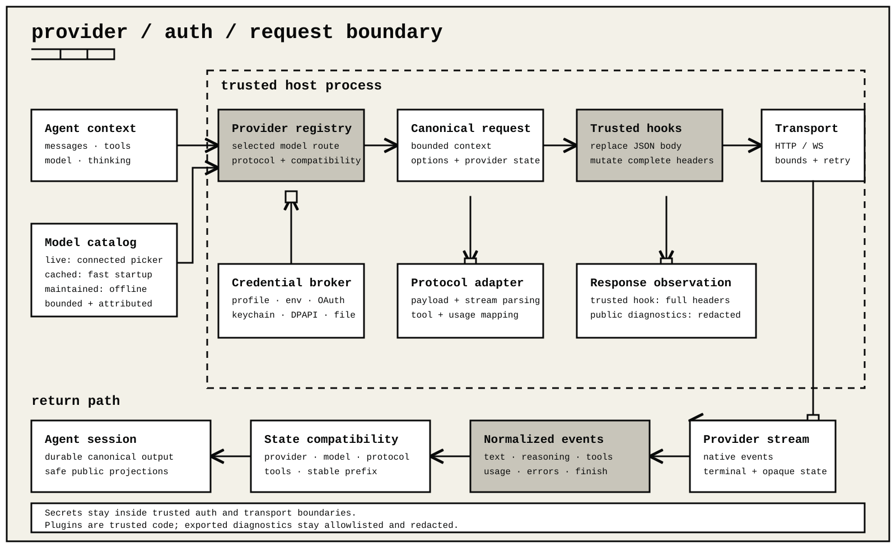

# Provider authoring

Trusted direct extensions can:

- add a provider;
- replace a provider for one extension generation;
- add a custom streaming implementation.

Provider declarations are executable trusted code. They do not belong in `config.json`. Never embed credentials in a package, model row, log, session entry, or diagnostic.



Use the public extension and model packages:

```ts
import type { ExtensionAPI, ProviderConfig } from "ohm/extensions";
import {
  createAssistantMessageEventStream,
  type Context,
  type Model,
  type Provider,
  type SimpleStreamOptions,
} from "@ohm/models";
```

## Registration forms

The compact form composes a `ProviderConfig` over the provider currently registered under the same ID:

```ts
export default function activate(ohm: ExtensionAPI): void {
  ohm.registerProvider("local-chat", {
    name: "Local chat",
    api: "openai-completions",
    baseUrl: "http://127.0.0.1:11434/v1",
    apiKey: "local-only",
    models: [{
      id: "model",
      name: "Model",
      reasoning: false,
      contextWindow: 8_192,
      maxTokens: 2_048,
      input: ["text"],
      cost: { input: 0, output: 0, cacheRead: 0, cacheWrite: 0 },
    }],
  });
}
```

The native form supplies the complete `@ohm/models` `Provider` object:

```ts
ohm.registerProvider(provider);
```

Both forms are generation-owned:

- successful refresh removes the old generation's registration and installs the new one;
- closing or unloading restores the provider that existed before the first replacement;
- `unregisterProvider(id)` removes this generation's registration early and restores the previous state.

Successive named registrations by the same active provider facade merge only fields whose new value is not `undefined`. A native registration replaces an earlier named registration, and a later named registration replaces a native one. Register a complete coherent configuration in one call unless a deliberate overlay is required.

## Named provider configuration

`ProviderConfig` has these fields:

| Field | Type | Behavior |
| --- | --- | --- |
| `name` | `string?` | Display name. Falls back to the previous provider name, then the provider ID. |
| `baseUrl` | `string?` | Default endpoint for declared models. It also rewrites inherited model endpoints when no replacement `models` array is supplied. |
| `apiKey` | `string?` | In-memory configuration credential. It marks the provider configured for the current runtime. Do not publish a real remote credential this way. |
| `api` | `Api?` | Default protocol identifier for models that omit `model.api`. |
| `streamSimple?` | `(model, context, options?) => AssistantMessageEventStream` | Replaces both ordinary and simplified generation for this provider. Required for a custom API identifier that has no built-in transport. |
| `headers` | `Record<string, string>?` | Static provider headers applied to API-key and OAuth requests. Later authentication, model, and per-call headers can override them. |
| `authHeader` | `boolean?` | When `true`, the named API-key resolver adds `Authorization: Bearer <resolved key>`. It does not rewrite a native provider's authentication contract. |
| `oauth` | `ExtensionOAuthConfig?` | Managed login, refresh, request-key derivation, and optional credential-conditioned model filtering. |
| `models` | `ProviderModelConfig[]?` | Exact static catalog. A new provider must supply it. |
| `refreshModels?` | `(context) => Promise<ProviderModelConfig[]>` | Refreshes the catalog. The returned array replaces the extension's current dynamic rows after validation. |

### Provider configuration values

`apiKey` and provider-level `headers` values may be literals, environment expressions, or commands. `$NAME` and `${NAME}` read one environment value, `$$` produces a literal `$`, and `$!` produces a literal `!`. Expansion is one pass. A command runs only when `!` is the original first character; whitespace before it makes the value literal.

Configuration commands run only while resolving authentication for a request. Catalog listing, availability checks, and status reporting never execute them, and configured commands are not cached between requests. They inherit the ambient process environment, then apply the stored provider credential's `env` values as overrides. Unsafe process-loader overrides are rejected. The host uses its configured shell when one is available, limits a command to 10 seconds and 64 KiB of output, trims outer stdout whitespace, and omits command output from failures. Internal newlines are preserved for keys, but resolved header values must remain single-line.

A durable API-key credential may store an `env` map and a key expression such as `$SCOPED_KEY`. Its saved environment takes precedence over the ambient environment. A successful stored command key result is cached only for that composed provider generation and shell policy; in-flight commands and provider-configuration commands are not shared. Resolved keys and configured secret headers are registered for redaction and stay outside the run-loop `ProviderRequest`. Host-owned adapters add private configured headers after extension-visible wire lifecycle interception at the final transport boundary.

A new provider requires `models`. Every resulting model must resolve an API and base URL from:

1. its own fields;
2. the provider config;
3. an inherited provider row.

`contextWindow`, optional `maxInputTokens`, and `maxTokens` must be positive. `maxInputTokens` is the provider's independent prompt-token ceiling; omit it when the provider does not publish one. If `streamSimple` is present and any declared model omits `api`, the provider-level `api` is required.

For an overlay of an existing provider:

- omitted fields inherit the original registration;
- a supplied `models` array replaces its catalog rather than appending rows;
- a supplied `refreshModels` runs after the inherited refresh and replaces the extension-owned dynamic rows;
- a supplied `streamSimple` handles every model selected through the composed provider;
- unloading restores the exact original provider and its previously available model snapshot.

The public low-level protocol identifiers are `openai-completions`, `openai-responses`, `azure-openai-responses`, `openai-codex-responses`, `anthropic-messages`, `bedrock-converse-stream`, `google-generative-ai`, and `google-vertex`. These identifiers describe wire adapters; they do not add provider identities to the built-in model picker. The direct boundary also recognizes the explicit protocol aliases `openai-chat-completions`, `bedrock-converse`, `gemini-generate-content`, `gemini-interactions`, and `ollama-chat`. `Api` permits a custom string; use one only with a matching custom stream. The core records an extension-owned custom stream as `extension-stream`; this is an internal continuation family, not a built-in network protocol.

## Model rows

Each `ProviderModelConfig` contains:

| Field | Type | Meaning |
| --- | --- | --- |
| `id` | `string` | Provider-owned model identifier. |
| `name` | `string` | Human-readable label. |
| `api` | `Api?` | Per-model protocol override. |
| `baseUrl` | `string?` | Per-model endpoint override. |
| `reasoning` | `boolean` | Whether the model exposes thinking-level selection. |
| `thinkingLevelMap` | `Partial<Record<ThinkingLevel, string \| null>>?` | Maps the seven public levels from `off` through `max` to provider values; `null` disables a level. |
| `input` | `Array<"text" \| "image">` | Accepted input modalities. |
| `cost` | `{ input, output, cacheRead, cacheWrite, tiers? }` | Rates per million tokens. |
| `contextWindow` | `number` | Total model context limit. |
| `maxInputTokens` | `number?` | Independent provider-published maximum prompt-token limit. |
| `maxTokens` | `number` | Maximum generated-token request. |
| `headers` | `Record<string, string>?` | Headers added for this model after resolved authentication. |
| `compat` | `Model<Api>["compat"]?` | Explicit protocol compatibility metadata. |

When `reasoning` is false, only `off` is available. For a reasoning model, `off` through `high` are available unless mapped to `null`; `xhigh` and `max` are available only when explicitly present with a non-null value. A string mapping is the exact provider value. The host clamps an unsupported saved selection to a supported level.

Cost tiers contain `inputTokensAbove` and a complete replacement set of four rates. The highest threshold below the billable input count wins. Billable input is ordinary input plus cache-read and cache-write tokens.

Compatibility metadata is protocol-specific:

- OpenAI-style completions models can declare `supportsStore`, `supportsDeveloperRole`, `supportsReasoningEffort`, `supportsUsageInStreaming`, `maxTokensField`, `requiresToolResultName`, `requiresAssistantAfterToolResult`, `requiresThinkingAsText`, `requiresReasoningContentOnAssistantMessages`, `reasoningOutputFormat`, `includeReasoning`, `reasoningFormat`, deprecated `thinkingFormat`, `chatTemplateKwargs`, `openRouterRouting`, `vercelGatewayRouting`, `zaiToolStream`, `supportsStrictMode`, `supportsOpenAIGrammarTools`, `cacheControlFormat`, `cacheControlTtl`, `sendSessionAffinityHeaders`, `deferredToolsMode`, `sessionAffinityFormat`, and `supportsLongCacheRetention`.
- Responses models can declare `supportsDeveloperRole`, `sessionAffinityFormat`, `supportsLongCacheRetention`, `supportsStrictMode`, `supportsOpenAIGrammarTools`, `supportsToolSearch`, `supportsExplicitPromptCacheMode`, `supportsPromptCacheBreakpoints`, `supportsReasoningSummaries`, and `exposesReasoningText`.
- Anthropic Messages models can declare `supportsEagerToolInputStreaming`, `supportsLongCacheRetention`, `sendSessionAffinityHeaders`, `supportsCacheControlOnTools`, `supportsTemperature`, `forceAdaptiveThinking`, `allowEmptySignature`, `supportsToolReferences`, `supportsStrictTools`, and `supportsThinkingDisplay`.
- Bedrock models can declare `supportsStrictMode` and `supportsPromptCaching`.

These flags assert exact wire behavior. Do not infer them from a model name or reuse metadata from a different endpoint.

## Refreshable catalogs

`refreshModels(context)` receives:

```ts
interface RefreshModelsContext {
  credential?: Credential;
  store: {
    read(): Promise<{ models: readonly Model[]; checkedAt?: number; etag?: string } | undefined>;
    write(entry: { models: readonly Model[]; checkedAt?: number; etag?: string }): Promise<void>;
    delete(): Promise<void>;
  };
  allowNetwork: boolean;
  force?: boolean;
  signal?: AbortSignal;
}
```

Honor `allowNetwork` and `signal`. A cache-only call must not make a request. The store is scoped to the provider and is the only supported catalog cache for this callback. Named-provider callbacks return model definitions; the host validates and installs them. Native-provider callbacks return `void` and must update the values later returned by `getModels()`.

Refresh failures are retained as provider diagnostics. The model runtime attempts a cache-only refresh after a network refresh fails, so the callback must be able to restore a prior valid cache without hiding the original error.

### Advanced routed runtime catalogs

Advanced `ohm/service` hosts can compose `RuntimeRoutedProviderConfig` delegates behind exact model routes. When `catalogAdapter` names one declared delegate, that delegate's authenticated `listModels(signal)` result filters the maintained route set by exact upstream model ID. It does not infer a protocol for new IDs, change a route's protocol, or turn deprecated rows into active models. Discovery errors and cancellation propagate, and the composed adapter retains ownership and disposal of every delegate. `credentialProvider` remains the one explicit credential binding for the routed provider unless a leaf deliberately overrides it.

## Named OAuth contract

The named compatibility object has these members:

| Member | Requirement |
| --- | --- |
| `name` | Display name for the authentication choice. |
| `isSubscription?` | Marks active OAuth authentication as subscription-backed for usage labeling. |
| `login(callbacks)` | Returns `Promise<OAuthCredentials>` after the interactive flow. |
| `refreshToken(credentials, signal?)` | Exchanges the current value for a complete replacement `OAuthCredentials` object. |
| `getApiKey(credentials)` | Derives the request secret as a string. |
| `modifyModels?(models, credentials)` | Optionally returns a credential-conditioned `Model[]` catalog. |

`OAuthCredentials` requires string `refresh` and `access` fields and a numeric `expires` field. Providers may retain
additional provider-owned values under other string keys.

`expires` is an absolute Unix time in milliseconds. The host:

1. adds the internal OAuth credential discriminator;
2. persists the returned object in the credential store;
3. serializes refreshes through that store;
4. calls `refreshToken` during the final five minutes of validity, or earlier
   when a caller requests a larger minimum-validity window.

`getApiKey` derives the request credential without exposing the stored object to tools or sessions. `modifyModels` runs only for an OAuth credential and must return a bounded subset or transformed copy of the supplied models.

`OAuthLoginCallbacks` provides:

| Callback | Contract |
| --- | --- |
| `onAuth({ url, instructions? })` | Announces a browser authorization URL. |
| `onDeviceCode({ userCode, verificationUri, intervalSeconds?, expiresInSeconds? })` | Announces a device flow. The extension owns bounded polling and cancellation. |
| `onPrompt({ message, placeholder?, allowEmpty? })` | Requests text. |
| `onProgress?(message)` | Emits progress without credentials. |
| `onManualCodeInput?()` | Requests a pasted authorization code. |
| `onSelect({ message, options: [{ id, label }] })` | Requests one option and may resolve `undefined`. |
| `signal?` | Cancels the login flow. |

Never log callback answers, access tokens, refresh tokens, authorization codes, client secrets, or derived headers. Validate authorization, token, and callback endpoints before connecting. Bound device polling by both expiry and cancellation.

An extension that needs a loopback callback server must own its server lifecycle, state verification, port bounds, timeout, and `onDispose` cleanup.

Automatic named `refreshToken` calls carry the requesting operation's optional
cancellation signal. Honor that signal and keep the provider request bounded.

## Native provider and authentication

A native `Provider<TApi>` is defined by four surface groups:

| Surface | Public contract |
| --- | --- |
| Identity | Read-only string `id` and `name`, with optional `baseUrl` and optional `headers: Record<string, string \| null>`. |
| Authentication | Read-only `auth: ProviderAuth`. |
| Catalog | `getModels()` returns `readonly Model<TApi>[]`; optional `refreshModels(context)` returns `Promise<void>`; optional `filterModels(models, credential)` returns a filtered read-only model list. |
| Streaming | Generic `stream(model, context, options?)` accepts `ApiStreamOptions<T>`; `streamSimple(model, context, options?)` accepts `SimpleStreamOptions`. Both return `AssistantMessageEventStream`. |

Every native model must already contain `provider`, `api`, and `baseUrl`. `filterModels` affects authenticated availability, not the provider's full `getModels()` catalog.

`ProviderAuth` can expose `apiKey`, `oauth`, `providerAccount`, or any supported combination:

```ts
interface ApiKeyAuth {
  name: string;
  login?(interaction: AuthInteraction): Promise<{ type: "api_key"; key?: string; env?: Record<string, string> }>;
  check?(input: { ctx: AuthContext; credential?: ApiKeyCredential }): Promise<AuthCheck | undefined>;
  resolve(input: { ctx: AuthContext; credential?: ApiKeyCredential }): Promise<AuthResult | undefined>;
}

interface OAuthAuth {
  name: string;
  loginLabel?: string;
  login(interaction: AuthInteraction): Promise<OAuthCredential>;
  refresh(credential: OAuthCredential, signal?: AbortSignal): Promise<OAuthCredential>;
  toAuth(credential: OAuthCredential): Promise<{ apiKey?: string; headers?: Record<string, string | null>; baseUrl?: string }>;
}

interface ProviderAccountAuth {
  name: string;
  loginLabel?: string;
  login(interaction: AuthInteraction): Promise<Credential>;
}
```

Use `providerAccount` when a provider-owned browser, device, CLI, or local-account ceremony returns the final credential ohm should store, but that credential is not itself an OAuth refresh envelope. For example, a browser exchange may mint an ordinary API key. The login menu presents the provider-account method separately from pasted keys while request authentication continues to use the returned credential's real type.

`AuthContext` exposes asynchronous environment lookup and `fileExists`. `AuthInteraction.prompt` accepts `text`, `secret`, `manual_code`, or `select` prompts and carries the active signal. `notify` accepts `info`, `progress`, `auth_url`, and `device_code` events.

The request-auth refresh path calls `refresh` without a signal, even though the native signature accepts one. A catalog refresh can forward its own signal. Bound every refresh request internally.

Authentication sources are selected in this order: an explicit per-call API key when the provider exposes API-key auth, a stored OAuth credential, a stored API-key credential, then the API-key resolver without a stored credential. Per-call environment values overlay the host environment seen by API-key resolution.

Headers are merged case-insensitively in this order:

1. `provider.headers`;
2. headers returned by `resolve` or `toAuth`;
3. `model.headers`;
4. per-call `options.headers`.

A later `null` value removes an earlier header. A returned auth `baseUrl` replaces the selected model URL for that request.

## Custom `streamSimple`

The callback receives the selected public model, a normalized public context, and `SimpleStreamOptions`:

```ts
interface Context {
  systemPrompt?: string;
  messages: Array<UserMessage | AssistantMessage | ToolResultMessage>;
  tools?: Array<{
    name: string;
    description: string;
    parameters: TSchema;
    constrainedSampling?: false | ConstrainedSamplingConfig;
  }>;
}
```

Provider-owned signatures and continuation state are replayed only when API, provider, and model still match their source. On a different source model, signed reasoning becomes portable text and signatures are removed. Treat every message, tool schema, and tool result as untrusted input.

`SimpleStreamOptions` contains:

| Field | Type |
| --- | --- |
| `temperature` | `number?` |
| `maxTokens` | `number?` |
| `signal` | `AbortSignal?` |
| `apiKey` | `string?` |
| `transport` | `("sse" \| "websocket" \| "websocket-cached" \| "auto")?` |
| `cacheRetention` | `("none" \| "short" \| "long")?` |
| `sessionId` | `string?` |
| `reasoning` | `("minimal" \| "low" \| "medium" \| "high" \| "xhigh" \| "max")?` |
| `thinkingBudgets` | Optional per-level numeric budgets |
| `toolChoice` | `("auto" \| "none" \| "required" \| { type: "function", function: { name } })?` |
| `onPayload` | `(payload, model) => replacementOrUndefined`, synchronously or asynchronously |
| `onResponse` | `(response, model) => void`, synchronously or asynchronously |
| `headers` | `Record<string, string \| null>?` |
| `timeoutMs` | `number?` |
| `websocketConnectTimeoutMs` | `number?` |
| `websocketIdleTimeoutMs` | `number?` |
| `maxRetries` | `number?` |
| `maxRetryDelayMs` | `number?` |
| `metadata` | `Record<string, unknown>?` |
| `env` | `Record<string, string>?` |
| `fetch` | `typeof fetch?` |

The custom implementation owns the meaning and enforcement of these options. When a callback is hosted through ohm's canonical provider boundary, `metadata` contains only string values; standalone `@ohm/models` callers may supply the broader public `Record<string, unknown>`. It must propagate `signal`, bound network and parsing work, enforce the applicable request and WebSocket idle timeouts, call `onPayload` before sending a provider-native body when it supports payload interception, and call `onResponse` when response status and headers become available.

Return an `AssistantMessageEventStream`, normally created with `createAssistantMessageEventStream()`. The event vocabulary is:

| Event | Required fields |
| --- | --- |
| `start` | `partial` |
| `text_start` | `contentIndex`, `partial` |
| `text_delta` | `contentIndex`, `delta`, `partial` |
| `text_end` | `contentIndex`, `content`, optional `contentSignature`, `partial` |
| `thinking_start` | `contentIndex`, `partial` |
| `thinking_delta` | `contentIndex`, `delta`, `partial` |
| `thinking_end` | `contentIndex`, `content`, optional `contentSignature` and `redacted`, `partial` |
| `toolcall_start` | `contentIndex`, `partial` |
| `toolcall_delta` | `contentIndex`, JSON fragment `delta`, `partial` |
| `toolcall_end` | `contentIndex`, complete `toolCall`, `partial` |
| `done` | `reason: "stop" \| "length" \| "toolUse"`, complete `message` |
| `error` | `reason: "aborted" \| "error"`, complete assistant message in `error` |

Every `partial` is an accumulated `AssistantMessage` snapshot. Its `stopReason` is `"pending"` until the provider establishes an outcome. Content indexes identify final content-array positions. A `toolCall` contains `{ type: "toolCall", id, name, arguments, thoughtSignature? }`, and `arguments` must be an object.

The host rejects normalized assistant output before it enters history when it exceeds any of these limits:

- 1,024 content blocks, a 1,024-byte tool-call ID, or a 256-byte tool name;
- 4 MiB for one text, thinking, signature, raw-argument, or serialized-argument field, and 8 MiB across retained content;
- 8,192 total content containers or 8,192 JSON values across all tool-call arguments; or
- 59 nested tool-argument container levels, 8,192 items in one argument array, or any sparse, accessor-backed, cyclic, or non-JSON argument value.

The terminal assistant message contains:

- `role: "assistant"`;
- complete text, thinking, and tool-call content;
- `api`, `provider`, and `model` matching the selected source;
- optional `responseModel`, `responseId`, diagnostics, and opaque provider state;
- optional non-negative usage components; omitted counters remain unavailable, reported zero remains zero, `totalTokens` is present only when reported or derivable from a protocol-safe split, and calculated cost requires every price-bearing counter;
- `stopReason`, optional `errorMessage`, and a millisecond timestamp.

Emit exactly one terminal `done` or `error`, and replace `"pending"` with the matching terminal reason before emission. The stream closes on that event and ignores later pushes. If the async sequence ends without a terminal event, the core adapter reports a retryable protocol failure. Final text and thinking must begin with the exact streamed prefix; a mismatch is rejected. A cancellation must finish with `error` and `reason: "aborted"`.

`AssistantMessageEventStream.result()` resolves to the terminal assistant message. `fail(error)` rejects that promise and closes iteration; prefer a structured terminal `error` event for provider failures that should enter the normal agent error path.

## Author checklist

Before shipping a provider extension, verify:

1. every model has an exact protocol, endpoint, modality, reasoning map, cost, and token limit;
2. authentication resolution and refresh never expose secrets through output or session state;
3. login and discovery honor cancellation and have explicit time, response-size, redirect, and polling bounds;
4. a cache-only refresh makes no network request;
5. streaming produces ordered accumulated snapshots and one terminal event;
6. tool-call JSON and terminal arguments agree;
7. signed provider state is replayed only at its exact source boundary;
8. repeated refresh neither duplicates registrations nor leaves sockets, servers, timers, or credential-bearing closures alive;
9. unloading restores the previous provider.
