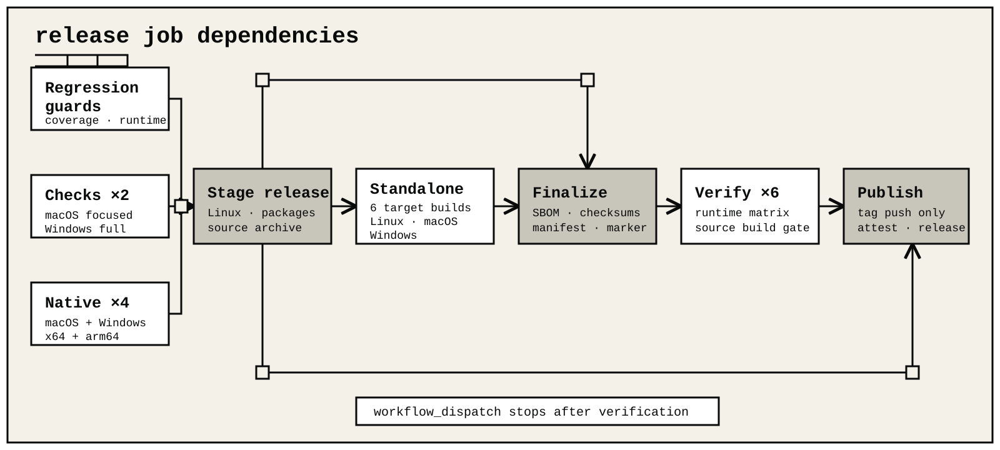

# Release policy and procedure

## Version policy

ohm uses `major.minor.patch` versions and `v<version>` Git tags. While the project is below 1.0:

- patch releases contain backward-compatible fixes, security updates, and documentation corrections;
- minor releases may add features and may contain a documented breaking change;
- every breaking change needs a `Breaking` changelog section and concrete migration steps;
- durable session-format or storage upgrade-floor changes, public subpath changes, CLI removals, and configuration incompatibilities are always release-impacting.

After 1.0, incompatible changes require a major version. Every final release
version and tag is immutable and is never reused.

The same version must appear in all four release workspace manifests, their internal dependency pins,
`package-lock.json`, `packages/ohm/src/version.ts`, the changelog heading, and the Git tag. `Unreleased` stays at
the top of the changelog. The first release uses an `Added` summary. Later releases classify release-visible work under
`Added`, `Changed`, `Fixed`, `Security`, `Deprecated`, `Removed`, or `Breaking`.

## Distribution model

Every release contains four npm-compatible package archives, six standalone runtime archives, and one versioned
source archive. The package archives follow dependency order: `@ohm/terminal`, `@ohm/models`, `@ohm/kernel`,
then `ohm`.

JavaScript and declarations are platform-neutral. npm resolves their pinned native production dependencies for the
consumer's operating system and architecture. The `@ohm/terminal` archive carries six native artifacts declared by
`packages/terminal/native/targets.json`: four N-API modules plus a Security-framework Keychain executable for each
macOS architecture. The `@ohm/kernel` archive carries the x64 and arm64 Windows Job Object launchers declared by
`packages/kernel/native/targets.json`. Matching macOS and Windows workers build and exercise their artifacts before
staging. Staging waits until all 8 native artifacts are at their declared package paths.

The source archive is `ohm-v<version>-source.tar.gz`, rooted at `ohm-v<version>/`. `git archive` creates it from
the exact release commit, not from the mutable workflow checkout. gzip metadata is normalized. Dependencies, build
directories, and generated native binaries are excluded.

Staging rejects an archive that escapes its versioned root. It also rejects one that omits the root lockfile,
workspace source and build inputs, native helper sources, or private source installer. The release manifest records
the commit, SHA-256, size, filename, and archive root.

Each target worker verifies the four staged package digests, projects their reachable production closure from the
committed root `package-lock.json`, and injects the staged archive filenames and SHA-512 integrities into a generated
package-lock v3. `npm ci` installs that lock with development and peer dependencies omitted and target-matching
optional dependencies included. No target performs fresh dependency selection. The worker copies the pinned official
Node 26.7.0 runtime and license, records the generated lock as `PRODUCTION-LOCK.json`, and records a canonical digest
of every installed package path, executable bit, and file byte in `PRODUCTION-CONTENT.json`. Before archiving, the
worker verifies the installed graph, runs real version, help, offline RPC, sharp image, and bundled ripgrep checks,
and creates a deterministic `tar.gz`.

The finalization job verifies every target sidecar and checksum. It generates `ohm-v<version>.spdx.json` from the
committed root lock with `npm sbom --sbom-format spdx --package-lock-only`, validates its SPDX 2.3 document, package
identities, and complete relationship graph, and adds it to
`SHA256SUMS` and the staging ownership marker. The SBOM is a separate release asset. It describes the complete
lockfile dependency graph. It does not claim that every development dependency is present in each platform archive.

The verification matrix extracts the matching archive, independently regenerates the expected production lock from
the committed workspace lock and staged archive integrities, and requires both the embedded lock and extracted
package graph to match it. It recomputes the content digest from the extracted standalone, runs its native image and
ripgrep capabilities directly, and requires a second locked `npm ci` to produce the same installed bytes. It also
checks public imports and the packed terminal helper. A macOS verifier loads its terminal and Keychain helpers; a
Windows verifier loads its terminal helper and kernel Job Object launcher for its own architecture.

Artifact assembly prefers the runner's npm cache. When a locked production package is missing from that cache, npm
fetches it from the exact registry archive URL recorded with its version and SHA-512 integrity in the committed lock.
Credential variables are removed from this install environment. The completed standalone runtime checks are offline
and do not need registry or provider access.

The staged output contains:

- `ohm-terminal-<version>.tgz`, `ohm-models-<version>.tgz`, `ohm-kernel-<version>.tgz`, and `ohm-<version>.tgz`;
- `ohm-v<version>-source.tar.gz`;
- `ohm-v<version>-<platform>-<arch>.tar.gz` for every declared target;
- `ohm-v<version>.spdx.json`;
- `SHA256SUMS`;
- `release-manifest.json` schema 4, preserving updater compatibility and recording npm integrity, package and source archive metadata, the Node range, the exact embedded Node version, and verified targets;
- `RELEASE_NOTES.md`, extracted from the matching changelog section;
- `.ohm-release-output.json`, which marks the directory as staging-owned before a later run may replace it.

Each standalone archive contains its target-projected installed modules, the common `PRODUCTION-LOCK.json`, and its
target-specific `PRODUCTION-CONTENT.json`. The lock retains all six targets' optional package entries; npm's `os`,
`cpu`, and `libc` selectors determine the exact installed subset. Verification rejects missing applicable optional or
required packages, mismatched versions, untracked additions, and installed-byte drift.

Staging refuses to replace a directory without that exact ownership marker. It swaps a completed staging directory
into place without first deleting the previous output. The package, source, and standalone archive inputs contain no
host path, credentials, or generated release prose. The SBOM keeps its standard generation metadata.

The archives are built once and attached to GitHub Releases only after verification. All four first-party package
manifests are registry-private. The `.tgz` format supports installation and verification, not npm registry
publication.

## Maintainer checklist

1. Move classified entries from `Unreleased` into a dated `[version]` section.
2. Update the four release workspace manifests, their internal dependency pins, `package-lock.json`, and `packages/ohm/src/version.ts` together.
3. Review migrations, public API changes, provider behavior, security impact, and platform notes.
4. On macOS or Windows, run `npm run native:build --workspace @ohm/terminal` so local verification has matching terminal artifacts. On Windows also run `npm run native:build --workspace @ohm/kernel` for the Job Object launcher. macOS requires both `cc` and `swiftc`; Windows requires an architecture-matching MSVC developer shell. Then run `npm run check`, `npm run test:coverage:risk`, and `npm run benchmark:release-offline`; the offline release evaluation composes harness outcomes, runtime performance, and focused high-risk release contracts into one report, while risk coverage remains the source-level threshold guard. Run `npm run release:stage` only after collecting all 8 native artifacts; the release workflow does this automatically. A local standalone build also requires the official Node 26.7.0 distribution root and uses `npm run release:standalone -- --directory .release --output .standalone --runtime-root <node-root>`.
5. Inspect `.release/RELEASE_NOTES.md`, `.release/release-manifest.json`, the SPDX SBOM, the versioned source archive, and `SHA256SUMS`.
6. Push the reviewed commit to `main`, dispatch `release.yml` manually for `main`, and confirm the run's head SHA is
   that exact commit. Require every regression, native-build, staging, standalone, and six-platform verification job
   to pass; manual dispatch does not publish a release.
7. Create and push `v<version>` at that already verified commit. Do not move or reuse a published tag.
8. Let the tag-triggered release workflow repeat the complete verification set and publish only its attested output.

The release workflow uses these job dependencies:



Risk-coverage and runtime-performance guards, the remaining platform checks, and the four native jobs run
independently. All three paths must pass before staging. Every job uses Node 26.7.0. Linux staging and the Windows
platform leg run the exhaustive check; the focused macOS leg builds the workspace, verifies the native terminal and
Keychain helpers, runs the kernel checks, and exercises the credential, process, path, lock, and session boundaries.
Each native target directory is uploaded, downloaded into its declared package path, and checked as part of the
complete 8-artifact set before `npm pack --ignore-scripts`.

Six target workers then build and execute their own standalone archives. No target result is inferred from another
host. The finalization job combines the staged and standalone files and creates the SBOM and final checksums. Six
target verifiers inspect the finalized release. The Linux x64 verifier also extracts the source archive into a clean
directory, installs from its lockfile, and builds the complete monorepo.

On a tag push, the publish job creates or updates a draft GitHub release and uploads the finalized files. It uses the
commit-pinned GitHub attestation action to create Sigstore-signed SLSA build provenance for every `SHA256SUMS`
subject. It also creates an SPDX 2.3 SBOM attestation for the source archive described by the workspace SBOM. The
release becomes public only after every platform and both attestation steps succeed.

When a failed publication is retried, the workflow first confirms that the existing release is still a draft and
removes its prior assets. After uploading, it requires the draft asset names to match the finalized manifest exactly.
An unexpected, missing, or duplicate asset stops publication.

The SBOM file is covered by `SHA256SUMS` and receives build provenance. It is not a subject of its own SBOM predicate.
Only the publish job receives `contents: write`, `id-token: write`, `attestations: write`, and
`artifact-metadata: write`; all other jobs keep repository-content read access. The workflow has no npm publication
step, registry configuration, npm token, or npm publication permission.

GitHub Releases are the only first-party distribution channel. A release contains the complete four-archive package
graph and standalone archives that need neither Node.js nor npm. Publishing requires no npm account, registry token,
or trusted-publisher configuration.

Manual workflow dispatch performs the regression guards, staging, and full platform verification without publishing a GitHub release.

## Verify a published release

Download `SHA256SUMS`, the SBOM, and the artifact you plan to use from one tag. Then verify the bytes locally:

```sh
tag=v0.1.0
artifact=ohm-v0.1.0-linux-x64.tar.gz
source=ohm-v0.1.0-source.tar.gz
gh release download "$tag" --repo devsohm/ohm --pattern SHA256SUMS --pattern '*.spdx.json' --pattern "$artifact" --pattern "$source"
sha256sum --check --ignore-missing SHA256SUMS
```

Verify each selected artifact's build provenance. Confirm that the signer is this repository's release workflow and
that the source ref is the selected release tag:

```sh
gh attestation verify "$artifact" \
  --repo devsohm/ohm \
  --signer-workflow devsohm/ohm/.github/workflows/release.yml \
  --source-ref "refs/tags/$tag"

gh attestation verify "$source" \
  --repo devsohm/ohm \
  --signer-workflow devsohm/ohm/.github/workflows/release.yml \
  --source-ref "refs/tags/$tag" \
  --predicate-type https://spdx.dev/Document/v2.3
```

The first command verifies the default SLSA provenance predicate. Repeat it for every other `SHA256SUMS` subject you
use. The second command verifies the workspace SPDX predicate for the matching source archive. Standalone and package
archives do not claim that workspace-wide predicate. A valid signature authenticates the workflow identity and binds
the predicate to the artifact digest. It does not replace review of the SBOM or source.

## Failure handling

Never publish a rebuilt archive under an existing version. If staging or platform verification fails, fix the source
and create a new commit before tagging. If draft creation or asset upload fails, rerun the same tagged commit. The
workflow will resume the existing draft with the same verified source. If released bytes are wrong, document the
issue and release a new version.
