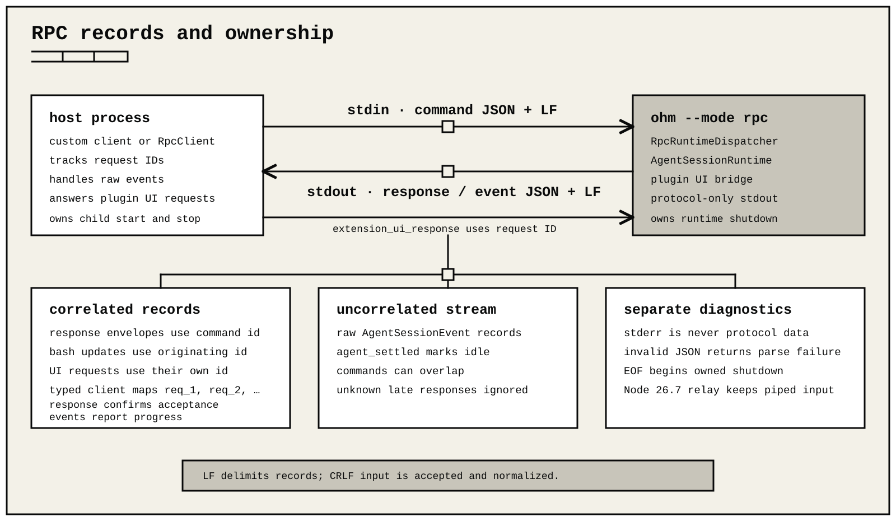

# RPC protocol and typed client

Run `ohm --mode rpc` to control one ohm runtime from another process. Standard input accepts commands and extension UI responses. Standard output emits command responses, raw agent events, shell updates, and extension UI requests.

RPC has no protocol-specific MCP command and no subagent command, event, or
handle family. Extension-owned bridges and delegation workflows appear as
ordinary registered tool calls. Any server transport or delegated child
process is owned and bounded by that extension rather than projected into the
RPC protocol as another session.

The command-line RPC host does not synthesize per-tool approval prompts. A Node.js host invoking `main([...], { toolAuthorizationHandler })` can install the same host-owned authorization callback used by the SDK; it is forwarded to every initial and replacement RPC session. Omission preserves allow behavior. See [SDK composition](sdk.md#host-owned-tool-authorization).



Every protocol record is one UTF-8 JSON object. Output records end with LF.

## Transport

- Split records on `\n` only. U+2028 and U+2029 remain ordinary JSON-string characters.
- CRLF input is accepted and normalized to the same record text as LF input.
- The platform UTF-8 decoder replaces malformed byte sequences.
- A final non-empty record is accepted without a newline. Blank records are ignored.
- Input and output records are limited to 16 MiB of UTF-8 JSON, excluding the final LF. An oversized output fails before any bytes are written.
- Standard output is protocol-only. Human diagnostics use standard error.
- Commands can overlap and events can interleave. Match responses with the optional string `id`.
- Raw agent events do not carry the command ID. `bash_execution_update` is the exception.

A successful response is:

```json
{"id":"req_1","type":"response","command":"get_state","success":true,"data":{}}
```

A failed response is:

```json
{"id":"req_1","type":"response","command":"get_state","success":false,"error":"reason"}
```

An unknown command keeps its `id` and command name in the failure response. Invalid JSON produces a failure with command `parse` and no ID.

Success responses omit `data` for commands whose result is `void`. Failure responses never contain `data`. Error strings are diagnostic data; consumers should avoid persisting them indiscriminately.

## Node.js client

`RpcClient` starts the packaged CLI with the current Node.js executable. `start()` waits for the child process `spawn` event, which is the protocol's transport-readiness boundary; RPC has no handshake record and the client does not send a hidden probe command. It rejects pending commands if the child exits or its input fails. Every non-response record is delivered to `onEvent()` listeners.

```ts
import { RpcClient } from "ohm/interfaces";

const client = new RpcClient({
  cwd: process.cwd(),
  provider: "YOUR_PROVIDER",
  model: "YOUR_MODEL",
});

await client.start();
const off = client.onEvent((event) => {
  console.log(event.type);
});

const events = await client.promptAndWait("Inspect package.json");
console.log(events.at(-1)?.type);

off();
await client.stop();
```

Construction options are:

| Option | Contract |
| --- | --- |
| `cliPath` | Compiled CLI entry point; defaults to the entry bundled with `ohm/interfaces`. |
| `cwd` | Child-process working directory. |
| `env` | Values overlaid on `process.env` for the child. |
| `provider`, `model` | Added as initial CLI selection arguments. |
| `args` | Additional CLI arguments appended after the generated RPC arguments. |

The public state is `started` and `pendingRequestCount`. `started` is true while the owned child is starting, running, or stopping, and false after it exits. Starting again after an exit first finishes bounded cleanup of the previous process tree. Lifecycle and observation methods are `start()`, `stop()`, `onEvent(listener)`, `respondToExtensionUi(response)`, and `getStderr()`. Every protocol command has a camel-case method: `prompt`, `steer`, `followUp`, `abort`, `clearQueue`, `newSession`, `getState`, `getRecoveryStatus`, `recoverInterruptedRun`, `setModel`, `cycleModel`, `getAvailableModels`, `setThinkingLevel`, `cycleThinkingLevel`, `getAvailableThinkingLevels`, `setSteeringMode`, `setFollowUpMode`, `compact`, `setAutoCompaction`, `setAutoRetry`, `abortRetry`, `bash`, `abortBash`, `getSessionStats`, `exportHtml`, `switchSession`, `fork`, `clone`, `getForkMessages`, `getEntries`, `getEntriesPage`, `getTree`, `getTreePage`, `getLastAssistantText`, `setSessionName`, `getMessages`, `getMessagesPage`, and `getCommands`.

`onEvent()` receives the exact `RpcStreamEvent` union: `AgentSessionEvent`, `RpcBashExecutionUpdate`, `RpcExtensionUiRequest`, or `RpcExtensionErrorEvent`.

The event helpers are `waitForIdle(timeout?)`, `collectEvents(timeout?)`, and `promptAndWait(message, images?, timeout?)`. `promptAndWait()` subscribes before sending the prompt, so it cannot miss a fast completion. All three settle on the raw `agent_settled` event, after terminal cleanup and queued work have finished; their default timeout is 60 seconds. At most 256 event waiters may be active. A collection retains at most 4,096 records or 32 MiB of wire records; use `onEvent()` to consume a larger stream incrementally.

The client assigns process-local IDs `req_1`, `req_2`, and so on. Each command has a fixed 30-second response timeout, and at most 64 commands may await responses concurrently. The client rejects a correlated response whose command or data envelope does not match the request. Late and unmatched response records remain ignored.

A client timeout rejects and forgets the request. It does not cancel server work. A late or unmatched response is ignored and is never delivered as a `RpcStreamEvent`.

A failure response rejects the typed method with a bounded, secret-redacted `response.error`. Process exit, process error, a broken input pipe, or `stop()` rejects every pending request. Diagnostic errors retain only bounded, redacted stderr; `getStderr()` exposes the raw bounded 64 KiB tail when a caller explicitly needs it.

`respondToExtensionUi()` writes one typed `extension_ui_response` record without creating a pending command or waiting for an acknowledgement. Match its ID to the request observed through `onEvent()`.

## Commands

All command records have an optional string `id` and a `type`.

An input image is `{ type: "image", mimeType, data }`. `data` is canonical base64 content without whitespace.

### Prompting and queues

| Type | Fields | Result |
| --- | --- | --- |
| `prompt` | `message`, `images?`, `streamingBehavior?` | Acknowledged after prompt preflight succeeds; agent events follow. |
| `steer` | `message`, `images?` | Queues steering input for the active run. |
| `follow_up` | `message`, `images?` | Queues follow-up input. |
| `abort` | none | Cancels the active operation and waits for it to settle. |
| `clear_queue` | none | Removes and returns the steering and follow-up text arrays. |
| `set_steering_mode` | `mode` | Selects `all` or `one-at-a-time`. |
| `set_follow_up_mode` | `mode` | Selects `all` or `one-at-a-time`. |

When `prompt.streamingBehavior` is `steer` or `followUp`, a prompt received during an active run is queued through that path and acknowledged. Without it, a second simultaneous prompt fails. Model and thinking changes leave the active accepted operation on its original tuple. Steering stays with that operation; a queued follow-up uses the atomically selected tuple when its own operation is accepted.

### State, model, and thinking

| Type | Fields | Result data |
| --- | --- | --- |
| `get_state` | none | `RpcSessionState` described below. |
| `set_model` | `provider`, `modelId` | The selected public `Model`; selection is session-only and does not rewrite the configured default. |
| `cycle_model` | none | The next model, effective thinking level, and whether the active scope was used; `null` when fewer than two candidates exist. |
| `get_available_models` | none | `{ models: Model[] }`. |
| `set_thinking_level` | `level` | none |
| `cycle_thinking_level` | none | `{ level }` or `null`. |
| `get_available_thinking_levels` | none | `{ levels }`. |

`RpcSessionState` is a closed, flat record. Its fields are grouped below for readability:

| Group | Fields and values |
| --- | --- |
| Selection | Optional public `model: Model`; `thinkingLevel` is `off`, `minimal`, `low`, `medium`, `high`, `xhigh`, or `max`. |
| Active work | Boolean `isStreaming` and `isCompacting` flags, plus optional `suspendedRun` recovery status. |
| Message delivery | `steeringMode` and `followUpMode`, each set to `all` or `one-at-a-time`. |
| Session identity | Required string `sessionId`, plus optional string `sessionFile` and `sessionName`. |
| Automation | Boolean `autoCompactionEnabled`. |
| Counts | Numeric `messageCount` and `pendingMessageCount`. |

### Compaction, retry, and shell

| Type | Fields | Result data |
| --- | --- | --- |
| `compact` | `customInstructions?` | The completed compaction run. |
| `set_auto_compaction` | `enabled` | none |
| `set_auto_retry` | `enabled` | none |
| `abort_retry` | none | none |
| `bash` | `command`, `excludeFromContext?` | Streams correlated updates, then returns shell output, exit code, cancellation, and truncation metadata. |
| `abort_bash` | none | none |

While `bash` runs, its merged stdout/stderr is emitted in order:

```json
{"type":"bash_execution_update","id":"req_1","delta":"building...\n"}
```

The update `id` is the originating command ID and is omitted when that command had no ID. Each delta is at most 64 KiB of UTF-8 text. A command emits at most 8 MiB across at most 2,048 update records; if further live output is omitted, the final update has `"truncated":true`. When `fullOutputPath` is present, it identifies the complete persisted artifact; otherwise the bounded final response `{ output, exitCode, isError?, cancelled, timedOut?, signal?, truncated, fullOutputPath? }` is authoritative. All queued updates are written before the final `bash` response. RPC does not expose a per-command shell timeout, so server execution is unbounded unless an extension-provided `BashOperations` implementation applies one. The RPC client's separate response deadline does not cancel server work.

### Sessions

| Type | Fields | Result data |
| --- | --- | --- |
| `new_session` | `parentSession?` | `{ cancelled }`. |
| `switch_session` | `sessionPath` | `{ cancelled }`. |
| `fork` | `entryId` | `{ text, cancelled }`; the selected user text can be restored to an editor. |
| `clone` | none | Clones through the current leaf and returns `{ cancelled }`. |
| `get_fork_messages` | none | `{ messages: Array<{ entryId, text }> }`. |
| `get_entries` | `since?`, `afterSequence?`, `limit?` | A bounded append-order entry page plus cursor and current-leaf metadata. |
| `get_tree` | `cursor?`, `limit?` | A bounded append-order page of tree fragments plus current-leaf and continuation metadata. |
| `get_session_stats` | none | `AgentSessionStats`: session identity; message/tool counts; normalized usage; token totals; cost; usage breakdown; and optional context use. |
| `get_last_assistant_text` | none | `{ text }`, using `null` when absent. |
| `set_session_name` | `name` | none |
| `export_html` | `outputPath?` | `{ path }`. |
| `get_messages` | `cursor?`, `limit?` | A bounded page of public `AgentMessage` values reconstructed from the current branch. |

Session replacement runs the same extension cancellation guards and lifecycle teardown as the interactive host. Successful replacement rebinds extensions and raw event delivery to the new session before the response is returned.

In `get_session_stats`, message, tool, usage, token, cost, and breakdown fields
describe the complete journal. Cache-waste fields follow the active branch
because only that prompt sequence is comparable. The optional
`cacheHitPercent` is a whole-journal main/summary rate and is omitted unless
every included usage record has complete nonzero-denominator prompt-cache
telemetry.

Exactness is independent for each usage counter. A successful metered
assistant or native summary with no usage makes the affected exact total
unavailable; failed, cancelled, or aborted no-usage attempts and hook-created
no-usage summaries do not. A `*Reported` field is the known partial sum when
some but not all contributing scopes reported that counter. A
provider-reported `totalTokens` remains exact independently of incomplete component counters;
otherwise a total is derived only from a complete protocol-safe split. Exact
and `*Reported` cost fields follow the same rule. This is the same public
contract as [`AgentSessionStats`](sdk.md#sessions-and-events).

Optional `contextUsage` includes `source: "provider" | "estimated"` and
`autoCompactionThresholdPercent` in addition to tokens, window, and percent.
Estimated values include projected transcript or tool-definition changes; the
threshold is the active automatic-compaction trigger.

Without paging fields, `get_entries`, `get_tree`, and `get_messages` return the complete compatible response when it fits the RPC line budget. If it does not fit, the server asks the caller to request bounded pages instead of silently truncating history. A supplied `limit` must be from 1 through 2048. For `get_entries`, use either the stable exclusive entry ID in `since` or the prior page's `nextSequence` in `afterSequence`; supplying both is an error. The response also includes `sequenceStart`, `nextSequence`, `hasMore`, and `totalEntries`. `RpcClient.getEntries(since?)` follows pages and returns `{ entries, leafId }`. Use `getEntriesPage()` when the caller owns pagination.

`get_tree` and `get_messages` use the same default and maximum page sizes. Start without `cursor`, then pass `nextCursor` until `hasMore` is false. A cursor is valid only for the unchanged session, selected leaf, and entry snapshot that created it. The server rejects malformed, stale, cross-command, and out-of-range cursors. The client also rejects missing or repeated continuations. `get_tree.tree` contains append-order fragments whose `children` include only nodes present in that page; use each entry's `parentId` to assemble the complete tree. The typed `RpcClient.getTree()` validates duplicate IDs, missing parents, cycles, totals, and the leaf while assembling pages. `getTree()` and `getMessages()` retain at most 32,768 items or 32 MiB of wire records, as does `getEntries()`. `getEntriesPage()`, `getTreePage()`, and `getMessagesPage()` are the bounded escape hatches for larger histories.

Durable extension `custom` and `custom_message` entries, including custom messages returned by `get_messages`, retain their optional provenance envelope through the structurally safe RPC projection. `RpcSessionEntry`, `RpcSessionTreeNode`, and `RpcAgentMessage` expose that envelope in the public RPC types. It identifies the owning extension generation with `schemaVersion`, `extensionId`, and `sourceSha256`, plus package version and digest fields when available.

All three history commands also stop a page before its item payload exceeds 8 MiB. This leaves room for the response envelope under the shared 16 MiB record limit. If one history item exceeds the page budget by itself, the command returns a failure instead of writing a partial record.

### Interrupted-run recovery

| Type | Fields | Result data |
| --- | --- | --- |
| `get_recovery_status` | none | The suspended-run status, or `null`. |
| `recover_interrupted_run` | `resolutions?` | `{ recovered, operationId?, blocked }`. |

Call `recover_interrupted_run` without resolutions first. ohm repeats only
verified repeatable work and runs registered reconciliation handlers. If
`recovered` is false, each `blocked` entry contains the effect ID, tool name,
and reason.

Each explicit resolution is `{ effectId, outcome, result? }`. `outcome` is
`succeeded`, `failed`, or `abandoned`. A `succeeded` or `failed` resolution
requires a bounded tool result whose `isError` value matches the outcome.
`abandoned` records a deliberate decision not to replay the effect and does
not require a result. Verify external state before sending any resolution.

### Discoverable commands

`get_commands` returns `{ commands }` containing extension commands, prompt templates, and skills. Each record is `{ name, description?, source, sourceInfo }`, where `source` is `extension`, `prompt`, or `skill` and `sourceInfo` contains `path`, `source`, `scope`, `origin`, and optional `baseDir`.

## Raw events

Agent events and `bash_execution_update` records are emitted directly, not wrapped in an RPC notification envelope. The session event records are:

| Event | Fields after `type` |
| --- | --- |
| `agent_start` | none |
| `agent_end` | `messages`, `willRetry` |
| `agent_settled` | none |
| `turn_start` | `turnIndex`, `timestamp` |
| `turn_end` | `turnIndex`, `message`, `toolResults` |
| `message_start` | `message` |
| `message_update` | accumulated `message`, provider-neutral `assistantMessageEvent` |
| `message_end` | `message` |
| `tool_execution_start` | `toolCallId`, `toolName`, `args` |
| `tool_execution_update` | same identity plus `partialResult` |
| `tool_execution_end` | same identity plus `result`, `isError` |
| `compaction_start` | `reason: "manual" \| "threshold" \| "overflow"` |
| `compaction_end` | `reason`, `result?`, `aborted`, `willRetry`, `errorMessage?` |
| `auto_retry_start` | `attempt`, `maxAttempts`, `delayMs`, `errorMessage` |
| `auto_retry_end` | `success`, `attempt`, `finalError?` |
| `summarization_retry_scheduled` | `attempt`, `maxAttempts`, `delayMs`, `errorMessage` |
| `summarization_retry_attempt_start` | `source: "branchSummary"`, or `source: "compaction"` with `reason` |
| `summarization_retry_finished` | none |
| `queue_update` | `steering: string[]`, `followUp: string[]` |
| `entry_appended` | projected public session `entry` |
| `session_info_changed` | optional `name` |
| `thinking_level_changed` | `level` |

For `toolcall_delta`, consume `assistantMessageEvent.delta` as the guaranteed
live argument representation. Parsed tool-call `arguments` are authoritative
at `toolcall_end` and `tool_execution_start`, after the JSON is complete.

Tool arguments are emitted only on `tool_execution_start`; correlate later updates and completion by `toolCallId`.

A prompt success response confirms preflight acceptance, not completion. `agent_end` closes one agent run but can be followed by retry or queued work. `agent_settled` is the authoritative idle boundary after cleanup, compaction, retry, and queued follow-up handling.

An extension failure is emitted as `{ type: "extension_error", extensionId,
extensionPath, event, error }`. The redacted fields are bounded to 1,024 UTF-8
bytes for `extensionId` and `event`, and 4,096 bytes for `extensionPath` and
`error`; host-owned or otherwise unattributed failures use `runtime`. Extension
UI request records are described next.

## Extension UI

An extension can emit:

| Method | Request fields after `type`, `id`, `extensionId`, and `method` | Blocking response |
| --- | --- | --- |
| `select` | `title`, `options: string[]`, `timeout?` | `value` or cancellation |
| `confirm` | `title`, `message`, `timeout?` | `confirmed` or cancellation |
| `input` | `title`, `placeholder?`, `timeout?` | `value` or cancellation |
| `editor` | `title`, `prefill?` | `value` or cancellation |
| `notify` | `message`, `notifyType?` | none |
| `setStatus` | `statusKey`, `statusText?` | none |
| `setWidget` | `widgetKey`, `widgetLines?`, `widgetPlacement?` | none |
| `setTitle` | `title` | none |
| `paste_editor_text` | `text` | none |
| `set_editor_text` | `text` | none |

Each output record has `type: "extension_ui_request"`, a unique string `id`, and the owning `extensionId`. The identity is limited to 1,024 UTF-8 bytes and is independent of the opaque presentation ownership keys described below. Reply to a blocking request with exactly one of:

```jsonl
{"type":"extension_ui_response","id":"REQUEST_ID","value":"selection or text"}
{"type":"extension_ui_response","id":"REQUEST_ID","confirmed":true}
{"type":"extension_ui_response","id":"REQUEST_ID","cancelled":true}
```

Raw terminal input, arbitrary terminal components, custom overlays, autocomplete providers, and theme switching are not serialized in RPC mode.

The RPC client applies `paste_editor_text` at its active editor cursor, while
`set_editor_text` replaces the complete draft. The bridge cannot observe edits
or cursor movement owned by the client, so `getEditorText()` reflects only the
last ohm-originated replacement. RPC advertises `editorTextWrite` but leaves
`editorTextRead` false.

`select`, `confirm`, and `input` accept integer timeouts from 1 through 3,600,000 milliseconds. `editor` has no RPC timeout field. Cancellation, timeout, host shutdown, or a failed request write resolves `select`, `input`, and `editor` as `undefined` and `confirm` as `false`. A response with an unknown or already-settled ID is ignored. Presentation request IDs are not awaiting responses.

The bridge admits at most 64 unanswered dialogs and serializes extension UI
records so a blocked output writer cannot accumulate an unbounded write chain.
The 16 MiB RPC line limit is also enforced across retained state. Unanswered
dialog request snapshots share 16 MiB. Current status/widget/editor state and
outstanding owner-cleanup records share another 16 MiB. Backpressured output
uses separate 16 MiB lanes for ordinary presentation, required dialog writes,
and owner cleanup, bounding those active and queued records to 48 MiB total.
Up to 512 ordinary presentation records may wait behind the active write.
Queued status, widget, title, and editor-replacement records coalesce by their
logical key so the latest value is retained. At capacity, additional
notifications are dropped; another non-coalescible presentation call throws a
`RangeError`. Already-admitted dialogs and generation-owned status or widget
removals have reserved bounded capacity, so ordinary notification pressure does
not prevent their completion or cleanup. Status and widget state retain at most
512 owners in total; replacing or removing an existing key releases or reuses
that capacity.

`statusKey` and `widgetKey` are opaque host-namespaced ownership keys, not the
extension's unqualified local key. Status text and widget lines are omitted to
remove the corresponding presentation value, and generation shutdown emits
removals for any keys that generation still owns. Only string-array widgets cross
this bridge; component factories, custom UI, background/header/footer changes,
working indicators, editor components, and autocomplete providers are
unavailable. The RPC context uses a non-color mono theme, reports no alternate
themes, and rejects theme switching.

## Shutdown

Closing standard input shuts down the owned session and its runtime generation. `RpcClient.stop()` is idempotent and terminates the owned process tree through the shared platform lifecycle helper. POSIX uses a detached process group and bounded `SIGTERM`/`SIGKILL` escalation. Windows uses bounded `taskkill /T /F` while the root PID is live and never targets that PID after its exit. The supported Node.js runtime relays file descriptor 0 through a bounded child process to avoid an inherited-stdin regression; this does not change protocol records.
