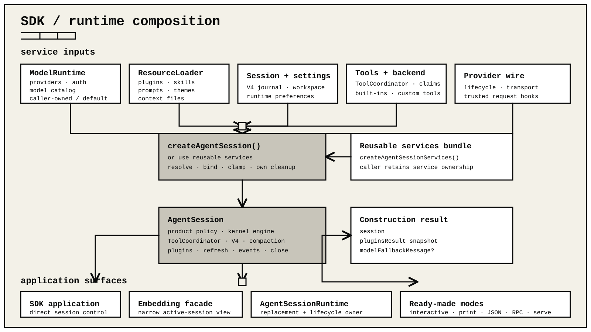

# SDK

`ohm/sdk` creates one directly composed `AgentSession`. It uses the same
kernel runtime engine, `ToolCoordinator`, V4 session manager, resource loader,
provider and model runtime, plugins, settings, compaction, and retry policy
as the command-line modes. It does not create another agent loop.
It also does not allocate a terminal or write to stdout or stderr: the embedding
host owns output, process signals, and the session lifetime.

## Install the public package graph

This branch documents the forthcoming 0.2.0 API. The download command below
applies after that release is published. For branch testing before release,
install the locally staged four-archive package graph from the same build.

The SDK packages are distributed through GitHub Releases rather than the npm
registry. Download `SHA256SUMS` and the four package archives for one version,
verify them together, and install the complete graph in one npm invocation:

```sh
version=0.2.0
gh release download "v$version" --repo devsohm/ohm \
  --pattern SHA256SUMS \
  --pattern "ohm-terminal-$version.tgz" \
  --pattern "ohm-models-$version.tgz" \
  --pattern "ohm-kernel-$version.tgz" \
  --pattern "ohm-$version.tgz"
awk -v version="$version" '
  $2 == "ohm-" version ".tgz" ||
  $2 == "ohm-terminal-" version ".tgz" ||
  $2 == "ohm-models-" version ".tgz" ||
  $2 == "ohm-kernel-" version ".tgz"
' SHA256SUMS > PACKAGE-SHA256SUMS
test "$(wc -l < PACKAGE-SHA256SUMS)" -eq 4
sha256sum --check PACKAGE-SHA256SUMS
npm install \
  "./ohm-terminal-$version.tgz" \
  "./ohm-models-$version.tgz" \
  "./ohm-kernel-$version.tgz" \
  "./ohm-$version.tgz"
```

On macOS, use `shasum -a 256 -c PACKAGE-SHA256SUMS` if `sha256sum` is unavailable.
Install all four archives from the same release; their internal versions are
pinned and are validated as one package graph.



```ts
import {
  createAgentSession,
  ModelRuntime,
  SessionManager,
} from "ohm/sdk";

declare const modelRuntime: ModelRuntime;

const { session, pluginsResult, modelFallbackMessage } = await createAgentSession({
  cwd: process.cwd(),
  modelRuntime,
  sessionManager: SessionManager.inMemory(process.cwd()),
});

if (modelFallbackMessage) console.error(modelFallbackMessage);

const unsubscribe = session.subscribe((event) => {
  const update = event.type === "message_update"
    ? event.assistantMessageEvent
    : undefined;
  if (update?.type !== "text_delta") return;
  process.stdout.write(update.delta);
});

try {
  await session.prompt("Inspect this workspace.");
} finally {
  unsubscribe();
  await session.close();
}
```

The packaged [`sdk-composition.mjs`](../examples/sdk-composition.mjs) example
is a runnable configured SDK session.

## Choose a composition level

| Need | Use |
| --- | --- |
| One directly composed coding session | `createAgentSession()` |
| Several sessions over shared model, settings, and resource services | `createAgentSessionServices()` with `createAgentSessionFromServices()` |
| New, resume, fork, or import with owner-safe replacement | `AgentSessionRuntime` |
| A narrow active-session facade | `ohm/embedding` |
| Ready-made interactive, print, JSON, or RPC hosting | `ohm/modes` |
| Ready-made HTTP/SSE hosting | `ohm/serve` |

The SDK also re-exports these composition helpers so embedding hosts do not
need private module paths:

| Area | Runtime exports |
| --- | --- |
| Tool catalogs | `allToolNames`, `createAllToolDefinitions`, `createAllTools`, `createCodingToolDefinitions`, `createCodingTools`, `createReadOnlyToolDefinitions`, `createReadOnlyTools`, `createTool`, `createToolDefinition` |
| Tool adaptation | `createHarnessToolFromDefinition`, `isHarnessTool` |
| Prompt and resource loading | `formatSkillsForPrompt`, `loadProjectContextFiles`, `loadPromptTemplates`, `loadSkills`, `loadSkillsFromDir` |
| Skill discovery and parsing | `discoverSkills`, `discoverSkillsDetailed`, `loadSkill`, `parseSkillBlock` |
| Serialized file mutation | `withFileMutationQueue` |

Related type-only exports are grouped by responsibility:

| Area | Type exports |
| --- | --- |
| Session input, state, and events | `AgentSessionAgentState`, `AgentSessionBashResult`, `AgentSessionEnvelopeListener`, `AgentSessionEventListener`, `AgentSessionInputImage`, `AgentSessionModel`, `AgentSessionModelCycleOptions`, `AgentSessionModelCycleResult`, `AgentSessionModelMutationOptions`, `AgentSessionOptions`, `AgentSessionPromptOptions`, `AgentSessionReplacedContext`, `AgentSessionToolInfo`, `AgentSessionTreeNavigationResult`, `AgentSessionUsageBreakdownEntry`, `CreateAgentSessionOptions` |
| Runtime and shared-service factories | `AgentSessionRuntimeDiagnostic`, `CreateAgentSessionFromServicesOptions`, `CreateAgentSessionRuntimeFactory`, `CreateAgentSessionRuntimeResult`, `CreateAgentSessionServicesOptions` |
| Resources and settings | `FullscreenScrollbar`, `LoadSkillsFromDirOptions`, `LoadSkillsOptions`, `LoadSkillsResult`, `ParsedSkillBlock`, `PersistedSettings`, `ReadonlySessionManager`, `SessionBranchQuery`, `SkillFrontmatter` |
| Statistics | `AgentSessionStats` |
| Tool execution and authorization | `DurableToolEffect`, `ResourceClaim`, `ToolAuthorizationContext`, `ToolAuthorizationDecision`, `ToolAuthorizationHandler`, `ToolAuthorizationOwner`, `ToolAuthorizationRequest`, `ToolContext`, `ToolExecutionBackend`, `ToolRecoveryContext`, `ToolRecoveryContract`, `ToolRecoveryMode`, `ToolRecoveryResult`, `ToolsOptions` |

## `createAgentSession()`

`inspectAgentSession(session)` returns an `AgentSessionInspection`: one bounded,
metadata-only snapshot of the selected model, context-source provenance, active
tools and their owners, current tool-gate configuration, loaded plugins, and
recent operation/tool timings and recognized terminal categories.
It does not include prompt bodies, messages, tool arguments, tool output, or
free-form cancellation/provider error details.
SDK hosts can render this data themselves. The interactive `/inspect` command,
RPC `get_inspection` command, and HTTP inspection endpoint use the same snapshot.
After `before_agent_start` hooks finish, prompt metadata describes the accepted
instructions, attributing a replacement to the plugin that last changed them.
The earlier `run_started` event retains the pre-hook composition; this snapshot
does not audit later per-request provider or transport transformations.
`toolPolicy.authorization` distinguishes `default_allow` from a `host_handler`
for `model_requested_tools`. `dynamicGates` reports whether plugin `tool_call`
and agent `beforeToolCall` callbacks are currently registered; inspection never
invokes them. The host authorization handler and agent callback do not govern
direct operator shell execution. Plugin `tool_call` hooks can also gate those
coordinated shell calls. These are configuration facts, not per-tool permission
predictions or decisions for an in-flight call. Tool selection and callbacks can
further restrict execution; none of these fields claims process or plugin isolation.
Recent operations retain their observed status. A recognized completed-run
`finishReason` or failed-run `errorCategory` comes from committed metadata;
`null` means no recognized value, including arbitrary imported detail and
recovery records that do not contain a terminal category. These fields do not
infer why a provider or external effect stopped.
`session.getLoadedPlugins()` returns detached package identity, path, hash,
and scope metadata; a session without plugins returns an empty array.

The factory accepts:

- `cwd` and `agentDir`
- `modelRuntime`, `model`, `modelScope`, and `thinkingLevel`
- `providerWireLifecycle` for a caller-owned model transport
- `noTools`, `tools`, `excludeTools`, `customTools`, a host-owned `toolBackend`, and an optional `toolAuthorizationHandler`
- `resourceLoader`, `sessionManager`, and `settingsManager`
- `sessionStartEvent` metadata for plugin startup

The exact options are:

| Option | Type and default |
| --- | --- |
| `cwd` | Working directory; defaults to the supplied session manager's cwd, then `process.cwd()`. The factory canonicalizes it and requires an existing path. |
| `agentDir` | ohm home; defaults to `~/.ohm`. |
| `modelRuntime` | Public `ModelRegistry` or `ModelRuntime`. Omission creates a standalone `ModelRuntime` backed by `auth.json` and `model-providers.json`; it does not install the CLI's interactive `ProviderAuthRegistry` or its OAuth registrations. |
| `providerWireLifecycle` | `ProviderWireLifecycleHost` already connected to a caller-owned model transport. It is rejected without a caller-supplied `modelRuntime`. |
| `model` | Initial `ProviderModel` or public `Model<Api>`. It wins when supplied; otherwise a configured and authenticated saved-session model, configured default, stable `gpt-5.6-sol`, or first available model is selected in that order. |
| `modelScope` | Up to 1,024 exact, case-sensitive `provider/model` selectors for this session. Providers are 1–128 UTF-8 bytes; model IDs are 1–512 UTF-8 bytes and may contain further slashes. Whitespace, control characters, and `*`, `?`, `[`, `]`, `{`, and `}` are rejected. An empty list means all available models. |
| `thinkingLevel` | Initial level. It wins when supplied; otherwise a switched model's configured level, an existing session thinking-level entry, the global configured default, or `medium` is used in that order. The result is clamped to the selected model. |
| `noTools` | `"all"` or `"builtin"`. |
| `tools` | Exact active-tool allowlist. |
| `excludeTools` | Names removed after the default or explicit selection. |
| `customTools` | `AgentSessionTool[]` added beside built-in and plugin tools. Each entry may be a low-level `HarnessTool` or a public `ToolDefinition`, including `defineTool()` and tool-factory results. |
| `toolBackend` | Global host execution backend consulted for operations it claims. |
| `toolAuthorizationHandler` | Host-owned one-shot authorization callback for model-requested tool effects. Omission allows them for compatibility. |
| `resourceLoader` | Prepared `ResourceLoader`; omission creates and loads a `DefaultResourceLoader`. |
| `sessionManager` | Active `SessionManager`; omission creates a persistent session in the resolved session directory. Its canonical cwd must match `cwd`. |
| `settingsManager` | Active `SettingsManager`; omission creates the normal file-backed manager for `cwd` and `agentDir`. |
| `sessionStartEvent` | Initial `SessionStartEvent`; defaults to startup. |
| `observabilitySink` | Caller-owned sink for metadata-only local records. Omission keeps SDK sessions silent. |

Without `resourceLoader`, the factory creates a `DefaultResourceLoader` and refreshes it once. A caller-supplied loader must already be loaded. The factory uses it without refreshing or replacing it.

The default provider runtime connects these plugin events to its exact transport lifecycle:

- `before_provider_headers`;
- `before_provider_request`;
- `after_provider_response`.

When `modelRuntime` is caller-supplied, pass the same `ProviderWireLifecycleHost` already connected to that transport as `providerWireLifecycle`. A separate lifecycle host cannot observe those requests. A custom lifecycle host implements `registerLifecycle()`, `withScope()`, and `withoutScope()`. `withoutScope(operation)` must run the operation without inheriting the current provider-lifecycle scope; callback-scoped `modelRegistry.complete()` uses it to avoid recursively emitting agent-turn provider hooks. `ProviderWireInterceptorRegistry` from `ohm/providers` implements the complete contract. The SDK removes its plugin observer when the session closes.

SDK factories do not create local operational logs. A host that wants the
bounded metadata event projection can pass its own `ObservabilitySink` as
`observabilitySink`. The host owns closing that sink; ohm flushes it when the
session closes. A supplied sink uses the configured level, `debug` by default;
`OHM_LOG_LEVEL` can override it for the process. The projection omits prompts, output, reasoning, tool
payloads, provider state, real runtime IDs, stacks, and raw provider
diagnostics. It also omits free-form failure and warning messages,
cancellation reasons, and in-doubt explanations. Failure records retain fixed
codes, normalized categories, counts, booleans, durations, and allowlisted
transport metadata. Provider-controlled strings survive only as a validated
bare media type or bounded opaque token; nonconforming values are omitted.
Exact run failures remain available through the active session and its private
V4 journal; fatal process messages and stacks live in separate private crash
reports. Both require explicit, scoped access during diagnosis.

Direct plugins can call `getDiscoveryView()` for one bounded snapshot of built-in and plugin commands, prompt templates, and skills. The SDK installs this binding for the initial resource generation and again after each successful `session.refresh()`.

The default active built-ins are `read`, `bash`, `edit`, `write`, `grep`, `find`, and `ls`. Custom and plugin tools remain available by default. An explicit `tools` list is an allowlist, and `excludeTools` applies afterward. `noTools: "all"` starts without tools; `noTools: "builtin"` suppresses the default built-ins while retaining custom and plugin tools.

### Host-owned tool authorization

`toolAuthorizationHandler(request, context)` is an opt-in host boundary. When it is omitted, model-requested tools retain the existing allow behavior. When present, the handler runs after input preparation, plugin and SDK tool-call reducers, final schema validation, resource claims, and backend selection, but before the durable dispatch record or execution. The immutable request contains the final invocation, resource claims, selected `backendId`, and a `recovered` flag. The immutable context contains the cancellation signal, workspace root, run and thread IDs, tool-call ID, optional branch and step, and owner provenance:

- `{ kind: "builtin" }`;
- `{ kind: "host" }` for caller-owned tools; or
- `{ kind: "extension", extensionId, sourcePath, scope? }`.

Return `{ decision: "allow_once" }` or `{ decision: "deny", reason? }`. A denial never dispatches the tool. Its optional reason is model-visible, so do not include secrets. A thrown or malformed decision fails closed with a generic authorization failure; host error details are not added to model context. Plugin `tool_result` reducers cannot replace a host denial or authorization failure with success.

Approval transactions are serialized per session even when a model requests parallel tools. A queued cancellation settles without waiting for the active decision. An active cancellation revokes that callback's authority and releases the queue; a late decision is ignored. Handlers must still observe `context.signal` promptly so stale host UI or external approval work closes cleanly.

The boundary applies only to provider/model-initiated tool calls, including a fresh decision for every recovered repeatable dispatch. It does not gate direct host calls such as `executeBash()`, user bash, or arbitrary raw Node.js work performed by a trusted in-process plugin. Plugin `tool_call` listeners may transform or block an invocation, but cannot approve it. Version 0.1.0 deliberately stores no approval ledger or invocation digest: an earlier allow decision is never replayed after interruption or restart.

Public `ToolDefinition` entries retain their execution metadata and optional `renderShell`, `renderCall`, and `renderResult` components. An omitted `renderShell` or `renderShell: "default"` keeps the terminal frame around custom content. `renderShell: "self"` gives the renderer responsibility for that frame. `session.toolRendererBinding()` combines caller-owned renderers with the active plugin generation; plugin tools take precedence when names collide.

Direct tool definitions are caller-owned rather than loaded plugins. Their callback context therefore has no plugin identity, so plugin-scoped `context.paths` is unavailable; use paths supplied by the embedding host when a direct tool needs durable storage.

The return value is:

```ts
interface CreateAgentSessionResult {
  session: AgentSession;
  pluginsResult: LoadPluginsResult;
  modelFallbackMessage?: string;
}
```

`LoadPluginsResult` is the SDK's exported alias for `ResourcePluginsResult`. It contains the loaded `Plugin[]`, path/error diagnostics, and the active `PluginRuntime`.

The returned `pluginsResult` is the construction snapshot. After `session.refresh()`, read the current generation through `session.resourceLoader.getPlugins()` instead of retaining that original result.

The session owns the default resources created for it. `close()`:

1. aborts active work;
2. flushes settings;
3. emits plugin shutdown lifecycle events;
4. releases owned resources.

Closing is idempotent.

If construction fails after creating owned resources, the factory closes the partial session, invalidates its plugin runtime, removes provider-wire observers, restores any temporary provider overlays, and closes the bootstrap runtime before rejecting.

## Sessions and events

Use `SessionManager.inMemory(cwd)` for ephemeral/no-save sessions and tests, `SessionManager.create(cwd)` for a new persistent SQLite session, `SessionManager.open(path)` for a saved session, and the list/continue helpers for discovery. The manager stores an append-only V4 tree and supports branching, labels, compaction entries, model changes, and thinking-level changes.

`createAgentSession()` uses the same persistent SQLite storage as CLI, RPC and
serve. Pass `sessionManager: SessionManager.inMemory(cwd)` to opt out of saving.
There is no alternate durable-backend selector or public storage plugin protocol.
`sessionFile` identifies the database; ephemeral sessions have no file. Opening a
legacy JSONL file explicitly validates and copies its committed journal into SQLite
without changing or deleting the source. Listing and read-only snapshots never
migrate files. JSONL remains the portable import/export format. See
[storage limits and lifecycle](sessions.md) for copy conflicts and writer ownership.
Read-only SQLite snapshots may create WAL coordination sidecars, but never a
missing session database or new journal records.

Use `getHistoryPage()` and cancellable `searchHistory()` for bounded presentation
reads. Saved owners query disposable metadata and load validated historical
payloads through fixed decoded caches backed by private temporary SQLite tables.
Metadata still grows with history, and full context/snapshot/export methods
materialize their requested output. Every open still validates the journal;
temporary backing and the first index build add work. Read-only snapshots remain
detached in-memory captures rather than retaining a database connection.
See [history paging](sessions.md) for cursor, byte-limit and search semantics.

Use `findEntriesOnBranch(query)` for a bounded read of one lineage and
`findEntryOnBranch(query)` for its first match. Queries default to the active
leaf in newest-first order. They can select an explicit start entry, reverse
the order, stop inclusively at an entry ID or type, filter entry or custom
types, and apply a positive result limit. `getBranch()` keeps its complete
oldest-first compatibility behavior.

`session.sessionManager` is the active mutable manager facade. Direct hosts can append entries or update the tree through it; plugin contexts receive a read-only projection of the active session, independent of its storage backend.

`session.subscribe(listener)` emits direct lifecycle, message-stream, and tool-execution events after plugin reducers have settled. It returns an unsubscribe function. `session.state` is a snapshot with the selected model, thinking level, system prompt, durable messages, active tools, `isStreaming`, the current `streamingMessage`, pending tool-call IDs, and the latest assistant `errorMessage`. Its message and set values are cloned so consumers cannot mutate live state accidentally.

### Plugin-owned integrations

`AgentSession` has no protocol-specific MCP registry or native child-agent
workflow. SDK hosts that need one load or supply an ordinary plugin package.
Loaded plugins receive the same generic durable `jobs` service as CLI-hosted
plugins. It records workflow metadata and results, not agent sessions. Plugins
create SDK sessions or use the public `RpcClient`, owning their model-facing
tools, cleanup, and continuation policy.

For delegated agents, the plugin owns profiles, orchestration, concurrency
and recursion limits, result composition, presentation, session persistence,
transport cancellation, and any restart reattachment. For MCP, the plugin owns
transport, framing, discovery, authentication, catalog changes, and server
lifecycle. The parent `AgentSession` observes only ordinary registered tool
calls and results, preserving the same execution boundary in TUI, print, JSON,
RPC, serve, and SDK hosts.

`session.getSessionStats()` reports message, tool, usage, token, cost, and
breakdown fields for the complete journal. Cache-waste fields follow the active
branch because only that prompt sequence is comparable. Its optional
`cacheHitPercent` is a whole-journal main/summary rate and remains absent when
any included request lacks an input, cache-read, or cache-write counter or the
combined prompt denominator is zero.

Each usage counter is exact independently. A successful metered assistant or
native summary with no usage makes its affected exact totals unavailable;
failed, cancelled, or aborted attempts with no usage and hook-created summaries
with no usage are unmetered and do not. When at least one contributing scope
reports a counter but not every scope does, the corresponding `*Reported` field
is the known partial sum. `totalTokens` is evaluated independently of its component
split, so a provider-reported total remains exact when cache components are
missing; otherwise it is derived only from a complete protocol-safe split.
`cost` and `costReported` follow the same exact-versus-partial rule. The
[`ohm stats` diagnostics](diagnostics.md#aggregate-local-stats) use the same
labels for process-local aggregates.

Optional `contextUsage` contains `tokens`, `contextWindow`, and `percent`.
Its `source` is `provider` only for an unchanged provider-observed prompt;
`estimated` includes projected message or tool-schema changes. The optional
`autoCompactionThresholdPercent` is the active automatic trigger. Use
`getContextUsage()` when only this lightweight snapshot is needed.

If a durable session contains an interrupted run, `session.suspendedRun` and
`session.state.suspendedRun` describe its operation, claimed queue entries,
and tool effects. New work remains blocked until the run is recovered.
Call `session.recoverInterruptedRun()` first without resolutions. If it returns
blocked effects, verify external state before passing explicit `succeeded`,
`failed`, or `abandoned` resolutions. The first two outcomes require a
matching bounded tool result. `abandoned` records that the effect must not run
again.

When either public session factory reopens suspended work, it preserves the
interrupted run's historical model and thinking level. A differing initial
model or thinking level requested through `createAgentSession()` or
`AgentSession.create()` remains pending through blocked recovery attempts and
is applied before new work only after recovery succeeds. This never replays a
`never_repeat` tool effect.

Compaction and branch-summary backoff use three public events:

| Event | Meaning |
| --- | --- |
| `summarization_retry_scheduled` | One-based retry number, configured retry count, delay, and bounded error message |
| `summarization_retry_attempt_start` | Summarizer identity; the `compaction` form also carries the compaction reason |
| `summarization_retry_finished` | Retry activity ended after at least one scheduled delay |

These events describe transient summary-generation retries. Protocol failures and failures after response content starts are not replayed.

`session.agent` is the mutable low-level agent contract backed by the session engine. Assigning `state.model`, `state.messages`, `state.tools`, `state.systemPrompt`, or `state.thinkingLevel` changes later model turns; `reset()` clears conversation and queues without changing the provider session ID. The stream, API-key, payload/response, context-conversion, tool-call/result, and prepare-next-turn hooks run at their corresponding provider or tool boundaries. Transport, thinking budgets, retry delay, global tool execution mode, and provider `sessionId` are forwarded into each run.

Messages and tools returned by state getters are snapshots, not live mutable
arrays. Use explicit assignment (for example, `state.tools = [...state.tools,
newTool]`) or the context hooks; `push()` on a returned array does not update the
session. Message replacement creates journaled state and never edits old commits.
Tool lookup and reassignment preserve preparation, recovery, prompt and renderer
metadata. Replacing a renderer also retires its previous component state.

For invocation-local model preferences, use
`session.cycleModel("forward", { models: [{ selector: "provider/model",
thinkingLevel: "high" }], persist: false })`. This preference order is distinct
from `modelScope`, which remains an eligibility allowlist. Missing/unavailable or
disallowed models are skipped. `persist: true` also saves the chosen model and
explicit thinking preference. `cycleThinkingLevel({ persist: false })` changes
only the session; omitting its option preserves the normal saved preference.

`agent.subscribe()` emits the low-level `AgentEvent` sequence, including prompt and assistant message events. Use `session.subscribe()` for the broader coding-session lifecycle such as compaction, retry, queue, session-entry, and settings events. A `prepareNextTurn` context may replace messages, the system prompt, or the complete tool set; a new tool registry is installed atomically after the completed tool batch and before the next provider request.

Messages supplied to context transforms and next-turn preparation use opaque
`contextId` values to retain their host-owned identity through filtering,
reordering, and edits. Preserve these values on retained messages; omit them on
new messages. They are scoped to the active context or preparation, not durable
session IDs. Do not cache them across resets or session replacement. The same
[provider-state ownership rules](plugin-api.md#agent-messages-and-transport)
apply to SDK hooks and plugins.

When `convertToLlm` turns a custom message into a user message, create a new
message without `contextId`; changing an existing message's role is not an edit.

`session.modelRuntime` is the public asynchronous `ModelRuntime` used by the session. When the factory receives a `ModelRuntime`, the property preserves that exact object. It exposes model snapshots and asynchronous availability refresh, authentication/login/logout, configuration refresh, and `stream()`/`streamSimple()` rather than the internal synchronous registry.

`ModelRuntime.create()` and the configured CLI, RPC, serve, and embedding hosts read optional editable provider declarations from `~/.ohm/model-providers.json` by default. Its top level is a provider map: `{ "providers": { "provider-id": { ... } } }`. Custom providers and built-in overrides use the same parser and model configuration in both composition paths. This is separate from the CLI-owned `models.json` catalog snapshot, whose `providers` field is an array and which the CLI may rewrite. Declared model lists take precedence over cached catalogs. Invalid configuration rejects a configured host's startup or staged refresh; a rejected refresh leaves its current generation unchanged. Pass `modelsPath` to select an explicit SDK configuration file or `modelsPath: null` to disable SDK file loading.

Provider `apiKey` and provider-level header values support literal, environment, and request-time command resolution. The exact syntax, execution limits, durable credential-environment precedence, and caching boundary are documented in [Provider configuration values](provider-authoring.md#provider-configuration-values).

`ModelRuntime.create(options)` accepts:

| Option | Contract |
| --- | --- |
| `models` | Preconstructed mutable model collection. When supplied, credential and model-storage construction options are ignored. |
| `credentials`, `authPath` | Credential-store override or path; omission uses the normal platform-selected credential store, including migration, backend pinning, and fail-closed handling. |
| `modelsPath` | Editable provider configuration path; `null` disables it. |
| `modelsStore`, `modelsStorePath` | Refreshable catalog cache override or path. |
| `allowModelNetwork` | Permit network catalog refresh during creation; defaults to false and is also disabled by `OHM_OFFLINE`. |
| `modelRefreshTimeoutMs` | Initial network-refresh timeout; defaults to 15 seconds. |
| `catalogBaseUrl` | Optional remote-catalog base URL for built-in providers. |

`ModelRuntime` groups its methods by responsibility:

| Area | Methods |
| --- | --- |
| Catalog | `getProviders`, `getProvider`, `getModels`, `getModel`, asynchronous `getAvailable`, synchronous `getAvailableSnapshot`, `getError`, `checkAuth`, `refresh`, `refreshConfig` |
| Authentication | `getAuth`, `hasConfiguredAuth`, `isUsingOAuth`, `isSubscription`, `getProviderAuthStatus`, `getCompatibilityRequestConfig`, `setRuntimeApiKey`, `removeRuntimeApiKey`, `listCredentials`, `login`, `logout` |
| Generation | `stream`, `complete`, `streamSimple`, `completeSimple` |
| Provider ownership | `registerNativeProvider`, `registerProvider`, `unregisterProvider`, `getRegisteredProviderConfig`, `getRegisteredProviderIds`, `getRegisteredNativeProvider` |

Call `await modelRuntime.close()` when a directly created runtime is no longer needed. The same cleanup is available through `await modelRuntime[Symbol.asyncDispose]()`; caller-supplied model collections remain caller-owned.

`getAvailable()` coalesces concurrent full-directory reads and updates the synchronous snapshot. `refresh()` refreshes `model-providers.json`, refreshes catalogs according to its network options, and then refreshes availability while retaining recorded diagnostics. Registration methods start a cache-only refresh in the background; call and await `refresh({ allowNetwork: false })` when the updated availability snapshot is required immediately.

`getAuth(provider, { minOAuthValidityMs })` accepts a non-negative safe integer. Stored OAuth is refreshed proactively during its last five minutes, or earlier when the caller requests more remaining time. After refresh, only the caller's requested minimum is enforced.

`internalRegistry()` and `models()` are internal bridges. `getAll()`, `find()`, and `getApiKeyAndHeaders()` are deprecated compatibility methods; prefer their named replacements.

The exported `ModelRegistry` is a synchronous view over a `ModelRuntime`. Its catalog, authentication, generation, provider-ownership, and lifecycle methods delegate to that runtime; its availability is only as current as the latest completed runtime snapshot. Catalog and registration-list reads return defensive arrays, so mutating a returned list does not alter later reads. `getAuth()` and `registerProvider()` retain their model-or-provider and native-or-configuration overloads. `close()` and `Symbol.asyncDispose` share the runtime's idempotent ownership boundary.

`continue()` resumes from an existing non-assistant history tail without appending an empty user message. `steer()` and `followUp()` return promises and expand prompt templates before queueing. Each accepted operation snapshots its model and thinking level atomically. Selection changes leave that operation's provider attempts, tool continuations, steering work, and compaction on the original tuple, then apply to the next accepted operation, including a queued follow-up. An explicitly installed low-level `agent.prepareNextTurn` hook may intentionally select the tuple for a later provider turn inside that operation. The direct session also exposes prompting, abort, model/thinking selection, active-tool selection, compaction, bash execution, tree navigation, statistics, and HTML export.

### Session state and properties

`AgentSession.state` is:

```ts
interface AgentSessionState {
  model?: Model<Api>;
  thinkingLevel: ThinkingLevel;
  isStreaming: boolean;
  suspendedRun?: AgentSessionSuspendedRun;
  streamingMessage?: AgentMessage;
  pendingToolCalls: ReadonlySet<string>;
  errorMessage?: string;
  systemPrompt: string;
  messages: AgentMessage[];
  tools: AgentTool[];
}
```

The class also exposes these read-only properties:

| Property | Meaning |
| --- | --- |
| `sessionManager` | Active mutable session facade with provider-neutral entries and public message shapes. |
| `agent` | Session-backed low-level `AgentSessionAgent`. |
| `modelRuntime` | Public asynchronous model/auth runtime; throws when the session was built without one. |
| `modelRegistry` | Synchronous registry backing the session; throws when absent. |
| `resourceLoader`, `pluginRunner` | Active resource and plugin objects; throw when absent. |
| `settingsManager` | Active settings manager. |
| `signal` | Current run signal, or `undefined`. |
| `suspendedRun` | Interrupted durable operation and tool-effect status, or `undefined`. |
| `lifecycleSignal` | Aborted once when the session closes. |
| `sessionFile`, `sessionName`, `sessionId`, `cwd` | Current session identity. |
| `model`, `thinkingLevel`, `modelScopeSelectors`, `modelScopeOverride`, `scopedModels`, `systemPrompt`, `messages`, `promptTemplates` | Provider-neutral, cloned current selections, active model scope, explicit per-session scope override, and resources. |
| `retryAttempt` | Current provider auto-retry attempt. |
| `isIdle`, `isStreaming`, `isBashRunning`, `isCompacting`, `isRetrying` | Operation state. |
| `hasPendingMessages`, `hasPendingBashMessages`, `pendingMessageCount` | Queue state. |
| `steeringMode`, `followUpMode` | `all` or `one-at-a-time`. |
| `autoRetryEnabled`, `autoCompactionEnabled` | Effective settings. |

### Session methods

Model and prompt operations:

| Method | Result |
| --- | --- |
| `resolveModel(reference, { provider?, api?, reasoningEffort?, signal? }?)` | Resolve an exact session model; default resolution timeout is 30 seconds. |
| `setModel(model, { persist? }?)` | Select a public `Model<Api>` for the session with `AgentSessionModelMutationOptions`. The configured default is unchanged unless `persist` is `true`; lower-level runtime model inputs and legacy event-source strings remain accepted for compatibility. |
| `cycleModel(direction?, options?)` | Select the next or previous available model within the session scope. `AgentSessionModelCycleOptions` can supply an ordered invocation-local list with per-model thinking levels, and `persist: true` saves the selection. Returns `AgentSessionModelCycleResult`, or `undefined` when there is no different candidate. |
| `isModelInScope(provider, modelId)` | Whether an exact model is permitted by the active session scope. |
| `setModelScope(selectors)` | Install an exact in-memory session scope; the selected model must remain included. An empty list restores all available models for that session. |
| `isSubscription()` | Whether the selected provider uses active OAuth declared subscription-backed. |
| `setThinkingLevel(level, source?)` | Select and persist an available level. |
| `cycleThinkingLevel(options?)` | Next level or `undefined` for a non-reasoning model. Saves the preference by default; `{ persist: false }` changes only the running session. |
| `getAvailableThinkingLevels()` | Current level strings. |
| `supportsThinking()` | Whether the selected model supports reasoning. |
| `getSystemPromptOptions()` | Current system-prompt build inputs. |
| `prompt(text, options?)` | `Promise<{ sessionId, results }>` for one run. |
| `promptMessages(messages)` | Run an exact non-empty canonical public message batch. |
| `continue()` | Continue a valid non-assistant history tail, or consume a queued user message after an assistant tail. |
| `steer(text, images?)`, `followUp(text, images?)` | Queue expanded user input. |
| `sendUserMessage(content, options?)` | Submit plugin-origin user content. |
| `sendCustomMessage(message, options?)` | Persist, queue, or trigger with a custom message. |
| `abort(reason?)`, `waitForIdle()` | Cancel and/or await settlement. |
| `recoverInterruptedRun(options?)` | Attempt safe recovery and return any blocked effects. |

`prompt` options are `images`, `displayPrompt`, `expandPromptTemplates`, `streamingBehavior`, `source`, `preflightResult`, per-run `model` and `thinkingLevel`, `maxSteps`, `maxOutputTokens`, `contextTokenBudget`, `summaryTokenBudget`, `autoCompaction`, `noContextFiles`, `allowedTools`, `excludedTools`, `signal`, `manualCompaction`, and `compactionInstructions`. An explicit `contextTokenBudget` applies to every step in that run, including steps after a tool call, but does not bypass a selected model's independent `maxInputTokens` ceiling. Without `streamingBehavior`, a prompt submitted during an active run rejects. With `steer` or `followUp`, it is queued and returns an empty result list after admission.

Prompt and recovery preflights enter one FIFO admission lane. A session retains
at most 100 admitted operations, 16 MiB of prompt and retained option data, and
64 MiB of canonical image source data across that lane. Per-run model info is a
detached JSON snapshot limited to 1 MiB, 8,192 values, 4,096 containers, and 59
levels; it participates in the 16 MiB aggregate. Allowed and excluded tool
filters are detached dense lists of at most 256 names, each at most 256 bytes.
A queued caller's abort signal removes it immediately. Session close, including
replacement, cancels active and queued preflights. The operation limit
separately bounds references to caller-owned callbacks and abort signals.

Recovery options are `signal` and `resolutions`. Each resolution contains an
`effectId`, an outcome of `succeeded`, `failed`, or `abandoned`, and the
required matching tool result for `succeeded` or `failed`. A successful
recovery closes the interrupted operation as cancelled after it settles its
tool results and claimed queue entries.

Retry, compaction, and shell operations:

| Method | Result |
| --- | --- |
| `cancelRetry()` | Whether a current retry was cancelled. |
| `abortRetry()` | Cancel a current retry. |
| `setAutoRetryEnabled(value)` | Persist and apply provider auto-retry policy. |
| `setAutoCompactionEnabled(value)` | Persist automatic compaction policy. |
| `compact(instructions?)` | Completed `CompactionResult`; aborts an active run first. |
| `abortCompaction()`, `abortBranchSummary()` | Cancel current summary work. |
| `executeBash(command, onChunk?, { excludeFromContext?, timeoutMs?, id?, operations?, cwd? }?)` | Streams `bash_execution_update` events, accepts an optional correlation ID, `BashOperations` implementation, or workspace-contained cwd, and returns `{ output, exitCode, isError?, cancelled, timedOut?, signal?, truncated, fullOutputPath? }`. `timeoutMs` is milliseconds; omit it for an unbounded run. Valid positive values are bounded by the Node timer limit. |
| `recordBashResult(command, result, options?)` | Persist a host-executed shell result. |
| `abortBash()` | Cancel the current session bash command. |

Tool and queue operations:

| Method | Result |
| --- | --- |
| `getTools()` | Public executable definitions with active and execution-mode state. |
| `getAllTools()` | Flat tool metadata with source provenance. |
| `getToolDefinition(name)` | Public executable `ToolDefinition` or `undefined`. |
| `toolRendererBinding()` | Combined caller-tool and plugin renderer binding, or `undefined`. |
| `getActiveTools()`, `getActiveToolNames()` | Active names. |
| `getToolPolicy()` | Callback-free authorization scope/mode and dynamic gate presence; not a permission decision or sandbox report. |
| `setActiveTools(names)`, `setActiveToolsByName(names)` | Select available names and take ownership from settings defaults. |
| `setSteeringMode(mode)`, `setFollowUpMode(mode)` | Persist and apply queue mode. |
| `clearQueue()` | Removed `{ steering, followUp }` text. |
| `clearSteeringQueue()`, `clearFollowUpQueue()` | Removed text for one queue. |
| `getQueuedMessages()`, `dequeueMessage()` | Cloned queued records. |
| `getSteeringMessages()`, `getFollowUpMessages()` | Current user text snapshots. |

Definitions from `getTools()` or `getToolDefinition()` can be registered through
another session's `customTools`. Generated native tool adapters use the receiving
session's coordinated workspace, thread, runner, and cancellation context; SDK
tool callbacks receive that session's context too. Metadata and explicit callback
replacements remain the author's choices. Calling a definition's `.execute()`
directly is a standalone invocation, not a call through either session's
coordinator; generated standalone tools retain their original factory workspace.
Plugin-owned snapshots cannot transfer their original session or generation to
another session: those guards still reject the call. Load the plugin or supply
fresh factories in the new host instead; copying a tool definition does not
inherit its plugin.

Session data and navigation:

| Method | Result |
| --- | --- |
| `setSessionName(name)`, `setLabel(entryId, label)` | Append metadata changes. |
| `appendCustomEntry(type, data?)`, `appendCustomMessage(type, content, display?, details?)` | New entry ID. |
| `branch(entryId)`, `createBranchedSession(entryId)` | Low-level idle-only branch operations. |
| `getUserMessagesForForking()` | `{ entryId, text }[]`. |
| `navigateTree(targetId, options?)` | `{ editorText?, cancelled, aborted?, summaryEntry? }`. |
| `newSession(options?)`, `switchSessionFile(path)` | Low-level idle-only manager mutation; use `AgentSessionRuntime` for full lifecycle replacement. |
| `getSessionStats()`, `getContextUsage()`, `getLastAssistantText()` | Current statistics or last text. |
| `exportToHtml(path?, { redact? }?)` | `Promise<string>` output path. |
| `exportToJsonl(path?, { redact? }?)` | `string` output path. |
| `refresh({ validateSettings?, beforeSessionStart? }?)` | Transactional resource/settings refresh while idle. |
| `close()` | Idempotent asynchronous cleanup. |
| `dispose()` | Starts `close()` without awaiting it. |

The low-level session replacement methods update the provider-facing `session.agent.sessionId` when it still tracks
the prior manager ID. A caller-owned affinity override remains unchanged.

`AgentSession` also implements `Symbol.asyncDispose`. Prefer `await session.close()` or `await using` when cleanup failures must be observed.

Host-integration methods are `onEvent()` for sequence-bearing internal envelopes, `createReplacedSessionContext()`, `hasPluginHandlers()`, `bindPlugins()`, `updatePluginBindings()`, and `setPluginCommandActions()`. Application consumers normally use `subscribe()`. Ready-made mode hosts bind plugins with the correct host mode and owner-managed session replacement actions. With its default factory-owned resource loader, `createAgentSession()` has already called `bindPlugins({ mode: "sdk" })` before it returns. Binding that same session and generation in the same mode only updates callbacks; it does not replay startup. Changing host mode, or attaching after a host detached, requires an idle session and emits `session_shutdown` in the previous mode followed by `session_start` in the new mode, both with reason `refresh`. This refreshes session/UI facets without reloading plugin files or restarting worker facets. Concurrent binding attempts are rejected. `updatePluginBindings()` is for callback updates within the current host, not host-mode transitions.

When a caller supplies `resourceLoader`, the factory deliberately leaves plugin binding to that owner, which must call `bindPlugins({ mode: "sdk", ...callbacks })` before the first prompt. Every replacement session or plugin generation needs its own first bind. The explicit event overload, such as `bindPlugins({ reason: "refresh" })`, still emits startup and is reserved for lifecycle owners that already emitted the matching shutdown.

The named state, statistics, bash-result, tool-info, tree-navigation, plugin-binding, event-listener, and replaced-context contracts in these tables are exported from `ohm/sdk`; consumers do not need private source imports.

### Public event catalog

`session.subscribe()` emits:

| Event | Fields after `type` |
| --- | --- |
| `agent_start` | none |
| `agent_end` | `messages`, `willRetry` |
| `agent_settled` | none |
| `turn_start` | `turnIndex`, `timestamp` |
| `turn_end` | `turnIndex`, `message`, `toolResults` |
| `message_start` | `message` |
| `message_update` | accumulated `message`, provider-neutral `assistantMessageEvent` |
| `message_end` | `message` |
| `tool_execution_start` | `toolCallId`, `toolName`, `args` |
| `tool_execution_update` | same identity plus `partialResult` |
| `tool_execution_end` | same identity plus `result`, `isError` |
| `compaction_start` | `reason: "manual" \| "threshold" \| "overflow"` |
| `compaction_end` | `reason`, `result: CompactionResult \| undefined`, `aborted`, `willRetry`, `errorMessage?` |
| `auto_retry_start` | `attempt`, `maxAttempts`, `delayMs`, `errorMessage` |
| `auto_retry_end` | `success`, `attempt`, `finalError?` |
| `summarization_retry_scheduled` | `attempt`, `maxAttempts`, `delayMs`, `errorMessage` |
| `summarization_retry_attempt_start` | `source: "branchSummary"`, or `source: "compaction"` with `reason` |
| `summarization_retry_finished` | none |
| `bash_execution_update` | optional `id`, incremental `delta` |
| `queue_update` | `steering: readonly string[]`, `followUp: readonly string[]` |
| `entry_appended` | public plugin `entry` |
| `session_info_changed` | `name: string \| undefined` |
| `thinking_level_changed` | `level` |

Tool arguments are emitted only on `tool_execution_start`; correlate later updates and completion by `toolCallId`.

`message_update.assistantMessageEvent` carries `start`, text, thinking, tool-call, done, or error stream detail. Consume its `delta` fields for live output; do not diff the accumulated message yourself. For `toolcall_delta`, `delta` is the guaranteed live argument representation. The parsed tool-call `arguments` object becomes authoritative at `toolcall_end` and `tool_execution_start` after the JSON is complete.

### Low-level agent

`session.agent` exposes mutable `state`, the current run `signal`, `convertToLlm`, `transformContext`, `streamFunction`, `getApiKey`, `onPayload`, `onResponse`, `beforeToolCall`, `afterToolCall`, `prepareNextTurn`, `prepareNextTurnWithContext`, `sessionId`, `thinkingBudgets`, `transport`, `timeoutMs`, `maxRetries`, `maxRetryDelayMs`, `toolExecution`, `steeringMode`, and `followUpMode`.

`beforeToolCall` may return `{ block: true, reason?, terminate: true }`. The
blocked call becomes an immediate terminating error result, but the automatic
next model turn is skipped only when every finalized result in the current
provider-requested batch terminates. A termination hint without `block: true`
is ignored. The decision must be an exact plain enumerable-data record containing
only `block`, `reason`, and `terminate`; `reason` is limited to 16 KiB. Unknown
fields, accessors, custom prototypes, and malformed values fail closed before
tool execution.

Its methods are `subscribe`, `prompt`, `continue`, `steer`, `followUp`, `clearSteeringQueue`, `clearFollowUpQueue`, `clearAllQueues`, `hasQueuedMessages`, `abort`, `waitForIdle`, and `reset`. Low-level `prompt()` resolves when the agent loop settles and returns `void`; coding-session persistence, compaction, resource refresh, and session replacement remain `AgentSession` responsibilities.

### Low-level session factory

`AgentSession.create(options)` remains the asynchronous lower-level alternative to `createAgentSession()`. Its native owner shape requires `sessionManager` and `providers`. Optional integration inputs are `modelRegistry`, `resourceLoader`, `pluginsResult`, deprecated `pluginRunner`, `providerWireLifecycle`, `providerDisplayNameOverride`, `workspace`, `agentDirectory`, `settingsManager`, `projectTrusted`, custom `tools`, `initialToolSelection`, `toolBackend`, `toolAuthorizationHandler`, `model`, `modelScope`, `thinkingLevel`, `sessionStartEvent`, and a `refresh` callback. Runtime policy options are `shellPath`, `shellCommandPrefix`, `outboundImages`, `cacheRetention` (`none`, `short`, or `long`), `autoCompaction`, `compactionReserveTokens`, `compactionRecentTokens`, `compactionRetainRecentTurns`, `compactionToolResultBytes`, and `imageAutoResize`.

`AgentSessionConfig` is the native owner shape accepted by `AgentSession.create()`. Session construction is asynchronous so workspace validation and resource ownership finish before the session is returned.

The optional second argument, `AgentSessionOwnership`, makes resource lifetime
explicit. `sessionStore: "host"` leaves the supplied writer open when this
session closes; the host must close it after its final session. `dispose` runs
once at session teardown. An owner `refresh` callback receives
`AgentSessionRefreshOptions` and replaces the complete configured generation;
consumers must use their owner's current session afterward. Without an owner
callback, refresh applies the direct SDK's in-place resource transaction.
`close({ reason: "replacement" })` retires a session without reporting a final
application shutdown to its replacement generation.

This low-level path does not synthesize a provider runtime or load a resource loader. The caller owns every supplied service and must connect the exact provider wire lifecycle used by its transport. Prefer `createAgentSession()` unless the embedding host already owns those layers.

### Reusable service composition

`createAgentSessionServices(options)` builds a reusable `{ cwd, agentDir, modelRuntime, settingsManager, resourceLoader, diagnostics }` bundle. Its options are:

| Option | Contract |
| --- | --- |
| `cwd` | Required workspace. |
| `agentDir` | Global configuration directory. |
| `settingsManager`, `modelRuntime` | Caller-owned overrides; omitted values use the normal file-backed settings and model runtime. |
| `pluginFlagValues` | Initial plugin boolean/string flag values; rejected values become diagnostics. |
| `resourceLoaderOptions` | `DefaultResourceLoaderOptions` except `cwd`, `agentDir`, and `settingsManager`. |
| `resourceLoaderRefreshOptions` | Options for the one initial resource refresh. |

`createAgentSessionFromServices({ services, sessionManager, ...options })` creates a session over that bundle. Additional options are `sessionStartEvent`, `providerWireLifecycle`, `model`, `modelScope`, `thinkingLevel`, `tools`, `excludeTools`, `noTools`, `customTools`, `toolBackend`, and `toolAuthorizationHandler`. The lifecycle and authorization options are forwarded unchanged to `createAgentSession()`. Because these services are supplied rather than factory-owned, the caller retains their lifecycle responsibility.

## Custom resources

Create and refresh a `DefaultResourceLoader` before passing it when you need explicit plugin, skill, prompt-template, theme, or context-file paths:

```ts
import { createAgentSession, DefaultResourceLoader, SettingsManager } from "ohm/sdk";

const cwd = process.cwd();
const agentDir = "/custom/agent";
const settingsManager = SettingsManager.inMemory();
const resourceLoader = new DefaultResourceLoader({
  cwd,
  agentDir,
  settingsManager,
  additionalPluginPaths: ["./my-plugin/src/index.ts"],
});
await resourceLoader.refresh();

const { session } = await createAgentSession({
  cwd,
  agentDir,
  settingsManager,
  resourceLoader,
});
```

For session replacement (`new`, resume, fork, clone), use `AgentSessionRuntime`. It recreates cwd-bound services and rebinds the active session rather than mutating a stale session object in place.

`AgentSessionRuntime` exposes:

| Member | Contract |
| --- | --- |
| `session`, `services`, `cwd` | Current owned session and cwd-bound services. |
| `pluginsResult` | Plugin discovery snapshot returned by the most recent factory call, or `undefined` when an external factory does not provide one. |
| `diagnostics`, `modelFallbackMessage` | Snapshots returned by the most recent factory call. |
| `setRebindSession(callback?)` | Install the host callback that binds each replacement session. |
| `setBeforeSessionInvalidate(callback?)` | Install the synchronous callback used to detach listeners before teardown or adoption. |
| `adoptSession(session, { rebind? }?)` | Adopt an owner-replaced session; it does not close the previously referenced objects. |
| `switchSession(path, options?)` | Guard, tear down, recreate, and resume a session, optionally overriding cwd and receiving `withSession`. |
| `newSession(options?)` | Guard, tear down, recreate, optionally initialize its manager, then call `withSession`. |
| `fork(entryId, options?)` | Guard and recreate at `before` or `at`; the result can include selected user text. |
| `importFromJsonl(path, cwdOverride?)` | Copy into the active session directory when needed, guard, then recreate from the imported file. |
| `dispose()` | Idempotently emit quit teardown and close the active session and services. |

Its constructors accept either `(initialResult, factory, lifecycle?)` or the lower-level `(session, services, factory, diagnostics?, modelFallbackMessage?, pluginsResult?)`. The first form is preferred when lifecycle guards are needed.

`createAgentSessionRuntime(factory, initialOptions, lifecycle?)` validates the initial workspace, calls the factory, and returns this owner. On new, fork, clone, switch, import, or recovery replacement, the factory input receives the active explicit `modelScope`; `undefined` means the replacement remains settings-owned. Built-in factories return both `pluginsResult` and `diagnostics` on every generation. Existing external factories may omit them; the runtime then uses an empty diagnostics list and leaves `pluginsResult` undefined. Lifecycle guards can cancel switch or fork before teardown; after teardown begins, a factory failure leaves the old session closed and is not a rollback.

The SDK subpath exports the supporting `AgentSessionRuntimeServices`, `AgentSessionRuntimeLifecycle`, and `SessionGuardResult` types. `importFromJsonl()` throws the exported `SessionImportFileNotFoundError` when its source path does not exist; its `filePath` property retains the resolved source supplied to the runtime.

## Direct settings management

`SettingsManager` reads strict JSON from two scopes:

1. `<agentDir>/config.json` for global settings;
2. `<cwd>/.ohm/config.json` for trusted-project settings.

Project values override global values. Arrays and scalar values replace the earlier scope; nested settings objects merge recursively. `null` inherits the lower-precedence or runtime default and is omitted from getters. An untrusted project is not read and cannot be written. Calling `setProjectTrusted(true)` loads its settings, while changing it back to `false` removes project values from the effective view.

The private installer and user-scope `config edit` create the portable, non-null global baseline; project-scope
`config edit` creates only `$schema` so it does not manufacture overrides. Direct SDK reads still leave missing files
missing. Getters supply runtime defaults without materializing another effective file. The global baseline omits
environment-, provider-, model-, path-, and provider-budget-derived settings, plus unrestricted tool and model
allowlists; the schema remains the complete contract. Existing explicit `null` values remain accepted as inheritance
markers but are not generated. Comments are not accepted. A malformed file is left untouched, its last valid
in-memory scope remains active across `refresh()`, and the error is available through `drainErrors()`.

```ts
import { SettingsManager } from "ohm/sdk";

const settings = SettingsManager.create(process.cwd(), "/custom/agent", {
  projectTrusted: true,
});

settings.setDefaultModelAndProvider("provider-id", "model-id");
settings.setDefaultThinkingLevel("high");
settings.setShowImages(false);

// Setters change the effective in-memory value immediately and queue a write.
await settings.flush();

for (const problem of settings.drainErrors()) {
  console.error(`${problem.scope}: ${problem.error.message}`);
}
```

Queued writes lock and re-read the selected file before merging. Fields changed externally are preserved unless the same setter changed that field. Nested setters update only their named child key, so changing `terminal.showImages`, for example, does not overwrite an externally edited `terminal.imageWidthCells`.

`applyOverrides()` adds an invocation-only layer above the file scopes. It changes neither file and is discarded by `refresh()`. Use `SettingsManager.inMemory(initial)` for tests or ephemeral hosts and `SettingsManager.fromStorage(storage)` for a custom locked storage implementation.

The public accessors cover:

- model selection, thinking level, transport, steering, and follow-up modes;
- compaction, branch-summary, retry, HTTP/WebSocket response-idle, and WebSocket-connect settings;
- theme, reasoning visibility, cache notices, editor, shell, startup, tree, padding, cursor, terminal, Markdown, image, and warning preferences;
- package, plugin, skill, prompt-template, and theme resource paths, including project-scoped setters;
- local changelog display, session directory, npm command argv, proxy, and project-trust policy.

The manager never stores API keys, OAuth tokens, or other provider credentials.
