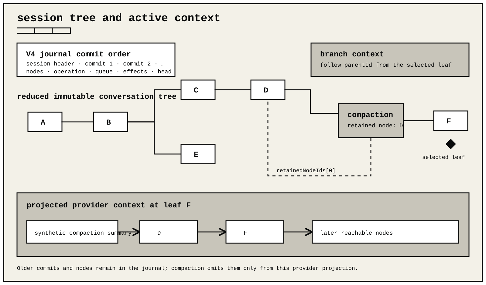

# Sessions and context

Each durable ohm session is one append-only V4 JSONL journal. There is no
required session database or background memory service.
The journal is the durable agent run history, often called a trajectory, and
is separate from metadata-only operational telemetry.



## Session commands

Interactive commands:

```text
/new                 start a new session
/resume [--all|SESSION]
                     select or open a saved session
/fork                branch before a selected user message and restore its text
/clone               copy the current journal leaf into an independent session
/atlas               explore the active journal's lineage tree
/name NAME           set the session name
/session             show the active file, model, usage, cost, and cache waste
/compact [FOCUS]     summarize older context
/recover             attempt safe recovery of an interrupted run
/recover abandon ID  continue without repeating one blocked tool effect
/export [FILE]       export the active session
```

Related startup options include `--continue`, `--resume`, `--session`,
`--session-id`, `--fork`, `--session-dir`, and `--no-session`.

A session reference can be an exact ID, an unambiguous ID prefix, an exact
name, or an explicit `.jsonl` path. Ambiguous references fail.

Session Atlas is the active journal's lineage tree. It shows the selected path
and alternate branches without mixing in unrelated saved sessions. Selecting a
journal point can check it out, check it out after summarizing the path being
left, or create a linked branch. Selecting the active head also offers an
independent optionally named snapshot. Atlas opens without interrupting a live
response and settles that response only when the user chooses a state-changing
action. `/resume` exclusively owns saved-session discovery and switching.

Session catalogs are scoped to the launch workspace unless `--all` is
selected. Opening a session owned by another workspace requires confirmation
and copies it into a session for the current workspace.

Deleting a session from the picker first asks the operating system to recycle
the file. ohm uses `gio trash` on Linux, Finder on macOS, and the Recycle
Bin through Windows PowerShell. If recycling fails, ohm deletes the file
permanently and reports which action completed.

`/new` does not copy facts from unrelated sessions. Cross-session memory is an
extension concern and must be visible to the user.

A worker or delegated agent launched through an extension-owned managed process
is not a branch or child of the current journal. The parent records only the
ordinary extension tool call and result. The extension owns any external
session files, correlation metadata, retention, and cleanup it chooses to add.

## Storage layout

The default session root is:

```text
~/.ohm/sessions/
```

Sessions are grouped by canonical workspace. `OHM_HOME` changes the ohm
home. `--session-dir` selects another directory for one invocation.

On POSIX systems, managed session roots and writer-lock directories use mode
`0700`; session journals, lock owner records, and new JSONL or HTML exports use
mode `0600`. On Windows, the current account's filesystem ACLs provide the
access boundary because POSIX mode bits do not apply.

The first record is the strict V4 header:

```json
{"record":"session","version":4,"sessionId":"...","createdAt":"...","workspace":"/work/project","cwd":"/work/project"}
```

Later records are ordered commits. A commit can atomically add conversation
nodes, select the active head, accept or finish a run, update a durable queue,
write a checkpoint, or move a tool effect through its recovery lifecycle.

A journal is bounded to 256 MiB, each JSONL record to 16 MiB, and its
conversation tree to 100,000 nodes. A write that would cross a limit is
rejected before the journal changes. These are storage safety limits;
compaction bounds model context but intentionally does not erase the durable
transcript. Start a new session before an exceptionally long journal reaches a
limit.

Conversation node `parentId` links form a tree. A `null` parent starts a root.
Multiple children create branches. The `main` head selects the active
ancestry. Nodes are immutable; selecting another branch changes the head
instead of rewriting history.

## Resume and discovery

`SessionManager.list(cwd)` scans the canonical directory for one workspace.
`SessionManager.listAll()` scans all workspace directories under the configured
session root.

`SessionManager.openSnapshot(path, cwdOverride?)` opens a detached
`ReadonlySessionManager` capture without acquiring the journal's writer slot.
It can inspect a session while its owning host continues writing, but it does
not observe commits made after the snapshot opened. Open a new snapshot for a
fresh view. Mutator methods are absent from the returned public type, and
runtime commit attempts still fail closed if a caller bypasses that type.

Listing:

- reads no more than ten files at once;
- stats every candidate but reparses only new or changed journals;
- reuses names, previews, searchable text, timestamps, and message counts from
  a private versioned catalog snapshot;
- uses a stable path tie-breaker when activity times match;
- rejects a missing pagination cursor instead of restarting silently.

The catalog snapshot is rebuildable metadata, not a second source of truth. It
lives beside the journals as `.ohm-session-catalog-v1.json`, uses private
permissions, is replaced atomically, and is discarded and rebuilt when its
version, shape, permissions, or file fingerprints do not match. Deleting or
corrupting it cannot alter a session journal.

`--continue` opens the most recently modified session in the current
workspace. `--resume` opens the interactive selector. `--all` expands their
search scope.

`ohm sessions doctor` reports invalid journals. It does not rewrite damaged
committed records.

## Crash and writer behavior

Only a complete JSON object followed by LF is committed.

- A trailing unterminated fragment is ignored during read.
- A writable open truncates that fragment before another append.
- Invalid LF-terminated data fails with a line diagnostic.
- A second live writer for the same file is rejected.

The writer validates each state transition, writes and synchronizes the commit,
then publishes it to live readers. A crash cannot publish state that was not
made durable.

An interrupted tool effect follows its stored recovery policy. ohm does not
blindly repeat an external side effect. An unresolved in-doubt effect blocks
new work until it is reconciled or explicitly resolved.

Interactive, print, JSON, and serve modes attempt safe recovery when they open a
session with an interrupted run. Safe repeatable work can run again. A tool
with a reconciliation handler can check external state. Any remaining
uncertain effect stays blocked. Reopening after a crash never treats the
interruption itself as permission to abandon an effect.

An intentional Escape cancellation in the same interactive process has a
narrower rule. After cancellation settles, the next submitted prompt records
each still-unsettled effect as abandoned and then continues without replaying
it. This is a non-replay decision only: it does not claim that an external
action succeeded or failed, undo an action, or repeat one. If cancellation or
recovery cannot settle, the prompt is not sent and the session remains blocked
for explicit recovery.

In interactive mode, typing `/recover` authorizes a complete automatic recovery
pass: ohm first repeats or reconciles only effects whose stored policy permits
it, then records every effect still blocked as abandoned without replay.
`/recover abandon EFFECT_ID` keeps the narrower one-effect form. Both record a
non-replay decision only; neither claims that the external action succeeded or
failed. Recovery itself does not start a model turn. On the next prompt, the
model receives the abandoned call as an error tool result that explicitly says
the external outcome is unknown, may already have completed, and must be
inspected before any retry.

RPC hosts can use `get_recovery_status` and `recover_interrupted_run`. SDK
hosts can read `session.suspendedRun` and call
`session.recoverInterruptedRun()`. Embedding exposes those members on its
narrow session facade. Serve keeps a blocked session registered and exposes
the same explicit decision through its authenticated
`/v1/sessions/:id/recovery` resource. These APIs let a host provide a verified
`succeeded`, `failed`, or `abandoned` resolution for a blocked effect.

## Context reconstruction

The V4 reducer rebuilds the selected head, nodes, run state, queues,
checkpoints, and tool effects. `SessionManager` then projects the active
conversation:

1. follow `parentId` from the selected head;
2. apply the latest reachable model, thinking, and tool selections;
3. start compacted context at the retained boundary;
4. keep valid user, assistant, tool-call, and tool-result order;
5. include extension context and omit extension state.

Provider conversion happens after canonical context exists. Provider
continuation state is reused only across a compatible provider, protocol,
model, and tool-definition boundary.

## Prompt-cache diagnostics

Prompt caching and provider continuation are separate optimizations. A cache
miss can increase cost or latency, but it does not mean context was lost.

When `showCacheMissNotices` is enabled, ohm compares each measured assistant
request with the preceding measured request. It reports a notice when at least
20,000 prior-prompt tokens were not cache-read, or when the estimated added
cost reaches about $0.10. This is an upper-bound estimate for that request, not
proof of billing. Differences below 1,024 tokens are ignored, and later
requests can recover normal cache reuse.

Missing cache telemetry ends the comparison chain. Compaction and branch
summaries reset it because they intentionally change the prompt prefix. A
provider or model route change also starts a new comparison epoch. When the
runtime has content-free structural fingerprints, changes to the API,
instructions, tool definitions, session, or other cache-affinity inputs start
a new epoch instead of being counted as avoidable waste.

Cache retention is provider-specific. ohm does not assume a universal idle
expiry. An adapter can supply a known retention window or mark idle expiry as
possible; otherwise elapsed time alone is not labeled as an expiry. Explicit
zero cache counters are measured values. An unavailable counter remains
unknown, and a zero cache-write counter does not prove that caching failed. Use
later provider-reported cache reads to confirm reuse.

Callers that use `observeCacheRequest()` directly can supply an opaque
`cacheBoundary` or build one with `cacheBoundaryFingerprint()`. Boundary parts
must be non-secret stable identifiers or hashes. Do not pass credentials or
credential-bearing URLs. Endpoint, account, transport-generation, and exact
retention identities are included only when the selected adapter exposes a
safe value.

`/session` reports message, tool, usage, and cost totals for the complete
journal, including non-active branches and summary requests. Cache-waste
estimates follow the active branch because only that prompt sequence is
comparable. Its `prompt` token label is uncached input plus cache reads and
cache writes, the same denominator used for cache-hit percentages elsewhere.
The prompt-cache line preserves an explicit reported zero and says `not
reported` when neither cache counter is available. If only some requests or
components report cache telemetry, its numbers are sums of the reported
counters rather than an estimate for the missing values. The whole-journal
cache-hit percentage appears only when every usage-bearing main or summary
request reports input, cache-read, and cache-write counters and their combined
prompt denominator is nonzero. Tool-attributed usage is excluded from that
percentage. Otherwise `/session` labels the rate unavailable instead of
treating missing counters as zero.

## Compaction and branches

Compaction shortens provider context without deleting history. Its node stores
the summary and retained node IDs. Product projection also exposes the first
retained entry, tokens before compaction, normalized usage, details, and hook
provenance when present.

Context begins with the summary, continues from the retained boundary, and
then includes later reachable nodes. An Atlas checkout can summarize the path
being left before selecting another head.

See [Context compaction](compaction.md) and
[Session JSONL format](session-jsonl.md).

## Extension state

Trusted extensions can store:

- `extension_state`, for durable data that does not enter model context;
- `extension_context`, for extension-authored model context.

Product-facing extension APIs project these as typed session entries.
Registrations remain generation-bound, so `/refresh` does not duplicate or
rewrite durable data. Do not retain a callback-scoped session view after
refresh or session replacement.

## Export and privacy

`exportToJsonl()` writes a valid, settled V4 journal for the selected branch.
It keeps conversation ancestry and selection state but does not carry an active
operation, pending queue, checkpoint, or tool-effect recovery state.

HTML export creates a self-contained transcript viewer. An ordinary HTML
export of a durable session embeds the exact source journal. A redacted export
regenerates a settled V4 journal with known secrets removed.

Exports may contain prompts, model output, tool arguments and results, local
paths, images, and extension content. Inspect a redacted copy before sharing.

See [Session export](session-export.md).
