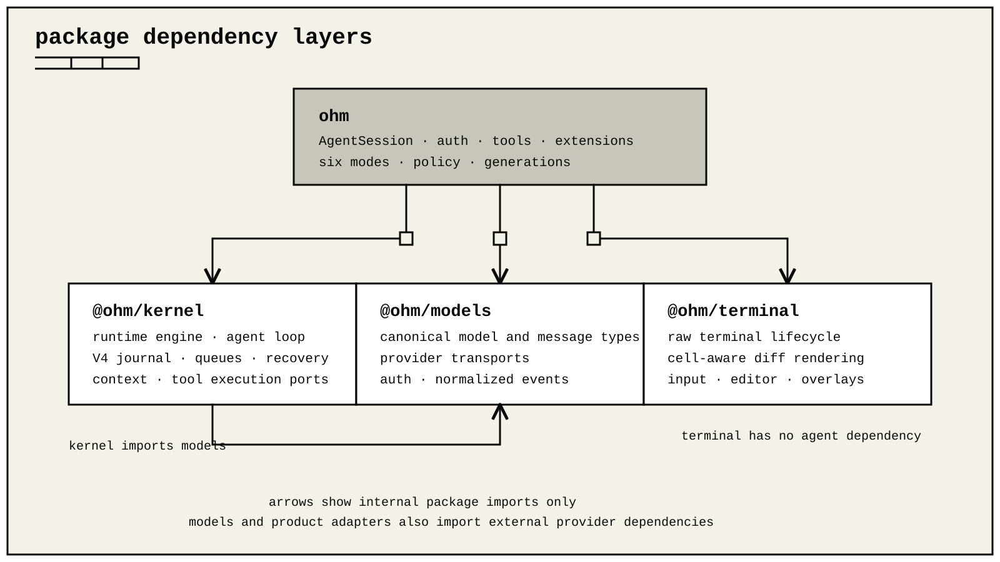

# @ohm/terminal

`@ohm/terminal` is ohm's raw-terminal engine. It provides cell-aware differential rendering, keyboard decoding, multiline editing, overlays, ANSI-safe layout, terminal images, autocomplete, and reusable components.

The package writes directly to the active terminal. It does not need a screen framework. It owns terminal modes and rendered state only between `TUI.start()` and `TUI.stop()`.



## Start an application

```ts
import { Editor, ProcessTerminal, TUI, Text } from "@ohm/terminal";

const terminal = new ProcessTerminal();
const app = new TUI(terminal);

app.addChild(new Text("Ready", 0, 0));

const editor = new Editor(app, {
  borderColor: (value) => value,
  selectList: {
    selectedPrefix: (value) => value,
    selectedText: (value) => value,
    description: (value) => value,
    scrollInfo: (value) => value,
    noMatch: (value) => value,
  },
});

editor.onSubmit = (value) => app.addChild(new Text(value, 0, 0));
app.addChild(editor);
app.setFocus(editor);
app.start();

process.once("SIGINT", () => app.stop());
```

`ProcessTerminal` enables raw input, bracketed paste, extended keyboard reporting when available, resize notifications, and terminal progress reporting. `stop()` restores every mode that `start()` enabled.

## Components and rendering

A component implements three operations:

```ts
interface Component {
  invalidate(): void;
  handleInput?(data: string): void;
  render(width: number): string[];
}
```

Each returned string is one physical terminal row. Non-image rows must fit the supplied width in terminal cells.

ANSI and OSC control sequences do not consume cells. CJK characters and emoji can consume more than one cell. Use `visibleWidth`, `sliceByColumn`, `truncateToWidth`, and `wrapTextWithAnsi` instead of JavaScript string length or ordinary slicing.

The package includes:

- `Container`, `Box`, `Text`, `Spacer`, and `TruncatedText` for composition.
- `HStack` and `VStack` for constrained horizontal and vertical regions.
- `ScrollView` for a fixed-height vertical viewport with follow, overscroll, and scrollbar policies.
- `ViewportWindowSource` for large text surfaces that expose an exact row count and render only the requested window.
- `Editor` and `Input` for multiline and single-line editing.
- `SelectList` and `SettingsList` for interactive choices.
- `Markdown` for lists, tables, quotes, fenced code, links, and styled inline content. Its optional `transform` receives the exact content width before parsing; a failed display transform leaves the source readable.
- `Loader` and `CancellableLoader` for active work.
- `Image` for Kitty and iTerm2 image placement with a text fallback.

These are the public component and editor capabilities; undo, redo, history, and kill-ring state belong to
`MultilineEditor` rather than separate state-container entry points.

The renderer compares physical rows and uses changed-region updates when safe. `FullscreenTUI` repaints changed ordinary-text rows independently; frames containing terminal controls or images take the conservative whole-frame path. It contains style and hyperlink state at row boundaries and tracks terminal scrollback separately from logical content. Kitty image placements are deleted before their reserved rows are redrawn.

### Fixed viewports

`TUI` renders on the terminal's main screen and preserves normal scrollback. `FullscreenTUI` uses the alternate screen and gives one root component the terminal's full width and height. These are low-level standalone `@ohm/terminal` hosts, not selectable ohm layout modes; ohm itself has one fixed rich interactive layout. `TuiMainScreen` aliases `TUI`, and `TuiAltScreen` aliases `FullscreenTUI`. `TuiAltScreenOptions` is the alias for `FullscreenTUIOptions`. `ViewportTUI` describes a host with `setLayoutRoot()`, and `isViewportTUI()` detects that capability. Put a stack at the root when the screen needs more than one region.

```ts
import { FullscreenTUI, ProcessTerminal, ScrollView, Text, VStack } from "@ohm/terminal";

const transcript = new ScrollView(new Text("Ready", 0, 0), {
  follow: "end",
  primary: true,
  scrollbar: "auto",
});
const screen = new FullscreenTUI(new ProcessTerminal());
screen.setRoot(new VStack([
  { component: transcript, grow: 1, minSize: 1 },
  { component: new Text("Press Ctrl+C to exit", 0, 0), basis: 1 },
]));
screen.start();
```

`StackEntryOptions` controls basis, growth, shrink, size bounds, and responsive visibility. `renderViewport()` and `fitViewportRows()` let custom components participate in fixed rectangles. `compositeTerminalLine()` and `compositeTerminalRows()` place trusted text without splitting ANSI state or wide cells.

Use `addChild()`, `removeChild()`, and `clear()` to change stacks. Use `setRoot()` or its `setLayoutRoot()` alias to change a `FullscreenTUI` root.

Terminal image row groups can be concatenated by `VStack.render()`. Horizontal placement and clipped or scrolling viewports reject image rows because terminal image protocols cannot be safely cropped by cell.

`FullscreenTUI` routes wheel input to the scroll view under the pointer. Unused movement chains through enclosing pointer regions when `overscroll` is `"chain"`; `"contain"` stops it. Automatic and persistent scrollbars support hover and drag. Only the visible scrollbar thumb starts a drag; track clicks fall through. Direct terminal sessions use all-motion pointer reporting, while tmux, Zellij, and GNU Screen sessions use button-motion reporting. Losing terminal focus cancels an active drag. `FullscreenTUI.stop()` restores pointer reporting, focus reporting, line wrapping, and the previous screen. Startup and render failures run the same cleanup. Call `dispose()` when a detached scroll view no longer needs its automatic-scrollbar timer.

Custom viewport components can participate in pointer routing through `ViewportPointerTarget` and `ViewportPointerRegionComponent`. Their symbol-marked methods receive cell coordinates and publish the child rectangles produced by the latest render. `dispatchViewportPointer()` is available to embedding hosts that need the same deepest-target and scroll-chaining behavior without `FullscreenTUI`.

## Input and keybindings

`StdinBuffer` separates batched input without splitting CSI, OSC, DCS, APC, extended-key, mouse, or bracketed-paste sequences. `parseKey` and `matchesKey` normalize legacy input, modifyOtherKeys, and extended keyboard events.

`KeybindingsManager` owns application keybindings. User overrides are validated against `TUI_KEYBINDINGS`. Use `getConflicts()` to inspect conflicting assignments.

`MultilineEditor` is the standalone text-buffer implementation used by higher-level editors. It supports Unicode grapheme movement, word navigation, history, grouped undo, a kill ring, bounded multiline paste markers, and visual-row movement. The `Editor` component adds forced and trigger-driven autocomplete, viewport scrolling, and an IME-positioned hardware cursor.

## Overlays

```ts
const handle = app.showOverlay(component, {
  width: "60%",
  maxHeight: "70%",
  anchor: "center",
  margin: 1,
});

handle.setHidden(true);
handle.setHidden(false);
handle.isHidden();
handle.focus();
handle.isFocused();
handle.unfocus({ target: baseComponent });
handle.hide();
```

Overlays support absolute or percentage sizing, nine anchors, offsets, margins, responsive visibility, and non-capturing presentation.

Focus ownership survives temporary base controls and dynamic visibility without sending input to a hidden component. Permanently removing an overlay also repairs dependent focus ancestry.

## Terminal capabilities

Image, true-color, and hyperlink support is detected from the active terminal environment. Call `getCapabilities()` to inspect it. Tests and embedding hosts can use `setCapabilities()` and `resetCapabilitiesCache()` to install a known capability set.

`TUI` exposes terminal color-scheme notifications and background-color queries. Their responses are consumed before normal input routing. Cell-size reports update image layout without swallowing unrelated keystrokes.

## Renderer diagnostics

Set `OHM_DEBUG_REDRAW=1` to record full-redraw reasons in
`~/.ohm/logs/ohm-debug.log`. `OHM_HOME` changes the root directory.
Embedded applications can instead pass a diagnostic directory as
the third `TUI` constructor argument. Either choice opts in to diagnostics;
they are disabled by default.

The log contains only timestamps and bounded renderer geometry. It does not
contain transcript rows. While diagnostics are enabled, a component that
violates the physical-row width contract writes the same bounded metadata to
`ohm-crash.log` before the raw TUI restores terminal state and stops the
render.

## Native release gate

The sources in `native/` provide three platform-specific functions:

- macOS modifier-state detection for terminal input that cannot encode Shift+Return directly.
- macOS Keychain Services access through a bounded stdin/stdout helper that never receives secrets in arguments or
  environment variables.
- Windows virtual-terminal input activation after Node enters raw mode.

GitHub release artifacts for macOS and Windows must contain the matching x64 and arm64 N-API binary under
`native/<platform>/prebuilds/<platform>-<arch>/`. Each Darwin directory must also contain its executable
`ohm-keychain-helper`. `native/targets.json` declares all six artifact paths across four build targets.

On a macOS or Windows release worker, `npm run native:build` compiles the artifacts for the current architecture.
Darwin builds require `cc` and `swiftc`; Windows builds require `cl`. `npm run native:verify` loads the N-API module
and, on Darwin, verifies invalid-request handling plus set/get/delete behavior with a unique synthetic Keychain item
that it removes in a `finally` cleanup. Keychain unavailability fails the matching macOS release lane.

Linux validates the source files and four-target manifest, but cannot load another operating system's binary. The
release workflow collects all six artifacts into one package tree. `npm run native:verify -- --release` checks their
paths, executable modes, and executable headers before staging. The staged archive verifier installs
`@ohm/terminal` and loads or executes the matching packed artifacts again on macOS and Windows.

## Verification

```sh
npm run check
npm run native:build       # macOS or Windows release worker
npm run native:verify
npm run native:verify -- --release
```

`npm run check` performs strict declaration typechecking, builds the package, and runs the repository-owned semantic regression suite.
